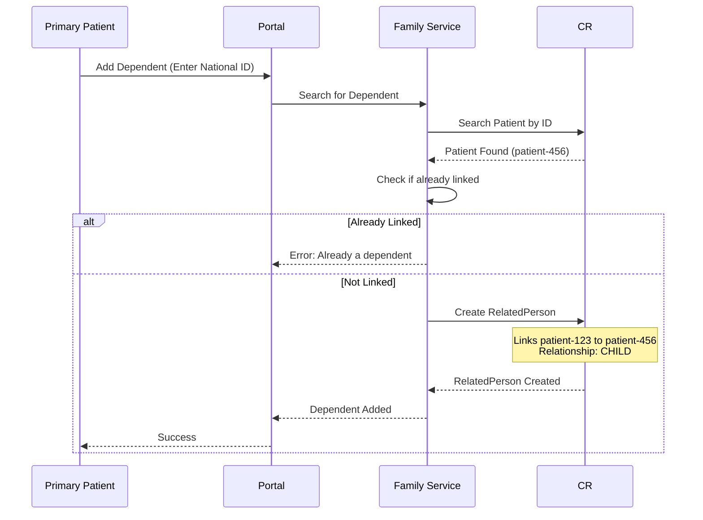
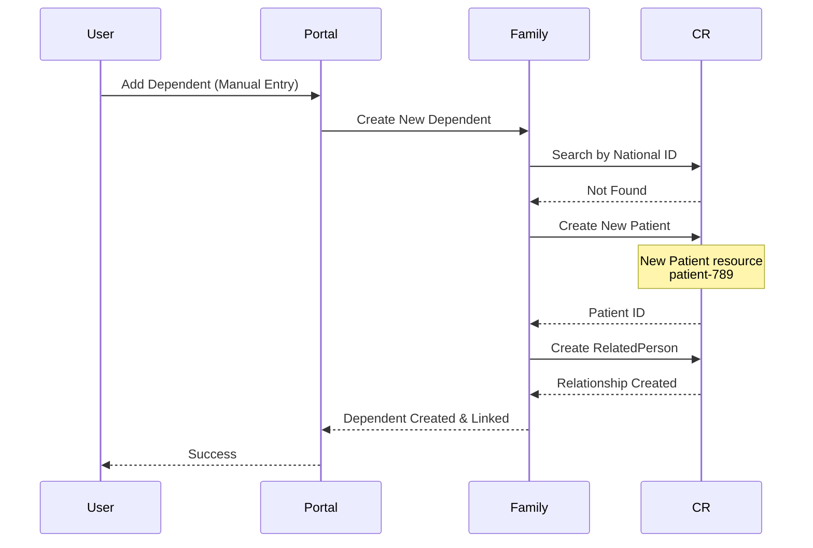
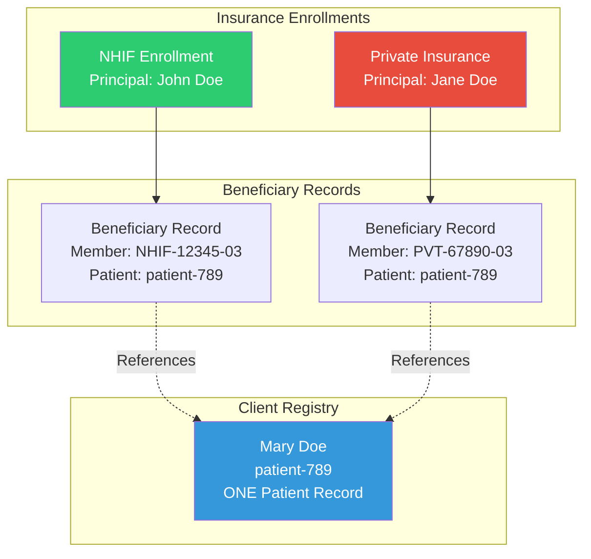
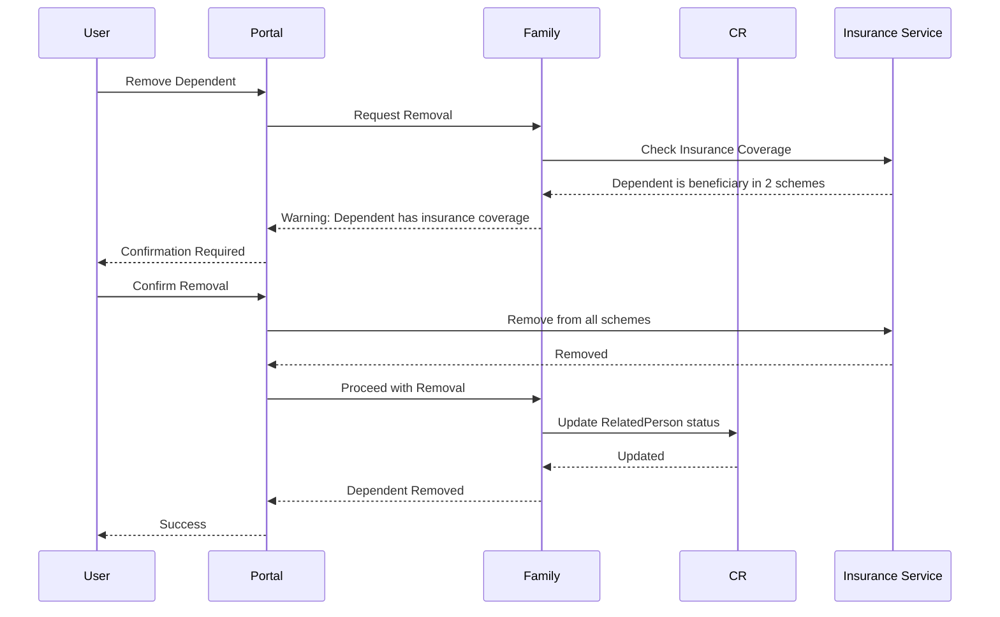

# Patient Portal - Family & Dependent Management

## Overview

The Family Tree service enables patients to link family members as dependents, maintaining relationships while ensuring each person has ONE unique Patient record in the Client Registry.

**Key Principle**: Every person exists as a single Patient resource in CR, regardless of how many family relationships they have.

---

## Architecture

### Data Model

```typescript
interface FamilyMember {
  id: string;
  patientId: string;  // Reference to CR Patient ID (unique)
  relationship: RelationshipType;
  isDependent: boolean;
  isPrimaryDependent: boolean;
  addedBy: string;  // PatientId who added this relationship
  addedDate: Date;
  status: 'ACTIVE' | 'REMOVED';
}

interface FamilyTree {
  primaryPatientId: string;
  members: FamilyMember[];
  lastUpdated: Date;
}

enum RelationshipType {
  SPOUSE = 'SPOUSE',
  CHILD = 'CHILD',
  PARENT = 'PARENT',
  SIBLING = 'SIBLING',
  GUARDIAN = 'GUARDIAN',
  OTHER = 'OTHER'
}
```

---

## Adding Dependents - Two Scenarios

### Scenario 1: Dependent Already Exists in CR



**FHIR RelatedPerson Resource**:
```json
POST https://cr.hie.example.com/fhir/RelatedPerson

{
  "resourceType": "RelatedPerson",
  "patient": {
    "reference": "Patient/patient-123",
    "display": "John Doe (Primary)"
  },
  "relationship": [{
    "coding": [{
      "system": "http://terminology.hl7.org/CodeSystem/v3-RoleCode",
      "code": "CHILD",
      "display": "child"
    }]
  }],
  "period": {
    "start": "2025-11-20"
  },
  "active": true,
  "extension": [{
    "url": "http://patient-portal.hie.example.com/fhir/StructureDefinition/dependent-patient-reference",
    "valueReference": {
      "reference": "Patient/patient-456",
      "display": "Mary Doe"
    }
  }]
}
```

### Scenario 2: Dependent Does Not Exist in CR



---

## Family Tree Visualization

### Example: John Doe's Family Tree

```
Primary Account Holder: John Doe (patient-123)
├── Spouse: Jane Doe (patient-456)
├── Child: Mary Doe (patient-789)
└── Child: Tom Doe (patient-012)

Notes:
- Each person (John, Jane, Mary, Tom) has ONE Patient ID in CR
- Jane Doe can also have her own portal account
- If Jane logs in, she sees John and the children as HER family members
- Mary and Tom are minors, so they don't have portal accounts yet
```

### Circular Relationships Handling

**Challenge**: John lists Jane as spouse, Jane lists John as spouse

**Solution**:
```typescript
async function addFamilyMember(
  primaryPatientId: string,
  dependentPatientId: string,
  relationship: RelationshipType
): Promise<void> {
  // Check for existing relationship
  const existing = await cr.searchRelatedPerson({
    patient: primaryPatientId,
    'related-patient': dependentPatientId
  });
  
  if (existing.total > 0) {
    throw new Error('Relationship already exists');
  }
  
  // Create bidirectional relationships for SPOUSE
  if (relationship === RelationshipType.SPOUSE) {
    // John -> Jane
    await cr.createRelatedPerson({
      patient: primaryPatientId,
      relatedPatient: dependentPatientId,
      relationship: 'SPOUSE'
    });
    
    // Jane -> John (automatic)
    await cr.createRelatedPerson({
      patient: dependentPatientId,
      relatedPatient: primaryPatientId,
      relationship: 'SPOUSE'
    });
  } else {
    // Unidirectional for other relationships
    await cr.createRelatedPerson({
      patient: primaryPatientId,
      relatedPatient: dependentPatientId,
      relationship
    });
  }
}
```

---

## Access Control for Dependents

### Minor Dependents (Under 18)
- Parent/guardian can view all clinical data
- Parent can manage appointments, insurance
- No separate login for minor

### Adult Dependents (18+)
- Requires explicit consent to view clinical data
- Can only view demographic information by default
- Adult dependent must grant access via Consent resource

**Consent Management**:
```typescript
interface DependentAccess {
  dependentPatientId: string;
  accessGrantedTo: string;  // Primary patient ID
  scope: ConsentScope[];
  effectiveDate: Date;
  expiryDate?: Date;
  status: 'ACTIVE' | 'REVOKED';
}

enum ConsentScope {
  DEMOGRAPHICS = 'DEMOGRAPHICS',
  CLINICAL_SUMMARY = 'CLINICAL_SUMMARY',
  ENCOUNTERS = 'ENCOUNTERS',
  PRESCRIPTIONS = 'PRESCRIPTIONS',
  LAB_RESULTS = 'LAB_RESULTS',
  APPOINTMENTS = 'APPOINTMENTS'
}

function canAccessDependentData(
  primaryPatientId: string,
  dependentPatientId: string,
  scope: ConsentScope
): boolean {
  // Check if dependent is minor
  const dependent = getPatient(dependentPatientId);
  const isMinor = calculateAge(dependent.birthDate) < 18;
  
  if (isMinor) {
    // Check if primary is parent/guardian
    const relationship = getRelationship(primaryPatientId, dependentPatientId);
    return ['PARENT', 'GUARDIAN'].includes(relationship);
  }
  
  // For adults, check consent
  const consent = getConsent(dependentPatientId, primaryPatientId);
  return consent && consent.scope.includes(scope) && consent.status === 'ACTIVE';
}
```

---

## Family Tree in Insurance Context

### One Person, Multiple Insurance Roles

**Example**:
- Mary Doe (patient-789) is:
  - Beneficiary under John's NHIF scheme (member: NHIF-12345-03)
  - Beneficiary under Jane's Private insurance (member: PVT-67890-03)



---

## GraphQL Queries for Family Tree

```graphql
query MyFamily {
  me {
    id
    name
    dependents {
      id
      patient {
        id
        name
        birthDate
        gender
      }
      relationship
      isMinor
      insuranceCoverage {
        scheme
        memberNumber
        status
      }
      canViewClinicalData
    }
  }
}

mutation AddDependent($input: DependentInput!) {
  addDependent(input: $input) {
    id
    patient {
      id
      name
    }
    relationship
    addedDate
  }
}

mutation RemoveDependent($dependentId: ID!) {
  removeDependent(dependentId: $dependentId) {
    success
    message
  }
}
```

**GraphQL Resolver**:
```typescript
const resolvers = {
  Query: {
    me: async (_, __, context) => {
      const patient = await cr.getPatient(context.user.patientId);
      return patient;
    }
  },
  
  Patient: {
    dependents: async (patient, _, context) => {
      // Get RelatedPerson resources
      const relatedPersons = await cr.searchRelatedPerson({
        patient: patient.id
      });
      
      // Fetch each dependent's Patient resource
      const dependents = await Promise.all(
        relatedPersons.entry.map(async (rp) => {
          const dependentPatient = await cr.getPatient(
            rp.resource.extension.find(
              ext => ext.url === 'dependent-patient-reference'
            ).valueReference.reference
          );
          
          return {
            id: rp.resource.id,
            patient: dependentPatient,
            relationship: rp.resource.relationship[0].coding[0].code,
            isMinor: calculateAge(dependentPatient.birthDate) < 18,
            addedDate: rp.resource.period.start
          };
        })
      );
      
      return dependents;
    }
  },
  
  Mutation: {
    addDependent: async (_, { input }, context) => {
      const { nationalId, relationship, demographics } = input;
      
      // Search for existing patient
      let dependentPatient = await cr.searchPatient({
        identifier: `http://nationalid.gov.ke|${nationalId}`
      });
      
      if (!dependentPatient) {
        // Create new patient
        dependentPatient = await cr.createPatient(demographics);
      }
      
      // Create RelatedPerson
      const relatedPerson = await cr.createRelatedPerson({
        patient: context.user.patientId,
        relatedPatient: dependentPatient.id,
        relationship
      });
      
      return {
        id: relatedPerson.id,
        patient: dependentPatient,
        relationship,
        addedDate: new Date()
      };
    }
  }
};
```

---

## Validation Rules

### Adding Dependents

**Age Restrictions**:
```typescript
function validateDependentRelationship(
  primaryAge: number,
  dependentAge: number,
  relationship: RelationshipType
): ValidationResult {
  const rules = {
    SPOUSE: () => {
      if (primaryAge < 18 || dependentAge < 18) {
        return { valid: false, reason: 'Both parties must be 18+' };
      }
      return { valid: true };
    },
    
    CHILD: () => {
      if (dependentAge >= primaryAge) {
        return { valid: false, reason: 'Child must be younger than parent' };
      }
      return { valid: true };
    },
    
    PARENT: () => {
      if (dependentAge <= primaryAge) {
        return { valid: false, reason: 'Parent must be older than child' };
      }
      return { valid: true };
    }
  };
  
  return rules[relationship]();
}
```

**Duplicate Prevention**:
- Cannot add same person twice
- Cannot add self as dependent
- Cannot create circular parent-child relationships

---

## Removing Dependents



**Soft Delete**:
```typescript
async function removeDependent(
  primaryPatientId: string,
  dependentId: string
): Promise<void> {
  // Check for active insurance coverage
  const insuranceCoverage = await insuranceService.getDependentCoverage(dependentId);
  
  if (insuranceCoverage.length > 0) {
    throw new Error(
      `Dependent has active insurance coverage in ${insuranceCoverage.length} scheme(s). ` +
      `Remove from insurance first.`
    );
  }
  
  // Soft delete - update status, don't delete record
  await cr.updateRelatedPerson(dependentId, {
    active: false,
    period: {
      end: new Date().toISOString()
    }
  });
}
```

---

**Next Document**: [PP_05_Insurance_Benefits.md](PP_05_Insurance_Benefits.md)