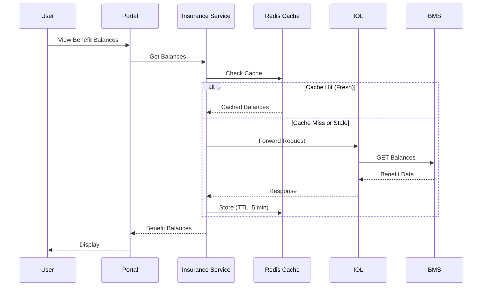
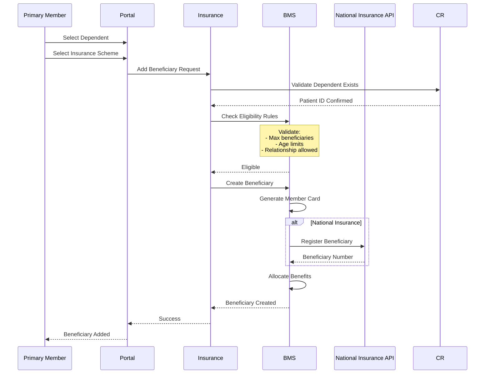
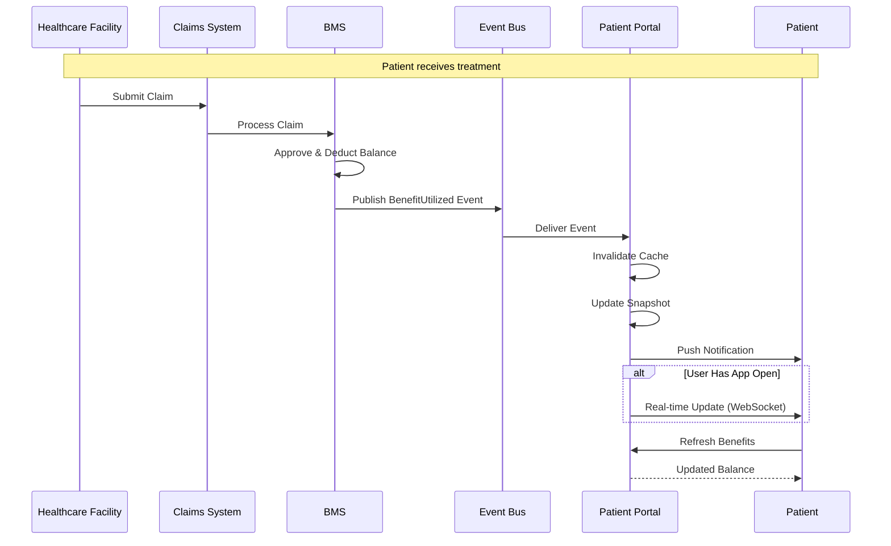

# Patient Portal - Insurance & Benefits Management

## Overview

The Insurance & Benefits module integrates with the Benefits Management System (BMS) to provide real-time access to insurance enrollments, benefit balances, and beneficiary management.

**Key Integration**: Hybrid approach - synchronous REST API for queries, asynchronous Kafka events for real-time updates.

---

## Insurance Enrollment Architecture

### Data Model

```typescript
interface InsuranceEnrollment {
  id: string;
  patientId: string;  // Primary account holder or beneficiary
  scheme: InsuranceScheme;
  memberNumber: string;
  principalMemberNumber?: string;  // If role is BENEFICIARY
  role: 'PRIMARY' | 'BENEFICIARY';
  relationship?: RelationshipType;  // If BENEFICIARY
  status: 'ACTIVE' | 'PENDING' | 'SUSPENDED' | 'TERMINATED';
  effectiveDate: Date;
  expiryDate?: Date;
  beneficiaries: Beneficiary[];  // If role is PRIMARY
  benefitPackage: BenefitPackage;
  paymentInfo?: PaymentInfo;
}

interface BenefitPackage {
  packageId: string;
  packageName: string;
  coverageType: 'INDIVIDUAL' | 'FAMILY';
  benefits: Benefit[];
}

interface Benefit {
  benefitType: BenefitType;
  benefitCode: string;
  annualLimit: number;
  currency: string;
}

interface BenefitBalance {
  benefitType: BenefitType;
  totalAllocation: number;
  utilized: number;
  remaining: number;
  utilizationPercentage: number;
  resetDate: Date;
}

enum BenefitType {
  OUTPATIENT = 'OUTPATIENT',
  INPATIENT = 'INPATIENT',
  MATERNITY = 'MATERNITY',
  DENTAL = 'DENTAL',
  OPTICAL = 'OPTICAL',
  PHARMACY = 'PHARMACY'
}
```

---

## BMS Integration - Synchronous

### API Endpoints

```typescript
// GET Benefit Balances
GET /bms/api/v1/enrollments/{membershipId}/balances

Response:
{
  "membershipId": "NHIF-12345",
  "patientId": "patient-123",
  "scheme": "National Health Insurance",
  "balances": [
    {
      "benefitType": "OUTPATIENT",
      "benefitCode": "OPD-01",
      "totalAllocation": 50000,
      "utilized": 12500,
      "remaining": 37500,
      "utilizationPercentage": 25.0,
      "resetDate": "2026-01-01",
      "currency": "KES"
    },
    {
      "benefitType": "INPATIENT",
      "benefitCode": "IPD-01",
      "totalAllocation": 200000,
      "utilized": 0,
      "remaining": 200000,
      "utilizationPercentage": 0,
      "resetDate": "2026-01-01",
      "currency": "KES"
    }
  ],
  "lastUpdated": "2025-11-20T10:30:00Z"
}

// GET Enrollment Details
GET /bms/api/v1/enrollments/{membershipId}

// ADD Beneficiary
POST /bms/api/v1/enrollments/{membershipId}/beneficiaries
{
  "patientId": "patient-456",
  "relationship": "CHILD",
  "effectiveDate": "2025-11-20"
}

// VALIDATE Beneficiary Eligibility
POST /bms/api/v1/enrollments/{membershipId}/validate-beneficiary
{
  "patientId": "patient-789",
  "relationship": "SPOUSE"
}
```

### Integration Flow



---

## BMS Integration - Asynchronous (Events)

### Event Types

```typescript
// Event: Benefit Utilized
{
  "eventType": "benefit.utilized",
  "eventId": "evt-abc123",
  "timestamp": "2025-11-20T14:30:00Z",
  "data": {
    "membershipId": "NHIF-12345",
    "beneficiaryId": "ben-123",
    "patientId": "patient-123",
    "benefitType": "OUTPATIENT",
    "benefitCode": "OPD-01",
    "utilizationAmount": 2500,
    "newBalance": 37500,
    "claimId": "CLM-2025-001234",
    "facility": "City General Hospital",
    "serviceDate": "2025-11-20"
  }
}

// Event: Enrollment Status Changed
{
  "eventType": "enrollment.status_changed",
  "eventId": "evt-def456",
  "timestamp": "2025-11-20T10:00:00Z",
  "data": {
    "membershipId": "NHIF-12345",
    "patientId": "patient-123",
    "previousStatus": "ACTIVE",
    "newStatus": "SUSPENDED",
    "reason": "PREMIUM_PAYMENT_OVERDUE",
    "effectiveDate": "2025-11-20",
    "actionRequired": "PAYMENT_REQUIRED"
  }
}

// Event: Beneficiary Added
{
  "eventType": "beneficiary.added",
  "eventId": "evt-ghi789",
  "timestamp": "2025-11-20T15:00:00Z",
  "data": {
    "membershipId": "NHIF-12345",
    "beneficiaryId": "ben-456",
    "patientId": "patient-456",
    "relationship": "CHILD",
    "memberCardNumber": "NHIF-12345-02",
    "effectiveDate": "2025-11-20"
  }
}
```

### Event Consumer

```typescript
class BMSEventConsumer {
  async handleBenefitUtilized(event: BenefitUtilizedEvent) {
    const { membershipId, patientId, utilizationAmount, newBalance } = event.data;
    
    // Invalidate cache
    await redis.del(`benefits:${membershipId}`);
    
    // Update local snapshot
    await db.benefitSnapshots.update({
      membershipId,
      balance: newBalance,
      lastUpdated: event.timestamp
    });
    
    // Send push notification
    await notificationService.send({
      userId: patientId,
      type: 'BENEFIT_USAGE',
      title: 'Benefit Used',
      message: `${utilizationAmount} KES used. New balance: ${newBalance} KES`,
      priority: 'NORMAL'
    });
  }
  
  async handleEnrollmentStatusChanged(event: EnrollmentStatusEvent) {
    const { membershipId, patientId, newStatus, actionRequired } = event.data;
    
    // Invalidate caches
    await redis.del(`enrollment:${membershipId}`);
    await redis.del(`benefits:${membershipId}`);
    
    if (newStatus === 'SUSPENDED') {
      // Critical notification
      await notificationService.send({
        userId: patientId,
        type: 'ENROLLMENT_SUSPENDED',
        title: 'Insurance Suspended',
        message: 'Your insurance has been suspended. Please update payment.',
        priority: 'HIGH',
        actionUrl: '/insurance/payment'
      });
    }
  }
}

// Kafka consumer setup
const consumer = kafka.consumer({ groupId: 'patient-portal-benefits' });
await consumer.subscribe({ topics: ['benefit.utilized', 'enrollment.status_changed', 'beneficiary.added'] });

await consumer.run({
  eachMessage: async ({ topic, message }) => {
    const event = JSON.parse(message.value.toString());
    
    switch (event.eventType) {
      case 'benefit.utilized':
        await bmsEventConsumer.handleBenefitUtilized(event);
        break;
      case 'enrollment.status_changed':
        await bmsEventConsumer.handleEnrollmentStatusChanged(event);
        break;
      case 'beneficiary.added':
        await bmsEventConsumer.handleBeneficiaryAdded(event);
        break;
    }
  }
});
```

---

## Adding Beneficiaries

### Workflow



### Validation Rules

```typescript
interface BeneficiaryEligibilityRules {
  maxBeneficiaries: number;
  allowedRelationships: RelationshipType[];
  ageRestrictions: {
    [key in RelationshipType]?: {
      minAge?: number;
      maxAge?: number;
    };
  };
}

// Example: NHIF Family Cover Rules
const nhifFamilyRules: BeneficiaryEligibilityRules = {
  maxBeneficiaries: 6,
  allowedRelationships: ['SPOUSE', 'CHILD', 'PARENT'],
  ageRestrictions: {
    CHILD: { maxAge: 21 },  // Children up to 21 years
    PARENT: { minAge: 60 }  // Elderly parents 60+
  }
};

async function validateBeneficiaryEligibility(
  membershipId: string,
  patientId: string,
  relationship: RelationshipType
): Promise<ValidationResult> {
  const enrollment = await bms.getEnrollment(membershipId);
  const rules = enrollment.benefitPackage.eligibilityRules;
  
  // Check max beneficiaries
  if (enrollment.beneficiaries.length >= rules.maxBeneficiaries) {
    return {
      eligible: false,
      reason: `Maximum ${rules.maxBeneficiaries} beneficiaries allowed`
    };
  }
  
  // Check relationship allowed
  if (!rules.allowedRelationships.includes(relationship)) {
    return {
      eligible: false,
      reason: `${relationship} relationship not allowed`
    };
  }
  
  // Check age restrictions
  const patient = await cr.getPatient(patientId);
  const age = calculateAge(patient.birthDate);
  const ageRule = rules.ageRestrictions[relationship];
  
  if (ageRule) {
    if (ageRule.minAge && age < ageRule.minAge) {
      return { eligible: false, reason: `Minimum age ${ageRule.minAge} required` };
    }
    if (ageRule.maxAge && age > ageRule.maxAge) {
      return { eligible: false, reason: `Maximum age ${ageRule.maxAge} exceeded` };
    }
  }
  
  // Check if already enrolled elsewhere
  const existingEnrollments = await bms.getPatientEnrollments(patientId);
  const alreadyEnrolled = existingEnrollments.some(
    e => e.scheme.id === enrollment.scheme.id
  );
  
  if (alreadyEnrolled) {
    return {
      eligible: false,
      reason: 'Already enrolled in this scheme'
    };
  }
  
  return { eligible: true };
}
```

---

## Real-Time Balance Updates



---

## Benefit Balance Display

### Dashboard View

```
┌─────────────────────────────────────────────┐
│ 💳 My Insurance Coverage                    │
├─────────────────────────────────────────────┤
│                                             │
│ NHIF - Family Cover                         │
│ Member: NHIF-12345 (Primary)                │
│ Status: ✓ ACTIVE                            │
│ Renews: Dec 31, 2025                        │
│                                             │
│ ━━━━━━━━━━━━━━━━━━━━━━━━━━━━━━━━━━━━━━━━━ │
│                                             │
│ 📊 Benefit Balances                         │
│                                             │
│ Outpatient Care                             │
│ ██████████████████░░░░  75% remaining       │
│ KES 37,500 of 50,000                        │
│ Resets: Jan 1, 2026                         │
│                                             │
│ Inpatient Care                              │
│ ████████████████████ 100% remaining         │
│ KES 200,000 of 200,000                      │
│ Resets: Jan 1, 2026                         │
│                                             │
│ Maternity                                   │
│ ████████████████████ 100% remaining         │
│ KES 100,000 of 100,000                      │
│ Resets: Jan 1, 2026                         │
│                                             │
│ ━━━━━━━━━━━━━━━━━━━━━━━━━━━━━━━━━━━━━━━━━ │
│                                             │
│ 👥 Covered Beneficiaries (3/6)              │
│ • Jane Doe (Spouse) - NHIF-12345-02         │
│ • Mary Doe (Child) - NHIF-12345-03          │
│ • Tom Doe (Child) - NHIF-12345-04           │
│                                             │
│ [Add Beneficiary] [View Claims History]     │
└─────────────────────────────────────────────┘
```

---

## Caching Strategy

```typescript
class BenefitCacheService {
  async getBenefitBalances(membershipId: string): Promise<BenefitBalance[]> {
    const cacheKey = `benefits:${membershipId}`;
    
    // Try cache first
    const cached = await redis.get(cacheKey);
    if (cached) {
      return JSON.parse(cached);
    }
    
    // Fetch from BMS
    const balances = await bmsClient.getBenefitBalances(membershipId);
    
    // Cache for 5 minutes
    await redis.setex(cacheKey, 300, JSON.stringify(balances));
    
    return balances;
  }
  
  async invalidateCache(membershipId: string): Promise<void> {
    await redis.del(`benefits:${membershipId}`);
    await redis.del(`enrollment:${membershipId}`);
  }
}
```

---

## Multiple Insurance Schemes

### One Person, Multiple Roles

**Example**: Mary Doe (patient-789)
- Beneficiary in John's NHIF (NHIF-12345-03)
- Beneficiary in Jane's Private Insurance (PVT-67890-03)

```typescript
async function getPatientInsurance(patientId: string): Promise<InsuranceEnrollment[]> {
  // Get all enrollments where patient is involved
  const enrollments = await bmsClient.getPatientEnrollments(patientId);
  
  return enrollments.map(e => ({
    id: e.id,
    scheme: e.scheme,
    memberNumber: e.memberNumber,
    role: e.principalMemberId === patientId ? 'PRIMARY' : 'BENEFICIARY',
    principalMember: e.principalMemberId !== patientId ? e.principalMember : null,
    benefitPackage: e.benefitPackage,
    balances: e.balances,
    status: e.status
  }));
}
```

---

**Next Document**: [PP_06_Clinical_Data.md](PP_06_Clinical_Data.md)