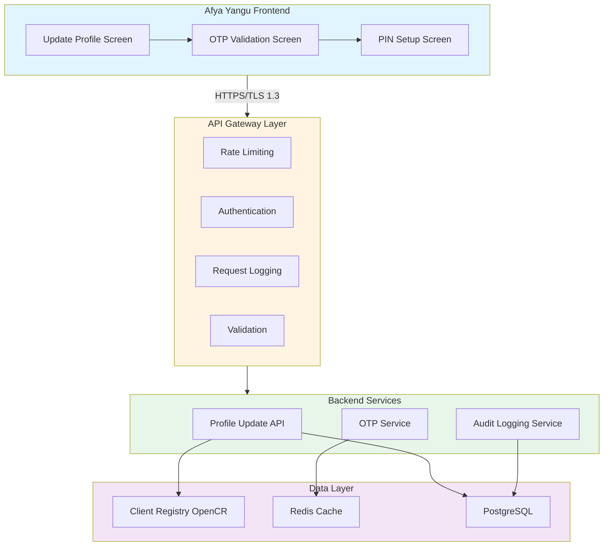
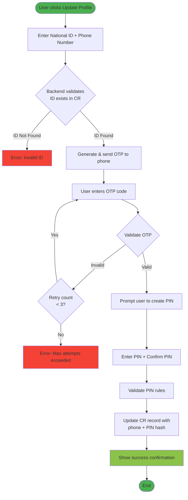

# Technical Scoping Document: Afya Yangu Self-Service Profile Update

## 1. Background & Context

The Afya Yangu application serves as the public-facing portal for Kenya's Universal Health Coverage (UHC) system. During mass registration campaigns (via assisted registration), a streamlined onboarding process was implemented that captured only National ID numbers, creating user records with system-generated Client Registry (CR) numbers but lacking critical biodata elements (phone numbers, self-service PINs). This technical scope addresses the secure enablement of self-service profile completion for these minimally-registered users.

## 2. Technical Architecture

### 2.1 System Components

**Frontend Layer (Afya Yangu Mobile/Web App)**
- React Native/Progressive Web App
- State management for multi-step form flow
- OTP validation UI components
- Secure PIN entry interface with masking

**API Gateway Layer**
- OAuth 2.0 token validation
- Rate limiting (10 requests/minute per National ID)
- Request logging and audit trail generation
- TLS 1.3 encryption for data in transit

**Backend Services Layer**
- Profile Update Service (Node.js/Python microservice)
- OTP Generation & Validation Service (Redis-backed, 5-minute TTL)
- Client Registry Integration Service (FHIR R4 Patient resource updates)
- Audit Logging Service (compliance with Data Protection Act 2019)

**Data Layer**
- PostgreSQL/MariaDB for transactional data
- Redis cache for OTP sessions
- Elasticsearch for audit logs

### 2.2 Architecture Diagram



## 3. Implementation Flow

### 3.1 User Journey Flow Diagram



## 4. Security & Compliance Measures

**Authentication & Authorization**
- National ID validation against Client Registry (CR FHIR endpoint)
- Multi-factor authentication via OTP (SMS gateway integration with Safaricom API)
- PIN hashing using bcrypt (cost factor 12) before storage

**Data Protection (DPA 2019 Compliance)**
- End-to-end encryption for sensitive data fields
- Audit logs capturing all profile update attempts (success/failure)
- Session timeout after 10 minutes of inactivity
- OTP expiry after 5 minutes, maximum 3 validation attempts

**Rate Limiting & Abuse Prevention**
- 10 profile update attempts per National ID per day
- CAPTCHA implementation after 2 failed OTP validations
- Temporary account lock after 5 consecutive failed attempts (24-hour cooldown)

## 5. API Specifications

### 5.1 Profile Update Initiation
```
POST /api/v1/profile/initiate-update
Request: { "nationalId": "12345678", "phoneNumber": "+254712345678" }
Response: { "sessionId": "uuid", "otpSent": true, "expiresIn": 300 }
```

### 5.2 OTP Validation & PIN Setup
```
POST /api/v1/profile/validate-and-update
Request: { 
  "sessionId": "uuid", 
  "otp": "123456",
  "pin": "hashed_pin",
  "phoneNumber": "+254712345678"
}
Response: { "success": true, "crNumber": "CR-00012345" }
```

---

**Author:** Ager Wasongah - Business Solutions Architect 
