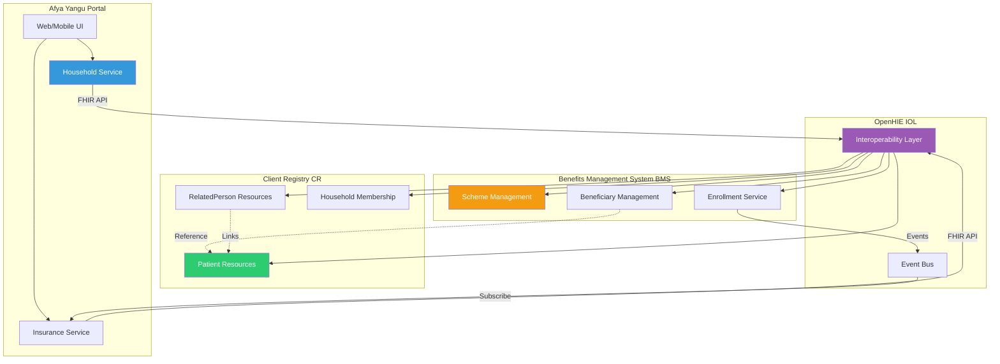
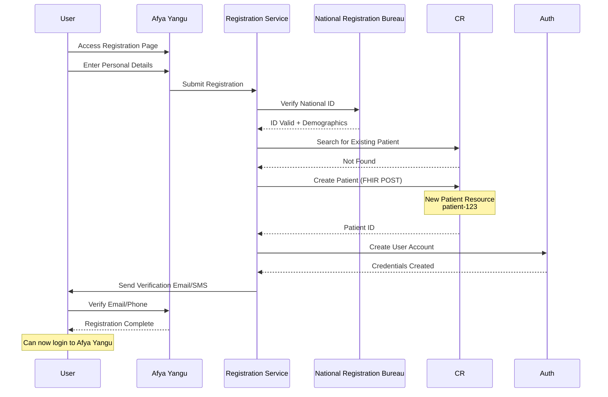
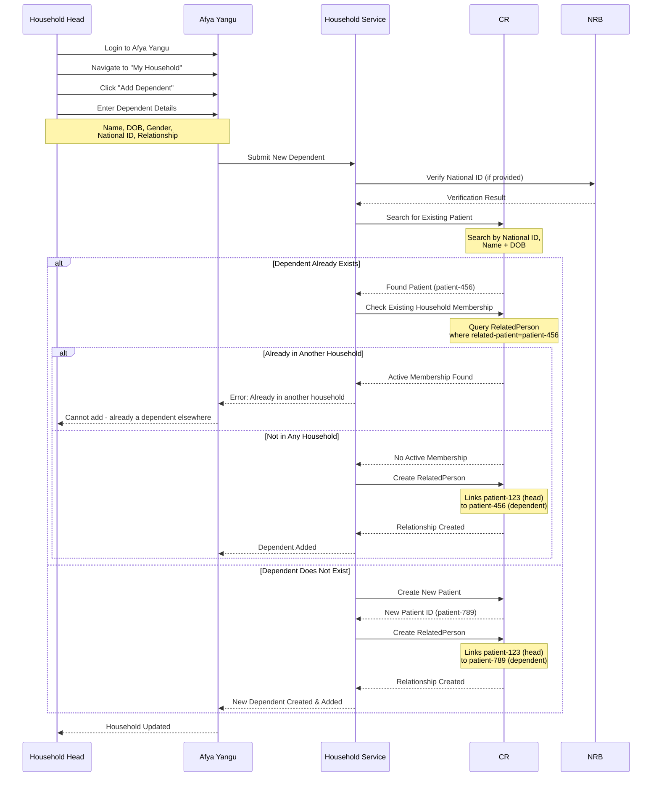
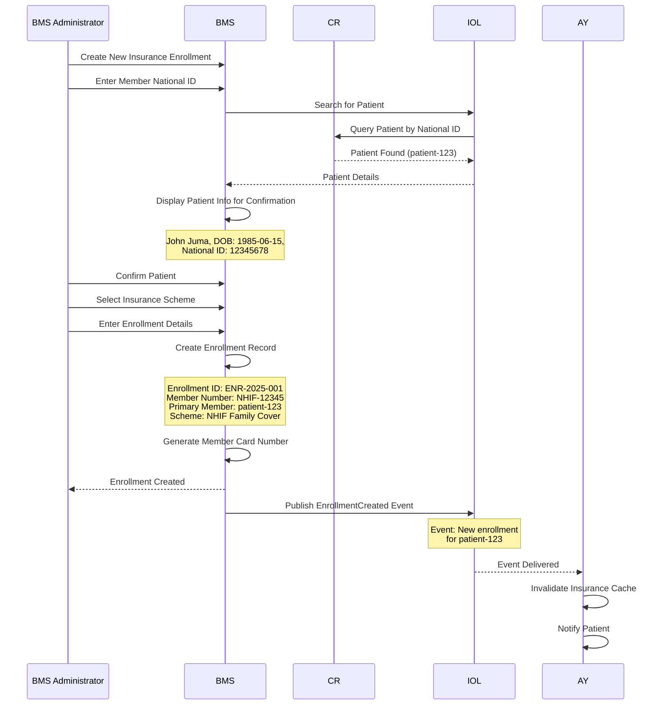
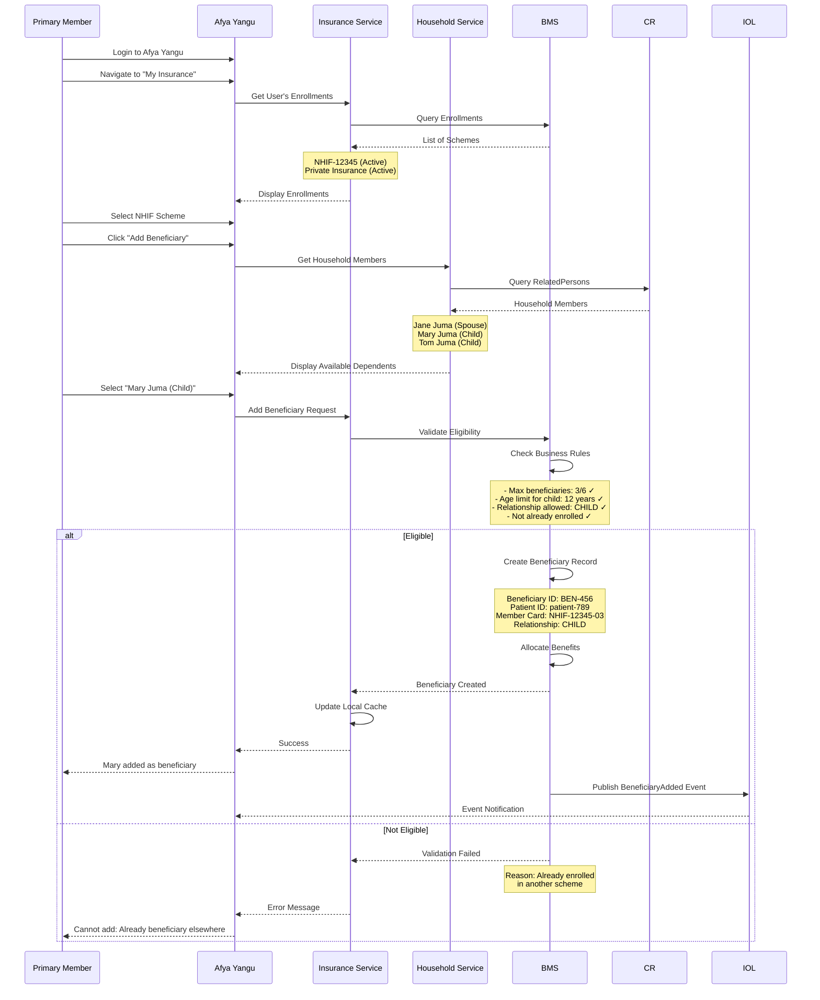
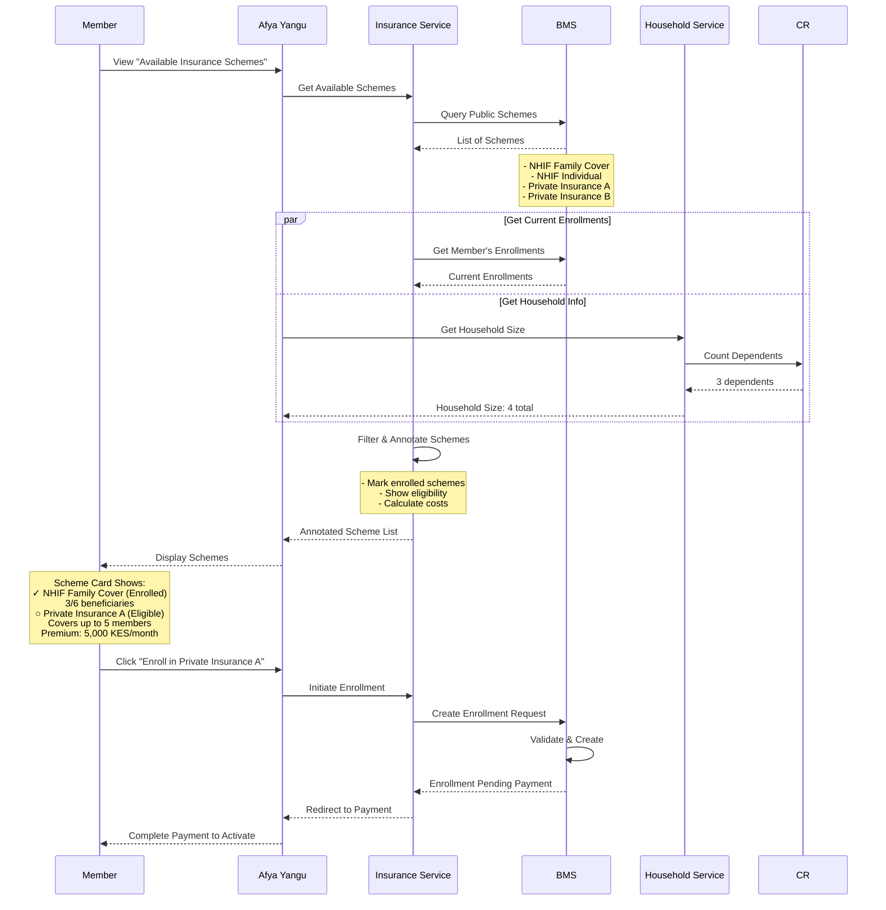
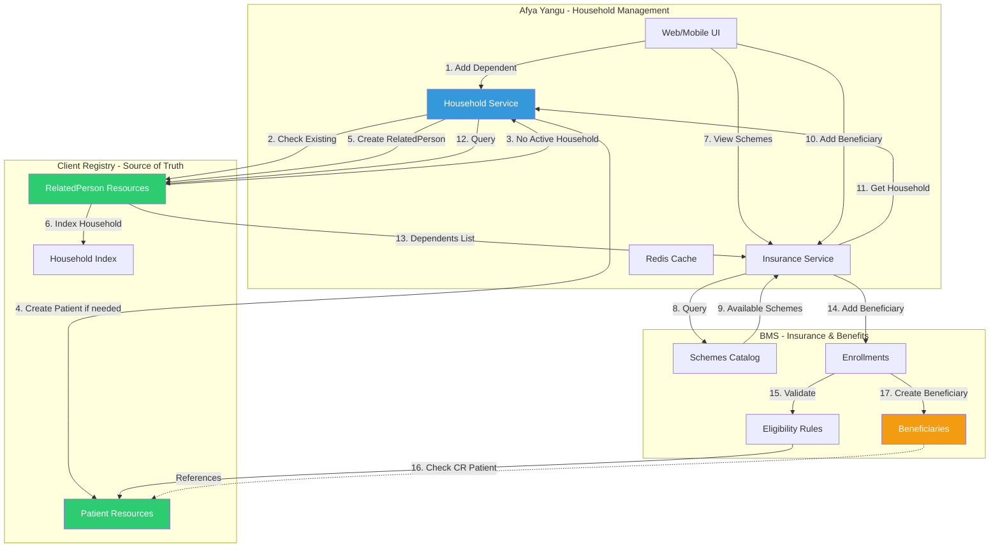
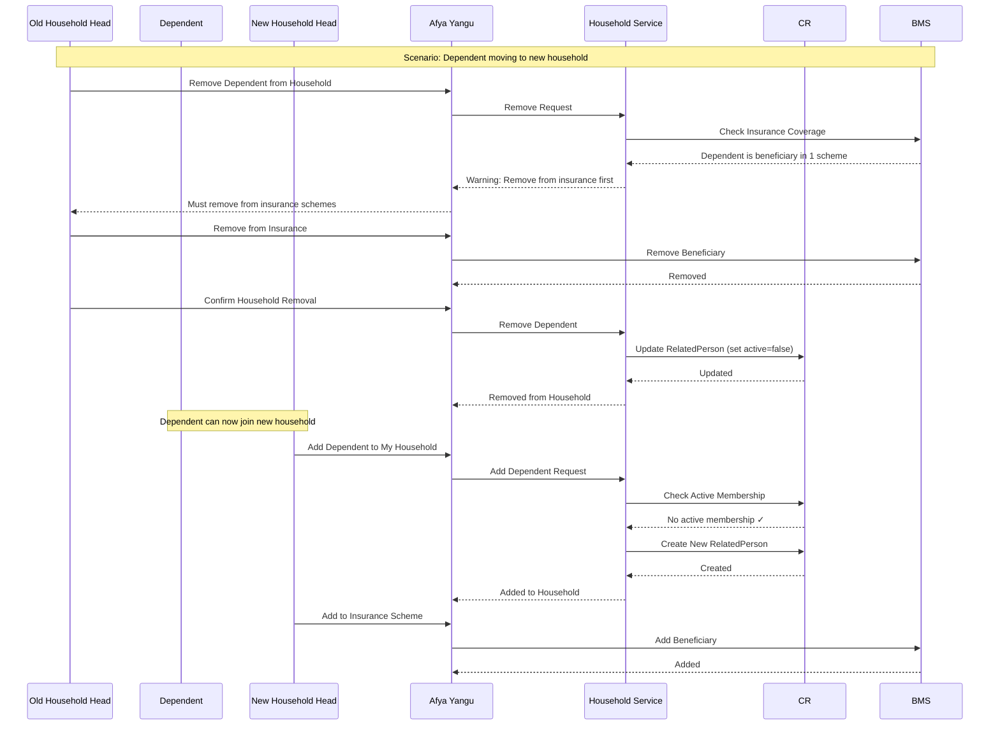

# Afya Yangu - Household & Dependent Management

## Overview

The Household & Dependent Management module enables patients to create household structures, link family members as dependents, and manage these relationships across the Client Registry (CR) and Benefits Management System (BMS).

**Key Principle**: Every person exists as a single Patient resource in CR, and each dependent can only belong to ONE household at any given time.

---

## Household vs Family Concepts

### Household
- A **household** is a group of related individuals managed by a primary member (household head)
- Tracked in **Afya Yangu** and **CR** via RelatedPerson resources
- Used for dependent management and access control
- **Rule**: One dependent can only belong to one household at a time

### Insurance Beneficiaries
- A **beneficiary** is a person covered under an insurance scheme
- Tracked in **BMS** with references to CR Patient IDs
- A person can be a beneficiary in **multiple** insurance schemes simultaneously
- Beneficiaries are selected from the household's dependents

---

## Architecture: CR-BMS-Afya Yangu Integration



---

## Data Model

### Household Structure

```typescript
interface Household {
  primaryMemberId: string;  // CR Patient ID of household head
  householdName?: string;   // Optional: "Juma Family"
  members: HouseholdMember[];
  createdDate: Date;
  lastUpdated: Date;
}

interface HouseholdMember {
  patientId: string;  // Reference to CR Patient ID (unique)
  relationship: RelationshipType;
  isDependent: boolean;
  isPrimaryDependent: boolean;
  addedBy: string;  // PatientId who added this member
  addedDate: Date;
  status: 'ACTIVE' | 'REMOVED';
  previousHousehold?: string;  // Track transfers
}

enum RelationshipType {
  SELF = 'SELF',           // Household head
  SPOUSE = 'SPOUSE',
  CHILD = 'CHILD',
  PARENT = 'PARENT',
  SIBLING = 'SIBLING',
  GUARDIAN = 'GUARDIAN',
  OTHER = 'OTHER'
}
```

### CR-BMS Relationship

```typescript
// CR: Patient (one per person)
interface CRPatient {
  id: string;  // e.g., "patient-123"
  identifier: Identifier[];
  name: HumanName[];
  birthDate: string;
  // ... other demographics
}

// CR: RelatedPerson (household membership)
interface CRRelatedPerson {
  id: string;
  patient: Reference;  // Primary member
  relatedPatient: Reference;  // Dependent
  relationship: CodeableConcept;
  active: boolean;
  period: Period;
}

// BMS: Insurance Enrollment
interface BMSEnrollment {
  enrollmentId: string;
  schemeId: string;
  primaryMemberId: string;  // CR Patient ID
  memberNumber: string;
  beneficiaries: BMSBeneficiary[];
}

// BMS: Beneficiary
interface BMSBeneficiary {
  beneficiaryId: string;
  patientId: string;  // CR Patient ID (reference)
  relationship: RelationshipType;
  memberCardNumber: string;
  status: 'ACTIVE' | 'PENDING' | 'REMOVED';
}
```

---

## Process Flows

### Flow 1: Register New Client to CR



**FHIR Patient Creation**:
```json
POST https://cr.hie.example.com/fhir/Patient

{
  "resourceType": "Patient",
  "identifier": [{
    "use": "official",
    "system": "http://nationalid.gov.ke",
    "value": "12345678"
  }],
  "active": true,
  "name": [{
    "use": "official",
    "family": "Juma",
    "given": ["John"]
  }],
  "gender": "male",
  "birthDate": "1985-06-15",
  "telecom": [
    {"system": "phone", "value": "+254712345678"},
    {"system": "email", "value": "john.juma@example.com"}
  ]
}
```

---

### Flow 2: Household Head Registers New Dependent



**FHIR RelatedPerson Creation**:
```json
POST https://cr.hie.example.com/fhir/RelatedPerson

{
  "resourceType": "RelatedPerson",
  "active": true,
  "patient": {
    "reference": "Patient/patient-123",
    "display": "John Juma (Household Head)"
  },
  "relationship": [{
    "coding": [{
      "system": "http://terminology.hl7.org/CodeSystem/v3-RoleCode",
      "code": "CHILD",
      "display": "child"
    }]
  }],
  "period": {
    "start": "2025-11-23"
  },
  "extension": [{
    "url": "http://afya-yangu.hie.example.com/fhir/StructureDefinition/dependent-patient-ref",
    "valueReference": {
      "reference": "Patient/patient-789",
      "display": "Mary Juma"
    }
  }, {
    "url": "http://afya-yangu.hie.example.com/fhir/StructureDefinition/household-membership",
    "valueBoolean": true
  }]
}
```

---

### Flow 3: BMS Adds Existing CR Client as Primary Policyholder



---

### Flow 4: Member Adds Household Dependent as Scheme Beneficiary



---

### Flow 5: Query Available Schemes and View Household Eligibility



---

## Household Management Architecture



---

## Validation Rules

### One Dependent, One Household Rule

```typescript
async function validateHouseholdMembership(
  dependentPatientId: string,
  newHouseholdHeadId: string
): Promise<ValidationResult> {
  // Check for existing active household membership
  const existingMembership = await cr.searchRelatedPerson({
    'related-patient': dependentPatientId,
    active: true,
    _has: 'Extension:household-membership:value=true'
  });
  
  if (existingMembership.total > 0) {
    const currentHead = existingMembership.entry[0].resource.patient.display;
    
    return {
      valid: false,
      reason: `Already a dependent in ${currentHead}'s household`,
      currentHousehold: existingMembership.entry[0].resource.patient.reference
    };
  }
  
  return { valid: true };
}
```

### BMS Beneficiary Eligibility Rules

```typescript
interface EligibilityRules {
  maxBeneficiaries: number;
  allowedRelationships: RelationshipType[];
  ageRestrictions: {
    [key in RelationshipType]?: {
      minAge?: number;
      maxAge?: number;
    };
  };
  oneSchemePerDependent?: boolean;  // Optional: restrict to one scheme
}

async function validateBeneficiaryEligibility(
  enrollmentId: string,
  dependentPatientId: string,
  relationship: RelationshipType
): Promise<ValidationResult> {
  const enrollment = await bms.getEnrollment(enrollmentId);
  const rules = enrollment.scheme.eligibilityRules;
  
  // Check 1: Max beneficiaries
  if (enrollment.beneficiaries.length >= rules.maxBeneficiaries) {
    return {
      valid: false,
      reason: `Maximum ${rules.maxBeneficiaries} beneficiaries reached`
    };
  }
  
  // Check 2: Relationship allowed
  if (!rules.allowedRelationships.includes(relationship)) {
    return {
      valid: false,
      reason: `${relationship} relationship not allowed in this scheme`
    };
  }
  
  // Check 3: Age restrictions
  const dependent = await cr.getPatient(dependentPatientId);
  const age = calculateAge(dependent.birthDate);
  const ageRule = rules.ageRestrictions[relationship];
  
  if (ageRule) {
    if (ageRule.minAge && age < ageRule.minAge) {
      return { valid: false, reason: `Minimum age ${ageRule.minAge}` };
    }
    if (ageRule.maxAge && age > ageRule.maxAge) {
      return { valid: false, reason: `Maximum age ${ageRule.maxAge} exceeded` };
    }
  }
  
  // Check 4: Not already a beneficiary in THIS scheme
  const alreadyBeneficiary = enrollment.beneficiaries.some(
    b => b.patientId === dependentPatientId
  );
  
  if (alreadyBeneficiary) {
    return {
      valid: false,
      reason: 'Already a beneficiary in this scheme'
    };
  }
  
  // Optional Check 5: One scheme per dependent rule
  if (rules.oneSchemePerDependent) {
    const otherEnrollments = await bms.getBeneficiaryEnrollments(dependentPatientId);
    if (otherEnrollments.length > 0) {
      return {
        valid: false,
        reason: 'Already a beneficiary in another scheme'
      };
    }
  }
  
  return { valid: true };
}
```

---

## Example: John Juma's Household

```
Household Head: John Juma (patient-123)
└── Household Members:
    ├── Jane Juma (patient-456) - Spouse
    ├── Mary Juma (patient-789) - Child (Age 12)
    └── Tom Juma (patient-012) - Child (Age 8)

Insurance Enrollments:

1. NHIF Family Cover (NHIF-12345)
   Primary Member: John Juma (patient-123)
   Beneficiaries:
   ├── Jane Juma (NHIF-12345-02)
   ├── Mary Juma (NHIF-12345-03)
   └── Tom Juma (NHIF-12345-04)

2. Private Insurance (PVT-67890)
   Primary Member: Jane Juma (patient-456)
   Beneficiaries:
   ├── John Juma (PVT-67890-02)
   └── Mary Juma (PVT-67890-03)
   
Note: 
- All 4 people have ONE Patient record in CR
- Household structure defined by RelatedPerson resources
- Mary is beneficiary in both schemes (allowed)
- Tom is only in NHIF (parents' choice)
```

---

## Household Transfer Process



---

## GraphQL Queries

```graphql
type Query {
  myHousehold: Household!
  availableInsuranceSchemes: [InsuranceScheme!]!
  householdDependentEligibility(
    dependentId: ID!
    schemeId: ID!
  ): EligibilityResult!
}

type Mutation {
  addHouseholdDependent(input: DependentInput!): HouseholdMember!
  removeHouseholdDependent(dependentId: ID!): Boolean!
  transferDependent(
    dependentId: ID!
    newHouseholdHeadId: ID!
  ): HouseholdMember!
  addSchemeBeneficiary(
    enrollmentId: ID!
    dependentId: ID!
  ): Beneficiary!
}

type Household {
  primaryMember: Patient!
  members: [HouseholdMember!]!
  insuranceEnrollments: [InsuranceEnrollment!]!
  totalMembers: Int!
}

type HouseholdMember {
  patient: Patient!
  relationship: RelationshipType!
  isDependent: Boolean!
  addedDate: DateTime!
  insuranceCoverage: [InsuranceCoverage!]!
  canBeAddedToSchemes: [InsuranceScheme!]!
}

type EligibilityResult {
  eligible: Boolean!
  reasons: [String!]!
  constraints: SchemeConstraints
}
```

---

**Next Document**: [PP_05_Insurance_Benefits.md](PP_05_Insurance_Benefits.md)
