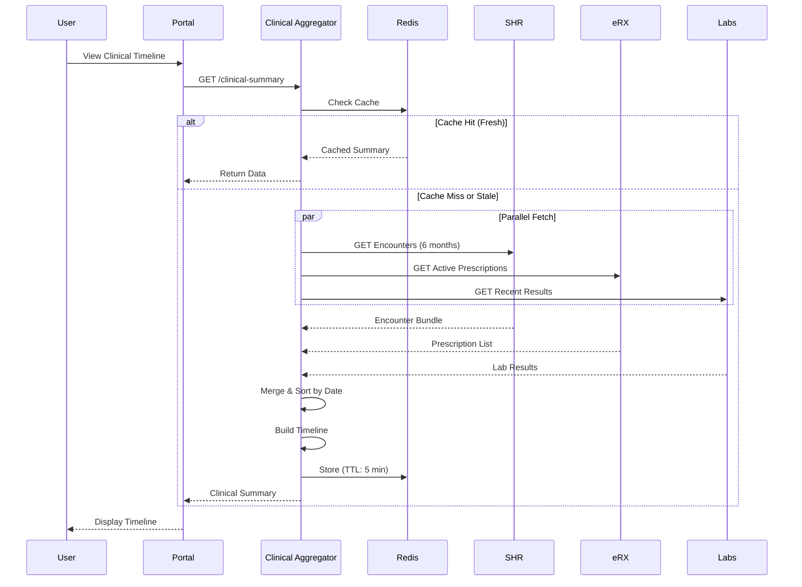

# Afya Yangu - Clinical Data Access

## Overview

The Clinical Data Aggregator fetches and consolidates clinical information from multiple HIE sources (SHR, eRX, Lab systems) into a unified, patient-friendly timeline view.

**Architecture Pattern**: Scatter-Gather with parallel fetching and response aggregation.

---

## Data Sources

| Source | Data Type | Protocol | Cache TTL |
|--------|-----------|----------|-----------|
| SHR | Encounters, Diagnoses, Procedures | FHIR R4 | 5 minutes |
| eRX | Active Prescriptions | FHIR R4 | 5 minutes |
| Lab Systems | Lab Results, Reports | FHIR R4 | 10 minutes |
| Imaging Systems | Radiology Reports | FHIR R4 | 10 minutes |
| Immunization Registry | Vaccination Records | FHIR R4 | 1 hour |

---

## Clinical Data Aggregation Flow



---

## Data Models

### Clinical Summary

```typescript
interface ClinicalSummary {
  patient: PatientReference;
  period: {
    start: Date;
    end: Date;
  };
  timeline: ClinicalTimelineItem[];
  summary: {
    activeConditions: Condition[];
    activeMedications: Medication[];
    allergies: Allergy[];
    recentVitals: VitalSigns;
  };
  metadata: {
    lastUpdated: Date;
    sources: string[];
  };
}

interface ClinicalTimelineItem {
  id: string;
  date: Date;
  type: 'ENCOUNTER' | 'PRESCRIPTION' | 'LAB_RESULT' | 'IMAGING' | 'PROCEDURE' | 'IMMUNIZATION';
  title: string;
  facility?: string;
  provider?: string;
  details: any;
  source: 'SHR' | 'eRX' | 'Labs' | 'Imaging' | 'Immunization';
  attachments?: Attachment[];
}

interface Condition {
  code: CodeableConcept;
  clinicalStatus: 'active' | 'inactive' | 'resolved';
  onsetDate: Date;
  recordedDate: Date;
}

interface Medication {
  code: CodeableConcept;
  dosage: string;
  frequency: string;
  startDate: Date;
  endDate?: Date;
  prescriber?: string;
  status: 'active' | 'completed' | 'stopped';
}

interface Allergy {
  substance: CodeableConcept;
  reaction?: string;
  severity: 'mild' | 'moderate' | 'severe';
  recordedDate: Date;
}
```

---

## FHIR Queries

### Fetch Recent Encounters from SHR

```
GET https://shr.hie.example.com/fhir/Encounter?
    patient=patient-123&
    date=ge2025-05-20&
    _sort=-date&
    _count=20&
    _include=Encounter:practitioner&
    _include=Encounter:location

Response: Bundle with Encounter resources + included Practitioners and Locations
```

### Fetch Active Prescriptions from eRX

```
GET https://erx.hie.example.com/fhir/MedicationRequest?
    patient=patient-123&
    status=active&
    _sort=-authoredOn&
    _include=MedicationRequest:medication

Response: Bundle with MedicationRequest resources + Medication details
```

### Fetch Recent Lab Results

```
GET https://labs.hie.example.com/fhir/DiagnosticReport?
    patient=patient-123&
    date=ge2025-05-20&
    _sort=-issued&
    _include=DiagnosticReport:result

Response: Bundle with DiagnosticReport + Observation resources
```

---

## Timeline Aggregation Logic

```typescript
class ClinicalAggregator {
  async getClinicalTimeline(
    patientId: string,
    periodMonths: number = 6
  ): Promise<ClinicalTimelineItem[]> {
    const startDate = new Date();
    startDate.setMonth(startDate.getMonth() - periodMonths);
    
    // Parallel fetch from all sources
    const [encounters, prescriptions, labResults, imaging] = await Promise.all([
      this.fetchEncounters(patientId, startDate),
      this.fetchPrescriptions(patientId),
      this.fetchLabResults(patientId, startDate),
      this.fetchImaging(patientId, startDate)
    ]);
    
    // Transform to timeline items
    const timelineItems: ClinicalTimelineItem[] = [
      ...this.transformEncounters(encounters),
      ...this.transformPrescriptions(prescriptions),
      ...this.transformLabResults(labResults),
      ...this.transformImaging(imaging)
    ];
    
    // Sort by date (newest first)
    timelineItems.sort((a, b) => b.date.getTime() - a.date.getTime());
    
    return timelineItems;
  }
  
  private transformEncounters(encounters: Encounter[]): ClinicalTimelineItem[] {
    return encounters.map(enc => ({
      id: enc.id,
      date: new Date(enc.period.start),
      type: 'ENCOUNTER',
      title: this.getEncounterTitle(enc),
      facility: enc.serviceProvider?.display,
      provider: enc.participant?.[0]?.individual?.display,
      details: {
        class: enc.class.display,
        reasonCode: enc.reasonCode,
        diagnosis: enc.diagnosis?.map(d => d.condition.display)
      },
      source: 'SHR'
    }));
  }
  
  private transformPrescriptions(medications: MedicationRequest[]): ClinicalTimelineItem[] {
    return medications.map(med => ({
      id: med.id,
      date: new Date(med.authoredOn),
      type: 'PRESCRIPTION',
      title: med.medicationCodeableConcept?.text || 'Prescription',
      provider: med.requester?.display,
      details: {
        medication: med.medicationCodeableConcept?.text,
        dosage: med.dosageInstruction?.[0]?.text,
        quantity: med.dispenseRequest?.quantity,
        refills: med.dispenseRequest?.numberOfRepeatsAllowed,
        status: med.status
      },
      source: 'eRX'
    }));
  }
  
  private transformLabResults(reports: DiagnosticReport[]): ClinicalTimelineItem[] {
    return reports.map(report => ({
      id: report.id,
      date: new Date(report.issued),
      type: 'LAB_RESULT',
      title: report.code.text,
      facility: report.performer?.[0]?.display,
      details: {
        category: report.category?.[0]?.text,
        status: report.status,
        conclusion: report.conclusion,
        results: report.result?.map(obs => ({
          test: obs.code?.text,
          value: obs.valueQuantity?.value,
          unit: obs.valueQuantity?.unit,
          interpretation: obs.interpretation?.[0]?.text
        }))
      },
      source: 'Labs'
    }));
  }
}
```

---

## Clinical Summary Cards

### Active Conditions Card

```typescript
async function getActiveConditions(patientId: string): Promise<Condition[]> {
  const response = await shrClient.search('Condition', {
    patient: patientId,
    'clinical-status': 'active',
    _sort: '-recorded-date'
  });
  
  return response.entry.map(entry => ({
    code: entry.resource.code,
    clinicalStatus: entry.resource.clinicalStatus.coding[0].code,
    onsetDate: entry.resource.onsetDateTime,
    recordedDate: entry.resource.recordedDate
  }));
}
```

### Active Medications Card

```typescript
async function getActiveMedications(patientId: string): Promise<Medication[]> {
  const response = await eRxClient.search('MedicationRequest', {
    patient: patientId,
    status: 'active',
    _sort: '-authored-on'
  });
  
  return response.entry.map(entry => {
    const dosage = entry.resource.dosageInstruction?.[0];
    return {
      code: entry.resource.medicationCodeableConcept,
      dosage: dosage?.doseAndRate?.[0]?.doseQuantity?.value + ' ' + 
              dosage?.doseAndRate?.[0]?.doseQuantity?.unit,
      frequency: dosage?.timing?.repeat?.frequency + ' times per ' + 
                 dosage?.timing?.repeat?.period + ' ' + 
                 dosage?.timing?.repeat?.periodUnit,
      startDate: entry.resource.authoredOn,
      prescriber: entry.resource.requester?.display,
      status: entry.resource.status
    };
  });
}
```

### Allergies Card

```typescript
async function getAllergies(patientId: string): Promise<Allergy[]> {
  const response = await shrClient.search('AllergyIntolerance', {
    patient: patientId,
    'clinical-status': 'active'
  });
  
  return response.entry.map(entry => ({
    substance: entry.resource.code,
    reaction: entry.resource.reaction?.[0]?.manifestation?.[0]?.text,
    severity: entry.resource.criticality,
    recordedDate: entry.resource.recordedDate
  }));
}
```

---

## Timeline Display Example

```json
{
  "timeline": [
    {
      "date": "2025-11-15T10:30:00Z",
      "type": "ENCOUNTER",
      "title": "Outpatient Consultation - Diabetes Follow-up",
      "facility": "City General Hospital",
      "provider": "Dr. Jane Smith",
      "details": {
        "class": "ambulatory",
        "diagnosis": [
          "Type 2 diabetes mellitus without complications"
        ],
        "chiefComplaint": "Routine diabetes check-up"
      },
      "source": "SHR"
    },
    {
      "date": "2025-11-15T10:45:00Z",
      "type": "PRESCRIPTION",
      "title": "Metformin 500mg",
      "provider": "Dr. Jane Smith",
      "details": {
        "medication": "Metformin hydrochloride 500mg tablets",
        "dosage": "1 tablet",
        "frequency": "2 times per day",
        "quantity": 60,
        "refills": 3,
        "status": "active"
      },
      "source": "eRX"
    },
    {
      "date": "2025-11-10T08:00:00Z",
      "type": "LAB_RESULT",
      "title": "Hemoglobin A1c Test",
      "facility": "National Lab Services",
      "details": {
        "category": "Laboratory",
        "status": "final",
        "results": [
          {
            "test": "Hemoglobin A1c",
            "value": 7.2,
            "unit": "%",
            "interpretation": "Above target"
          }
        ]
      },
      "source": "Labs"
    },
    {
      "date": "2025-10-20T14:00:00Z",
      "type": "IMMUNIZATION",
      "title": "Influenza Vaccine (2025-2026 Season)",
      "facility": "Community Health Center",
      "provider": "Nurse Mary Johnson",
      "details": {
        "vaccineCode": "CVX-141",
        "lotNumber": "LOT12345",
        "site": "Left deltoid",
        "route": "Intramuscular",
        "doseQuantity": "0.5 mL"
      },
      "source": "Immunization"
    }
  ]
}
```

---

## GraphQL Schema for Clinical Data

```graphql
type Query {
  clinicalTimeline(patientId: ID!, periodMonths: Int = 6): ClinicalSummary!
  activeConditions(patientId: ID!): [Condition!]!
  activeMedications(patientId: ID!): [Medication!]!
  allergies(patientId: ID!): [Allergy!]!
  recentVitals(patientId: ID!): VitalSigns
}

type ClinicalSummary {
  patient: Patient!
  period: DateRange!
  timeline: [TimelineItem!]!
  activeConditions: [Condition!]!
  activeMedications: [Medication!]!
  allergies: [Allergy!]!
  recentVitals: VitalSigns
}

type TimelineItem {
  id: ID!
  date: DateTime!
  type: TimelineItemType!
  title: String!
  facility: String
  provider: String
  details: JSON!
  source: DataSource!
}

enum TimelineItemType {
  ENCOUNTER
  PRESCRIPTION
  LAB_RESULT
  IMAGING
  PROCEDURE
  IMMUNIZATION
}

enum DataSource {
  SHR
  eRX
  Labs
  Imaging
  Immunization
}

type Condition {
  code: CodeableConcept!
  clinicalStatus: String!
  onsetDate: DateTime!
  recordedDate: DateTime!
}

type Medication {
  code: CodeableConcept!
  dosage: String!
  frequency: String!
  startDate: DateTime!
  endDate: DateTime
  prescriber: String
  status: MedicationStatus!
}

enum MedicationStatus {
  ACTIVE
  COMPLETED
  STOPPED
  ON_HOLD
}
```

---

## Performance Optimization

### Parallel Fetching

```typescript
async function fetchClinicalData(patientId: string): Promise<ClinicalData> {
  // Use Promise.allSettled to handle partial failures
  const results = await Promise.allSettled([
    fetchEncounters(patientId),
    fetchPrescriptions(patientId),
    fetchLabResults(patientId),
    fetchImaging(patientId),
    fetchImmunizations(patientId)
  ]);
  
  // Extract successful results, log failures
  const [encounters, prescriptions, labs, imaging, immunizations] = results.map((result, index) => {
    if (result.status === 'fulfilled') {
      return result.value;
    } else {
      logger.error(`Failed to fetch ${['encounters', 'prescriptions', 'labs', 'imaging', 'immunizations'][index]}`, {
        patientId,
        error: result.reason
      });
      return [];
    }
  });
  
  return {
    encounters,
    prescriptions,
    labs,
    imaging,
    immunizations
  };
}
```

### Incremental Loading

```typescript
// Load summary first (fast), then details (slower)
async function getClinicalSummaryIncremental(patientId: string) {
  // Phase 1: Quick summary (from cache if available)
  const summary = await cache.get(`summary:${patientId}`) || 
                  await buildQuickSummary(patientId);
  
  yield { phase: 'summary', data: summary };
  
  // Phase 2: Recent timeline (last 30 days)
  const recentTimeline = await getRecentTimeline(patientId, 1);
  yield { phase: 'recent', data: recentTimeline };
  
  // Phase 3: Full timeline (6 months)
  const fullTimeline = await getFullTimeline(patientId, 6);
  yield { phase: 'full', data: fullTimeline };
}
```

---

## Error Handling

```typescript
class ClinicalDataError extends Error {
  constructor(
    public source: string,
    public originalError: Error,
    public patientId: string
  ) {
    super(`Failed to fetch ${source} data for patient ${patientId}`);
  }
}

async function fetchWithFallback<T>(
  primary: () => Promise<T>,
  fallback: () => Promise<T>,
  errorMessage: string
): Promise<T> {
  try {
    return await primary();
  } catch (error) {
    logger.warn(`Primary source failed, using fallback: ${errorMessage}`, { error });
    return await fallback();
  }
}

// Usage
const encounters = await fetchWithFallback(
  () => shrClient.getEncounters(patientId),
  () => getCachedEncounters(patientId),
  'Failed to fetch encounters from SHR'
);
```

---

## Data Freshness Indicators

```typescript
interface DataFreshness {
  source: string;
  lastUpdated: Date;
  status: 'fresh' | 'stale' | 'unavailable';
  message?: string;
}

function calculateFreshness(lastUpdated: Date, maxAge: number): DataFreshness['status'] {
  const ageMinutes = (Date.now() - lastUpdated.getTime()) / 60000;
  
  if (ageMinutes <= maxAge) return 'fresh';
  if (ageMinutes <= maxAge * 2) return 'stale';
  return 'unavailable';
}

// Display to user
const freshness = {
  source: 'Lab Results',
  lastUpdated: new Date('2025-11-20T08:00:00Z'),
  status: calculateFreshness(new Date('2025-11-20T08:00:00Z'), 10),
  message: 'Updated 2 hours ago'
};
```

---

**Next Document**: [PP_07_Security_Privacy.md](PP_07_Security_Privacy.md)
