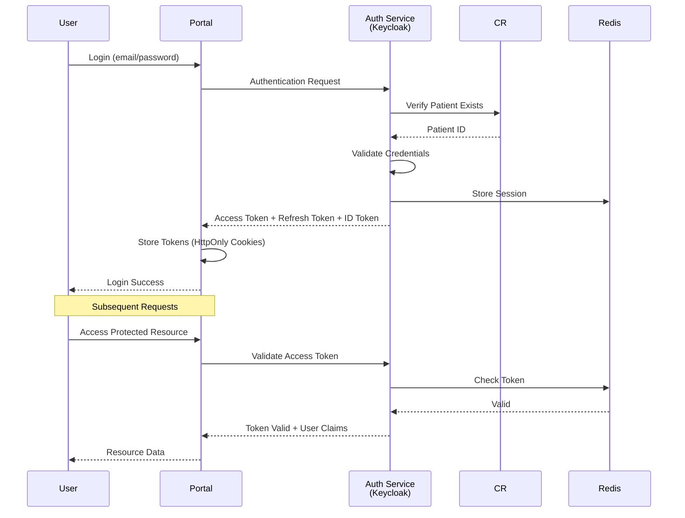
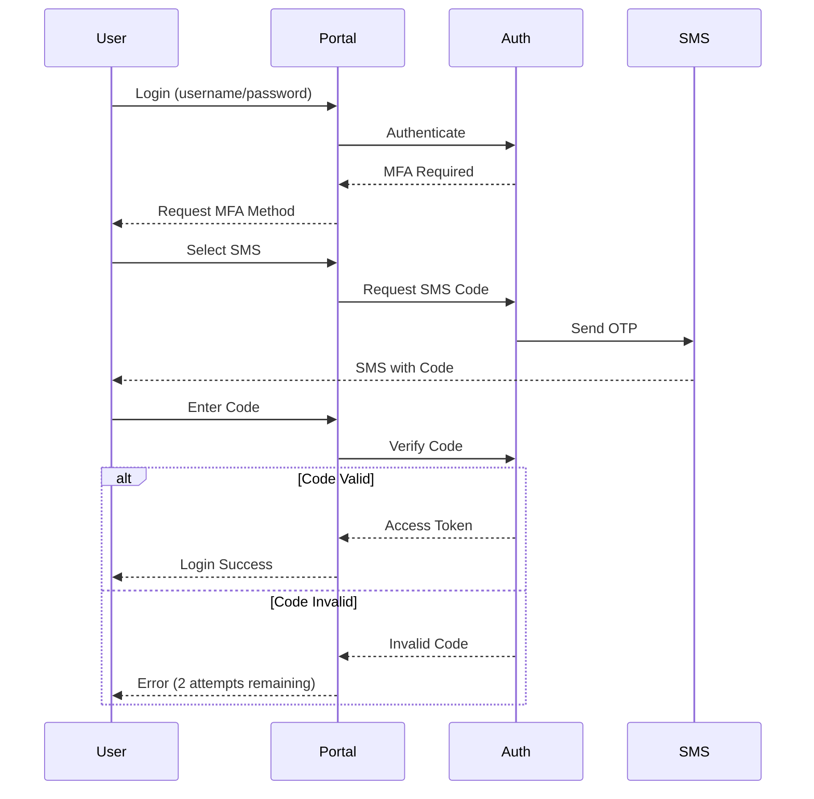
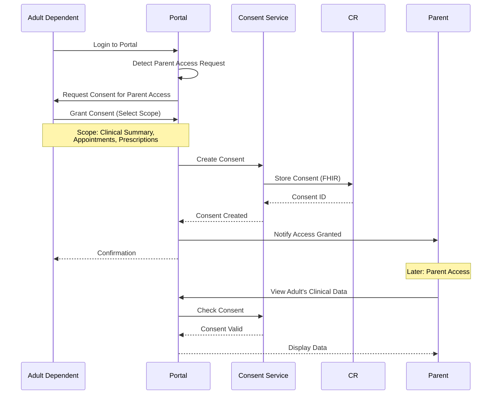

# Afya Yangu - Security & Privacy

## Overview

Security and privacy are foundational to the Afya Yangu, protecting sensitive health information while enabling appropriate access for care coordination.

**Principles**: Defense in depth, zero trust, least privilege, privacy by design, comprehensive audit logging.

---

## Authentication

### OAuth 2.0 + OpenID Connect Flow



### Token Structure

**Access Token (JWT)**:
```json
{
  "iss": "https://auth.afya-yangu.hie.example.com",
  "sub": "patient-123",
  "aud": ["afya-yangu-api"],
  "exp": 1700003600,
  "iat": 1700000000,
  "scope": "read:own_data write:own_profile manage:dependents",
  "patient_id": "patient-123",
  "national_id": "12345678",
  "email": "john.doe@example.com",
  "email_verified": true,
  "roles": ["patient"],
  "verification_level": 2
}
```

**ID Token (JWT)**:
```json
{
  "iss": "https://auth.afya-yangu.hie.example.com",
  "sub": "patient-123",
  "aud": "afya-yangu-web",
  "exp": 1700003600,
  "iat": 1700000000,
  "name": "John Juma",
  "given_name": "John",
  "family_name": "Doe",
  "email": "john.doe@example.com",
  "email_verified": true,
  "picture": "https://storage.example.com/profiles/patient-123.jpg"
}
```

**Refresh Token**:
- Opaque token (not JWT)
- Stored in Redis with 30-day TTL
- One-time use (rotated on refresh)
- Revocable

### Multi-Factor Authentication (MFA)

**Supported Methods**:
1. **SMS OTP**: 6-digit code, 10-minute validity
2. **Email OTP**: 6-digit code, 10-minute validity
3. **TOTP Authenticator App**: Google Authenticator, Authy
4. **Biometric** (Mobile): Fingerprint, Face ID

**MFA Flow**:


### Biometric Authentication (Mobile)

```typescript
async function authenticateWithBiometric(): Promise<boolean> {
  // Check if biometric is available
  const biometricType = await LocalAuthentication.supportedAuthenticationTypesAsync();
  
  if (biometricType.length === 0) {
    throw new Error('Biometric authentication not available');
  }
  
  // Authenticate
  const result = await LocalAuthentication.authenticateAsync({
    promptMessage: 'Authenticate to access Afya Yangu',
    fallbackLabel: 'Use PIN',
    disableDeviceFallback: false
  });
  
  if (result.success) {
    // Retrieve stored refresh token from secure storage
    const refreshToken = await SecureStore.getItemAsync('refresh_token');
    
    // Exchange for new access token
    const tokens = await authService.refreshAccessToken(refreshToken);
    
    return true;
  }
  
  return false;
}
```

---

## Authorization

### Role-Based Access Control (RBAC)

**Roles**:
- `patient` - Standard patient access
- `guardian` - Access to minor dependents
- `delegate` - Authorized representative (power of attorney)

**Permissions**:
```typescript
enum Permission {
  READ_OWN_DATA = 'read:own_data',
  WRITE_OWN_PROFILE = 'write:own_profile',
  MANAGE_DEPENDENTS = 'manage:dependents',
  VIEW_DEPENDENT_DATA = 'view:dependent_data',
  ENROLL_INSURANCE = 'enroll:insurance',
  MANAGE_CONSENT = 'manage:consent',
  VIEW_CLINICAL_DATA = 'view:clinical_data',
  BOOK_APPOINTMENTS = 'book:appointments'
}

const rolePermissions = {
  patient: [
    Permission.READ_OWN_DATA,
    Permission.WRITE_OWN_PROFILE,
    Permission.MANAGE_DEPENDENTS,
    Permission.ENROLL_INSURANCE,
    Permission.MANAGE_CONSENT,
    Permission.VIEW_CLINICAL_DATA,
    Permission.BOOK_APPOINTMENTS
  ],
  guardian: [
    Permission.READ_OWN_DATA,
    Permission.VIEW_DEPENDENT_DATA,
    Permission.MANAGE_DEPENDENTS
  ]
};
```

### Attribute-Based Access Control (ABAC)

**Access Decision Factors**:
- User role
- Resource ownership
- Relationship to resource
- Consent status
- Time of access
- Location (IP geofencing for sensitive operations)

**Access Control Example**:
```typescript
function canAccessPatientData(
  requestingPatientId: string,
  targetPatientId: string,
  dataType: string,
  context: AccessContext
): boolean {
  // Rule 1: Always can access own data
  if (requestingPatientId === targetPatientId) {
    return true;
  }
  
  // Rule 2: Check family relationship
  const relationship = getFamilyRelationship(requestingPatientId, targetPatientId);
  
  if (!relationship) {
    return false;
  }
  
  // Rule 3: If target is minor, check guardian status
  const targetPatient = getPatient(targetPatientId);
  const isMinor = calculateAge(targetPatient.birthDate) < 18;
  
  if (isMinor && ['PARENT', 'GUARDIAN'].includes(relationship.type)) {
    return true;
  }
  
  // Rule 4: If target is adult, check consent
  const consent = getConsent(targetPatientId, requestingPatientId);
  
  if (!consent || consent.status !== 'ACTIVE') {
    return false;
  }
  
  // Rule 5: Check if data type is in consent scope
  if (!consent.scope.includes(dataType)) {
    return false;
  }
  
  // Rule 6: Check consent expiry
  if (consent.expiryDate && new Date() > consent.expiryDate) {
    return false;
  }
  
  return true;
}
```

---

## Consent Management

### FHIR Consent Resource

```json
POST https://cr.hie.example.com/fhir/Consent

{
  "resourceType": "Consent",
  "status": "active",
  "scope": {
    "coding": [{
      "system": "http://terminology.hl7.org/CodeSystem/consentscope",
      "code": "patient-privacy"
    }]
  },
  "category": [{
    "coding": [{
      "system": "http://loinc.org",
      "code": "59284-0",
      "display": "Patient Consent"
    }]
  }],
  "patient": {
    "reference": "Patient/patient-789",
    "display": "Mary Juma (18+ years)"
  },
  "dateTime": "2025-11-20",
  "performer": [{
    "reference": "Patient/patient-789",
    "display": "Mary Juma"
  }],
  "organization": [{
    "reference": "Organization/afya-yangu"
  }],
  "provision": {
    "type": "permit",
    "period": {
      "start": "2025-11-20",
      "end": "2026-11-20"
    },
    "actor": [{
      "role": {
        "coding": [{
          "system": "http://terminology.hl7.org/CodeSystem/v3-ParticipationType",
          "code": "IRCP",
          "display": "information recipient"
        }]
      },
      "reference": {
        "reference": "Patient/patient-123",
        "display": "John Juma (Parent)"
      }
    }],
    "action": [{
      "coding": [{
        "system": "http://terminology.hl7.org/CodeSystem/consentaction",
        "code": "access"
      }]
    }],
    "securityLabel": [{
      "system": "http://terminology.hl7.org/CodeSystem/v3-Confidentiality",
      "code": "N",
      "display": "normal"
    }],
    "data": [{
      "meaning": "instance",
      "reference": {
        "reference": "Patient/patient-789"
      }
    }]
  }
}
```

### Consent Workflow



---

## Data Protection

### Encryption at Rest

**Database Encryption**:
- PostgreSQL: Transparent Data Encryption (TDE)
- MongoDB: Encrypted Storage Engine
- Algorithm: AES-256-GCM

**File Storage Encryption**:
- S3/MinIO: Server-Side Encryption (SSE)
- Client-Side Encryption for highly sensitive data
- Key Management: AWS KMS / HashiCorp Vault

### Encryption in Transit

**TLS Configuration**:
```nginx
ssl_protocols TLSv1.3;
ssl_ciphers 'ECDHE-ECDSA-AES256-GCM-SHA384:ECDHE-RSA-AES256-GCM-SHA384';
ssl_prefer_server_ciphers on;
ssl_session_cache shared:SSL:10m;
ssl_session_timeout 10m;
```

**Certificate Management**:
- Auto-renewal via cert-manager + Let's Encrypt
- Certificate pinning for mobile apps
- HSTS headers enforced

### Sensitive Data Handling

**PII Masking in Logs**:
```typescript
function sanitizeForLogging(data: any): any {
  const sensitive = ['nationalId', 'email', 'phone', 'password'];
  
  return Object.keys(data).reduce((acc, key) => {
    if (sensitive.includes(key)) {
      acc[key] = maskValue(data[key]);
    } else {
      acc[key] = data[key];
    }
    return acc;
  }, {});
}

function maskValue(value: string): string {
  if (value.length <= 4) return '****';
  return value.slice(0, 2) + '****' + value.slice(-2);
}

// Usage
logger.info('User registration', sanitizeForLogging({
  nationalId: '12345678',  // Logged as: '12****78'
  email: 'john@example.com',  // Logged as: 'jo****om'
  name: 'John Juma'  // Not masked
}));
```

---

## Audit Logging (ATNA Compliant)

### Audit Event Types

```typescript
enum AuditEventType {
  USER_LOGIN = 'user_login',
  USER_LOGOUT = 'user_logout',
  FAILED_LOGIN = 'failed_login',
  PATIENT_DATA_ACCESS = 'patient_data_access',
  PROFILE_UPDATE = 'profile_update',
  DEPENDENT_ADDED = 'dependent_added',
  INSURANCE_ENROLLMENT = 'insurance_enrollment',
  CONSENT_GRANTED = 'consent_granted',
  CONSENT_REVOKED = 'consent_revoked',
  CLINICAL_DATA_VIEW = 'clinical_data_view',
  APPOINTMENT_BOOKED = 'appointment_booked',
  SENSITIVE_DATA_EXPORT = 'sensitive_data_export'
}
```

### FHIR AuditEvent Resource

```json
{
  "resourceType": "AuditEvent",
  "type": {
    "system": "http://terminology.hl7.org/CodeSystem/audit-event-type",
    "code": "rest",
    "display": "RESTful Operation"
  },
  "subtype": [{
    "system": "http://hl7.org/fhir/restful-interaction",
    "code": "read",
    "display": "read"
  }],
  "action": "R",
  "recorded": "2025-11-20T10:30:00Z",
  "outcome": "0",
  "agent": [{
    "type": {
      "coding": [{
        "system": "http://terminology.hl7.org/CodeSystem/extra-security-role-type",
        "code": "humanuser"
      }]
    },
    "who": {
      "identifier": {
        "system": "https://afya-yangu.hie.example.com",
        "value": "patient-123"
      },
      "display": "John Juma"
    },
    "requestor": true,
    "network": {
      "address": "192.168.1.100",
      "type": "2"
    }
  }],
  "source": {
    "site": "Afya Yangu",
    "observer": {
      "display": "Afya-Yangu-API"
    },
    "type": [{
      "system": "http://terminology.hl7.org/CodeSystem/security-source-type",
      "code": "4",
      "display": "Application Server"
    }]
  },
  "entity": [{
    "what": {
      "reference": "Patient/patient-456",
      "display": "Mary Juma (Dependent)"
    },
    "type": {
      "system": "http://terminology.hl7.org/CodeSystem/audit-entity-type",
      "code": "1",
      "display": "Person"
    },
    "role": {
      "system": "http://terminology.hl7.org/CodeSystem/object-role",
      "code": "1",
      "display": "Patient"
    }
  }]
}
```

### Audit Log Implementation

```typescript
class AuditLogger {
  async log(event: AuditEvent): Promise<void> {
    // Store in immutable audit database
    await auditDb.insert({
      eventId: event.eventId,
      eventType: event.eventType,
      timestamp: event.timestamp,
      userId: event.userId,
      patientId: event.patientId,
      action: event.action,
      resource: event.resource,
      outcome: event.outcome,
      ipAddress: event.ipAddress,
      userAgent: event.userAgent,
      metadata: event.metadata
    });
    
    // Also send to FHIR Audit Repository
    await fhirClient.create('AuditEvent', this.toFHIRAuditEvent(event));
    
    // Send to SIEM for security monitoring
    await siemClient.sendEvent(event);
  }
  
  async query(criteria: AuditQueryCriteria): Promise<AuditEvent[]> {
    // Only authorized users can query audit logs
    if (!criteria.requestingUser.hasRole('AUDITOR')) {
      throw new UnauthorizedError('Audit log access denied');
    }
    
    return await auditDb.query(criteria);
  }
}

// Usage
await auditLogger.log({
  eventType: AuditEventType.CLINICAL_DATA_VIEW,
  timestamp: new Date(),
  userId: 'patient-123',
  patientId: 'patient-456',
  action: 'READ',
  resource: 'Encounter/enc-789',
  outcome: 'SUCCESS',
  ipAddress: '192.168.1.100',
  userAgent: 'Mozilla/5.0...',
  metadata: {
    dataType: 'clinical_summary',
    relationship: 'PARENT'
  }
});
```

---

## Security Best Practices

### Rate Limiting

```typescript
const rateLimitConfig = {
  login: {
    windowMs: 15 * 60 * 1000,  // 15 minutes
    max: 5,  // 5 attempts
    message: 'Too many login attempts. Please try again in 15 minutes.'
  },
  api: {
    windowMs: 60 * 1000,  // 1 minute
    max: 60,  // 60 requests
    message: 'Rate limit exceeded. Please slow down.'
  },
  registration: {
    windowMs: 60 * 60 * 1000,  // 1 hour
    max: 3,  // 3 attempts
    message: 'Too many registration attempts.'
  }
};

app.use('/api/auth/login', rateLimit(rateLimitConfig.login));
app.use('/api/', rateLimit(rateLimitConfig.api));
```

### Session Management

**Session Timeout**:
- Absolute timeout: 12 hours
- Idle timeout: 30 minutes
- Refresh token rotation on use

**Session Termination Events**:
- Password change
- MFA enrollment/change
- User-initiated logout
- Security event (suspicious activity)

### Input Validation

```typescript
import { body, param, validationResult } from 'express-validator';

const validateRegistration = [
  body('nationalId').matches(/^\d{8}$/),
  body('email').isEmail().normalizeEmail(),
  body('phone').matches(/^\+254\d{9}$/),
  body('password').isStrongPassword({
    minLength: 8,
    minLowercase: 1,
    minUppercase: 1,
    minNumbers: 1,
    minSymbols: 1
  }),
  (req, res, next) => {
    const errors = validationResult(req);
    if (!errors.isEmpty()) {
      return res.status(400).json({ errors: errors.array() });
    }
    next();
  }
];

app.post('/api/registration', validateRegistration, registrationHandler);
```

### SQL Injection Prevention

```typescript
// Use parameterized queries
const user = await db.query(
  'SELECT * FROM users WHERE email = $1',
  [email]  // Parameters prevent injection
);

// ORM with prepared statements
const user = await User.findOne({
  where: { email }  // Sequelize uses parameterized queries
});
```

### XSS Prevention

```typescript
import DOMPurify from 'isomorphic-dompurify';

function sanitizeHtml(dirty: string): string {
  return DOMPurify.sanitize(dirty, {
    ALLOWED_TAGS: ['b', 'i', 'em', 'strong', 'p', 'br'],
    ALLOWED_ATTR: []
  });
}

// Usage
const cleanInput = sanitizeHtml(userInput);
```

---

## Incident Response

### Security Event Detection

```typescript
interface SecurityEvent {
  type: 'SUSPICIOUS_LOGIN' | 'DATA_BREACH' | 'UNAUTHORIZED_ACCESS' | 'ANOMALY';
  severity: 'LOW' | 'MEDIUM' | 'HIGH' | 'CRITICAL';
  userId?: string;
  patientId?: string;
  details: string;
  timestamp: Date;
}

async function detectAnomalies(event: AuditEvent): Promise<SecurityEvent[]> {
  const anomalies: SecurityEvent[] = [];
  
  // Check for multiple failed logins
  const recentFailures = await auditDb.count({
    userId: event.userId,
    eventType: 'FAILED_LOGIN',
    timestamp: { $gt: new Date(Date.now() - 15 * 60 * 1000) }
  });
  
  if (recentFailures >= 5) {
    anomalies.push({
      type: 'SUSPICIOUS_LOGIN',
      severity: 'HIGH',
      userId: event.userId,
      details: `${recentFailures} failed login attempts in 15 minutes`,
      timestamp: new Date()
    });
  }
  
  // Check for unusual access patterns
  const normalHours = await getUserNormalAccessHours(event.userId);
  const currentHour = new Date().getHours();
  
  if (!normalHours.includes(currentHour)) {
    anomalies.push({
      type: 'ANOMALY',
      severity: 'MEDIUM',
      userId: event.userId,
      details: `Access outside normal hours (${currentHour}:00)`,
      timestamp: new Date()
    });
  }
  
  return anomalies;
}
```

### Automated Response

```typescript
async function handleSecurityEvent(event: SecurityEvent): Promise<void> {
  switch (event.severity) {
    case 'CRITICAL':
      // Immediate account lockout
      await lockAccount(event.userId);
      // Alert security team
      await alertSecurityTeam(event);
      // Notify user
      await notifyUser(event.userId, 'ACCOUNT_LOCKED');
      break;
      
    case 'HIGH':
      // Require MFA on next login
      await enableForcedMFA(event.userId);
      // Alert security team
      await alertSecurityTeam(event);
      break;
      
    case 'MEDIUM':
      // Log for review
      await logSecurityEvent(event);
      break;
      
    case 'LOW':
      // Monitor only
      await incrementAnomalyCounter(event.userId);
      break;
  }
}
```

---

## Compliance

### Data Retention

| Data Type | Retention Period | Deletion Method |
|-----------|------------------|-----------------|
| Audit Logs | 7 years | Secure deletion |
| Clinical Data Access Logs | 7 years | Secure deletion |
| Session Logs | 90 days | Automatic purge |
| Failed Login Attempts | 30 days | Automatic purge |
| Consent Records | 10 years | Archived |

### Right to Access (GDPR)

```typescript
async function generatePatientDataExport(patientId: string): Promise<DataExport> {
  return {
    personalData: await getPatientDemographics(patientId),
    familyMembers: await getFamilyMembers(patientId),
    insuranceEnrollments: await getInsuranceEnrollments(patientId),
    clinicalData: await getClinicalData(patientId),
    consents: await getConsents(patientId),
    auditLog: await getPatientAuditLog(patientId),
    exportDate: new Date()
  };
}
```

### Right to Erasure

```typescript
async function deletePatientData(patientId: string, reason: string): Promise<void> {
  // Cannot delete if active insurance enrollment
  const activeEnrollments = await getActiveEnrollments(patientId);
  if (activeEnrollments.length > 0) {
    throw new Error('Cannot delete data with active insurance enrollment');
  }
  
  // Anonymize instead of delete (legal requirement for audit logs)
  await anonymizePatient(patientId);
  
  // Log deletion
  await auditLogger.log({
    eventType: 'DATA_DELETION',
    patientId,
    reason,
    timestamp: new Date()
  });
}
```

---

**End of Afya Yangu Documentation**
