# Architectural Considerations

## Overview

This document outlines the cross-cutting architectural concerns, integration patterns, technology stack, and design principles that apply across all three HIE support applications (Practice360, Facility360, and Compliance360). These considerations ensure consistency, interoperability, and maintainability across the entire ecosystem.

---

## Table of Contents

1. [Core Architectural Principles](#core-architectural-principles)
2. [Integration with OpenHIE Components](#integration-with-openhie-components)
3. [Integration Patterns](#integration-patterns)
4. [Data Management Strategy](#data-management-strategy)
5. [Security Architecture](#security-architecture)
6. [Technology Stack](#technology-stack)
7. [Deployment Architecture](#deployment-architecture)
8. [Performance & Scalability](#performance--scalability)
9. [Monitoring & Observability](#monitoring--observability)
10. [Disaster Recovery & Business Continuity](#disaster-recovery--business-continuity)

---

## Core Architectural Principles

### 1. Interoperability First

**Principle**: All applications must be OpenHIE-compliant and support seamless data exchange using international standards.

**Implementation**:
- HL7 FHIR R4 as the primary data exchange format
- Support for IHE profiles (PIX, PDQ, XDS, ATNA, XUA)
- RESTful APIs with JSON payloads for synchronous communication
- Event-driven architecture for asynchronous communication
- Standard terminologies (SNOMED CT, ICD-10, LOINC, RxNorm)

**Benefits**:
- Seamless integration with existing health systems
- Future-proof architecture supporting new integrations
- Reduced vendor lock-in
- International best practices compliance

### 2. Microservices Architecture

**Principle**: Applications are composed of loosely-coupled, independently deployable microservices.

**Implementation**:
- Domain-driven design for service boundaries
- Each microservice owns its data store (database per service pattern)
- API Gateway pattern for client-facing APIs
- Service mesh for inter-service communication
- Independent scaling of services based on load

**Benefits**:
- Independent deployment and scaling
- Technology diversity where appropriate
- Fault isolation and resilience
- Easier maintenance and updates

### 3. Event-Driven Integration

**Principle**: Systems communicate through events to achieve loose coupling and eventual consistency.

**Implementation**:
- Message queue (Kafka/RabbitMQ) for event streaming
- Event sourcing for critical workflows
- Pub/Sub pattern for broadcasting events
- Saga pattern for distributed transactions
- Dead letter queues for failed message handling

**Benefits**:
- Loose coupling between systems
- Asynchronous processing for better performance
- Scalability through horizontal scaling
- Audit trail through event history

### 4. API-First Design

**Principle**: All functionality is exposed through well-documented, versioned APIs.

**Implementation**:
- OpenAPI/Swagger specifications for all APIs
- RESTful API design principles
- GraphQL for complex data queries (where appropriate)
- API versioning (URI versioning: /v1/, /v2/)
- Backward compatibility for at least two versions

**Benefits**:
- Clear contracts between systems
- Easier integration for third parties
- Self-documenting APIs
- Parallel development of frontend and backend

### 5. Security by Design

**Principle**: Security is built into every layer of the architecture, not added as an afterthought.

**Implementation**:
- Defense in depth strategy
- Zero-trust network model
- Encryption at rest and in transit (TLS 1.3)
- Comprehensive audit logging (ATNA compliant)
- Regular security assessments and penetration testing

**Benefits**:
- Protection of sensitive health data
- Regulatory compliance (HIPAA, GDPR, local laws)
- Reduced security vulnerabilities
- Patient and practitioner privacy protection

### 6. Cloud-Native Design

**Principle**: Applications are designed to leverage cloud infrastructure capabilities for scalability and resilience.

**Implementation**:
- Container-based deployment (Docker)
- Container orchestration (Kubernetes)
- Stateless application design where possible
- Horizontal scaling through replicas
- Use of managed cloud services (databases, message queues)

**Benefits**:
- Elastic scalability
- High availability
- Cost optimization through auto-scaling
- Portable across cloud providers

---

## Integration with OpenHIE Components

### OpenHIE Architecture Overview

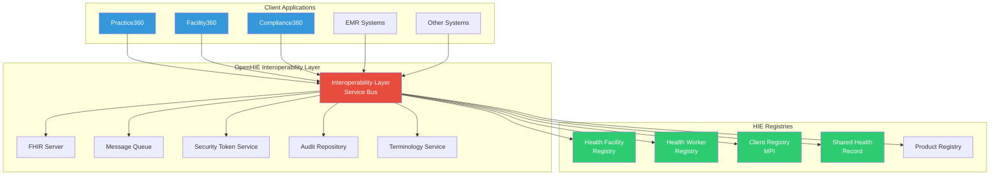

### Health Facility Registry (HFR) Integration

**Purpose**: Authoritative source for facility master data, locations, services, and licensing information.

**FHIR Resources Used**:
- `Organization` - Facility details
- `Location` - Physical locations and service delivery points
- `HealthcareService` - Services offered at facilities

**Integration Patterns**:

| Application | Integration Type | Operations | Frequency |
|-------------|-----------------|------------|-----------|
| Practice360 | Read-only | Query facility details, validate facility codes | Real-time |
| Facility360 | Bidirectional | Create/update facilities, sync master data | Real-time + Batch |
| Compliance360 | Write (Authoritative) | Update license status, compliance ratings | Real-time |

**Key Workflows**:
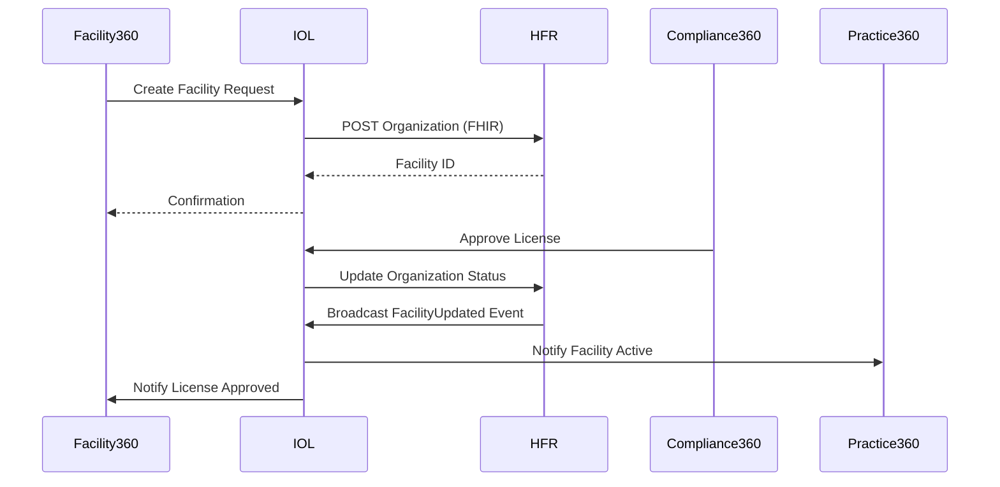

### Health Worker Registry (HCWR) Integration

**Purpose**: Authoritative source for practitioner credentials, qualifications, licenses, and professional information.

**FHIR Resources Used**:
- `Practitioner` - Practitioner demographics and identifiers
- `PractitionerRole` - Roles, specializations, and facility associations
- `Qualification` - Education, training, certifications

**Integration Patterns**:

| Application | Integration Type | Operations | Frequency |
|-------------|-----------------|------------|-----------|
| Practice360 | Read-only | Validate credentials, retrieve license status | Real-time |
| Facility360 | Read + Limited Write | Query practitioners, associate with facilities | Real-time |
| Compliance360 | Write (Authoritative) | Update license status, disciplinary actions | Real-time |

**Key Workflows**:
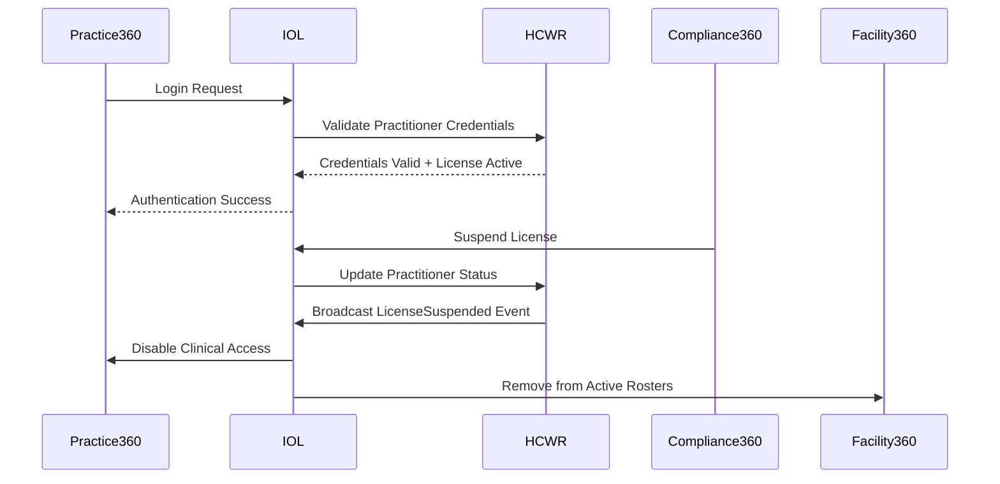

### Client Registry (CR) Integration

**Purpose**: Master Patient Index (MPI) for patient identification and demographic queries.

**FHIR Resources Used**:
- `Patient` - Patient demographics and identifiers
- `RelatedPerson` - Next of kin, guardians

**Integration Patterns**:

| Application | Integration Type | Operations | Frequency |
|-------------|-----------------|------------|-----------|
| Practice360 | Read-only | Patient demographic queries (PDQ), identity matching | Real-time |
| Facility360 | None | No direct integration | N/A |
| Compliance360 | None | No direct integration | N/A |

**Key Workflows**:
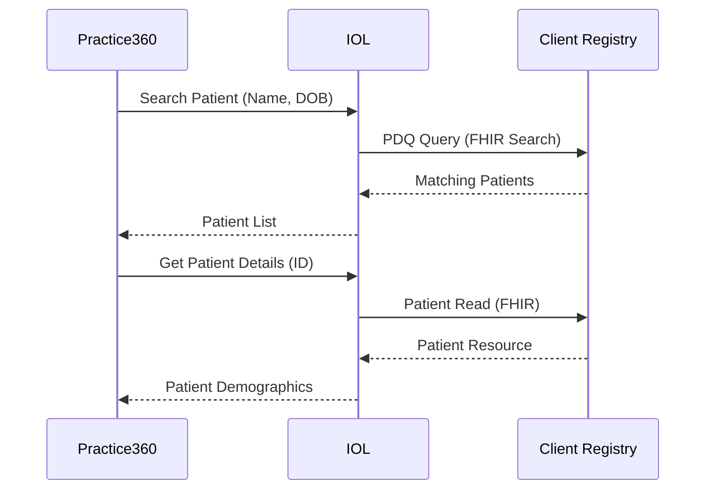

### Shared Health Record (SHR) Integration

**Purpose**: Longitudinal health record repository for clinical documents and encounters.

**FHIR Resources Used**:
- `Encounter` - Clinical encounters
- `Observation` - Lab results, vital signs
- `DiagnosticReport` - Lab and imaging reports
- `MedicationRequest` - Prescriptions
- `Condition` - Diagnoses

**Integration Patterns**:

| Application | Integration Type | Operations | Frequency |
|-------------|-----------------|------------|-----------|
| Practice360 | Read + Write | Access patient records, submit encounters | Real-time |
| Facility360 | None | No direct integration | N/A |
| Compliance360 | Read-only | Audit access for investigations | As needed |

---

## Integration Patterns

### Pattern 1: Synchronous Request-Response

**When to Use**:
- Real-time validation required (license checks, credential verification)
- Interactive user operations requiring immediate feedback
- Transactional operations requiring immediate consistency
- Simple queries with minimal data transfer

**Protocol**: REST APIs over HTTPS with JSON payloads

**Example**:
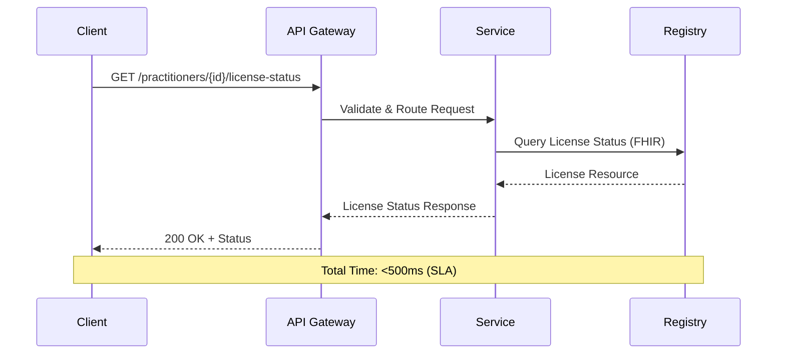

**Characteristics**:
- **Latency**: <500ms for 95th percentile
- **Timeout**: 5 seconds max
- **Retry**: Idempotent operations only, exponential backoff
- **Error Handling**: Synchronous error responses with problem details (RFC 7807)

**Best Practices**:
- Implement circuit breakers to prevent cascade failures
- Use caching for frequently accessed, slowly-changing data
- Set appropriate timeouts to prevent thread pool exhaustion
- Implement idempotency for state-changing operations using idempotency keys

### Pattern 2: Asynchronous Event-Driven

**When to Use**:
- Broadcasting state changes to multiple subscribers
- Non-time-critical operations (notifications, analytics)
- Bulk data synchronization
- Operations requiring eventual consistency

**Protocol**: Message queue (Kafka/RabbitMQ) with event payloads

**Example**:
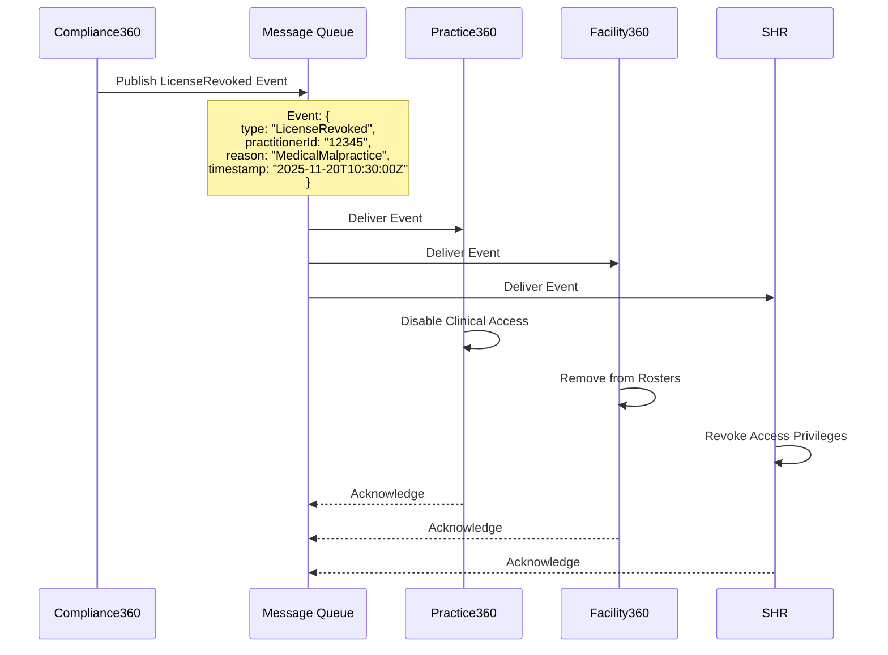

**Characteristics**:
- **Delivery**: At-least-once delivery guarantee
- **Ordering**: Ordered within a partition/topic
- **Durability**: Messages persisted to disk
- **Retention**: Configurable (typically 7-30 days)

**Event Schema Example**:
```json
{
  "eventId": "evt_abc123",
  "eventType": "LicenseStatusChanged",
  "timestamp": "2025-11-20T10:30:00Z",
  "source": "compliance360",
  "data": {
    "practitionerId": "pract_12345",
    "previousStatus": "active",
    "newStatus": "revoked",
    "reason": "Medical malpractice investigation concluded",
    "effectiveDate": "2025-11-20",
    "affectedFacilities": ["fac_001", "fac_002"]
  },
  "metadata": {
    "correlationId": "corr_xyz789",
    "initiatedBy": "officer_456",
    "regulatorId": "reg_medical_board"
  }
}
```

**Best Practices**:
- Use dead letter queues for failed message processing
- Implement idempotent consumers (messages may be delivered multiple times)
- Include correlation IDs for distributed tracing
- Version event schemas for backward compatibility
- Monitor queue depth and consumer lag

### Pattern 3: Batch Processing

**When to Use**:
- Large dataset processing (analytics, reports)
- Non-time-critical operations (nightly aggregations)
- Resource-intensive operations (data warehouse updates)
- Scheduled maintenance tasks

**Implementation**: Scheduled jobs (Kubernetes CronJobs, Apache Airflow)

**Example**:
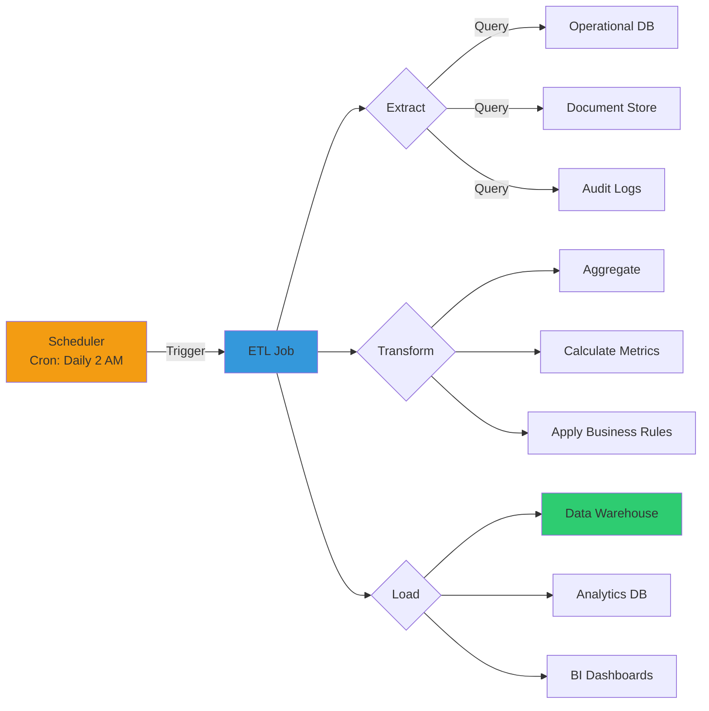

**Characteristics**:
- **Schedule**: Configurable (hourly, daily, weekly)
- **Concurrency**: Limited to prevent resource exhaustion
- **Error Handling**: Retry failed batches, alert on repeated failures
- **Monitoring**: Track job duration, success rate, data quality

**Best Practices**:
- Run during off-peak hours to minimize impact
- Implement checkpointing for resumability
- Validate data quality before loading
- Monitor resource utilization (CPU, memory, I/O)
- Implement alerting for job failures

### Pattern 4: Backend for Frontend (BFF)

**When to Use**:
- Different client types with different data needs (mobile vs web)
- Reducing chattiness between client and microservices
- Aggregating data from multiple microservices
- Client-specific security or caching requirements

**Implementation**: Dedicated API Gateway per client type

**Example**:
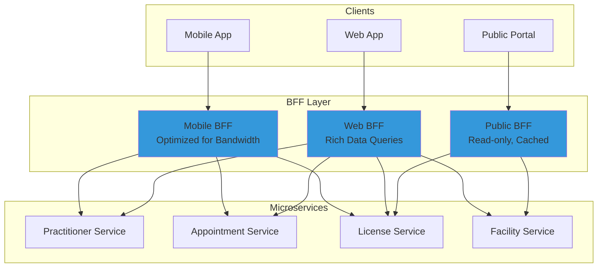

**Benefits**:
- Reduced network chattiness (single API call vs multiple)
- Client-optimized data formats and payloads
- Better separation of concerns
- Independent evolution of client and backend

---

## Data Management Strategy

### Database Per Service Pattern

**Principle**: Each microservice owns its database and no other service can access it directly.

**Implementation**:
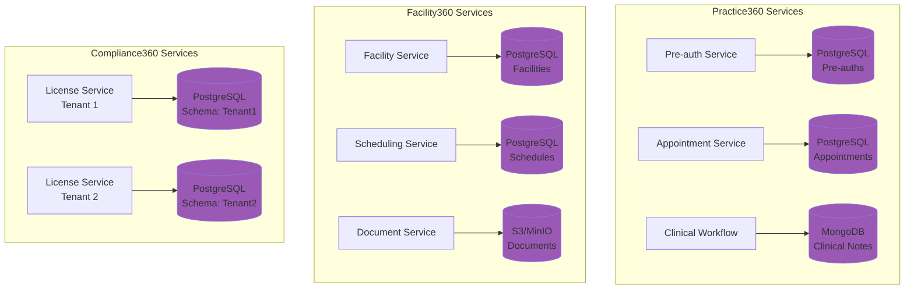

**Benefits**:
- Service independence and autonomy
- Technology diversity (use the right tool for the job)
- Scalability (scale databases independently)
- Fault isolation (database issues don't affect other services)

**Challenges & Solutions**:
- **Challenge**: Joins across services not possible
  - **Solution**: Denormalize data, use CQRS pattern for read models
- **Challenge**: Distributed transactions
  - **Solution**: Saga pattern for coordinating multi-service transactions
- **Challenge**: Data consistency
  - **Solution**: Eventual consistency via events, compensating transactions

### Data Synchronization Strategy

**Authoritative Sources**:
- **HFR**: Facility master data, locations, license status
- **HCWR**: Practitioner credentials, qualifications, license status
- **Compliance360**: Regulatory decisions (license approvals, sanctions)
- **Practice360**: Practitioner availability, shift preferences
- **Facility360**: Facility operational data, shift schedules

**Synchronization Patterns**:

1. **Real-time Sync** (Critical Data):
   - License status changes
   - Facility activations/suspensions
   - Practitioner credential revocations
   - Implementation: Event-driven via message queue

2. **Periodic Sync** (Master Data):
   - Facility details (nightly)
   - Practitioner qualifications (nightly)
   - Terminology updates (weekly)
   - Implementation: Scheduled ETL jobs

3. **On-Demand Sync** (User-Triggered):
   - Manual refresh of practitioner profile
   - Facility details refresh
   - Implementation: REST API calls

**Conflict Resolution**:
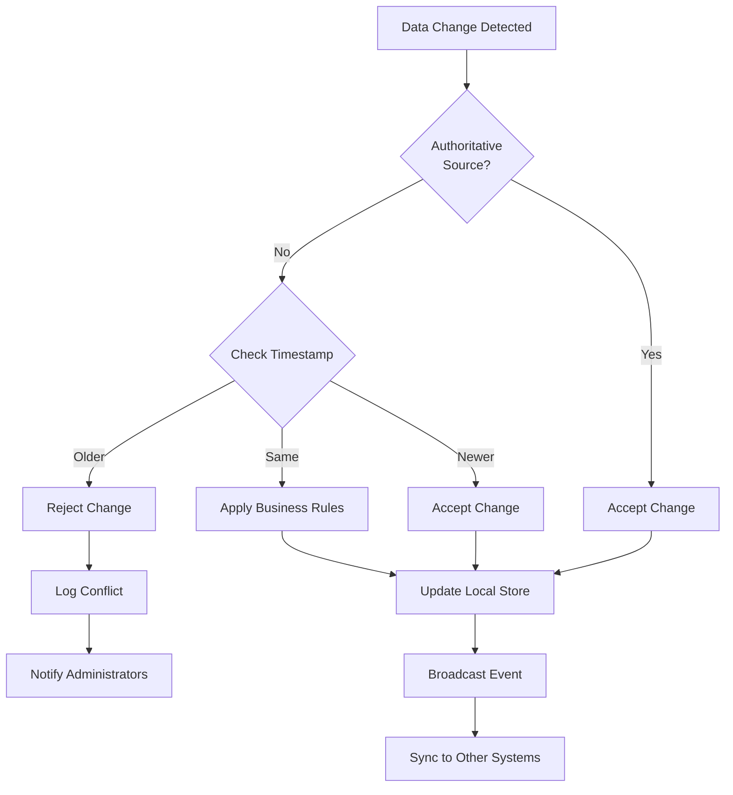

### Caching Strategy

**Cache Layers**:

1. **Application Cache** (Redis):
   - Session data (TTL: 30 minutes)
   - Frequently accessed reference data (TTL: 1 hour)
   - API response cache for expensive queries (TTL: 5 minutes)

2. **CDN Cache** (CloudFront/Cloudflare):
   - Static assets (HTML, CSS, JS, images)
   - Public API responses (license verification)
   - TTL: 24 hours with cache invalidation on updates

3. **Database Query Cache**:
   - PostgreSQL query cache
   - MongoDB WiredTiger cache
   - Managed by database engine

**Cache Invalidation**:
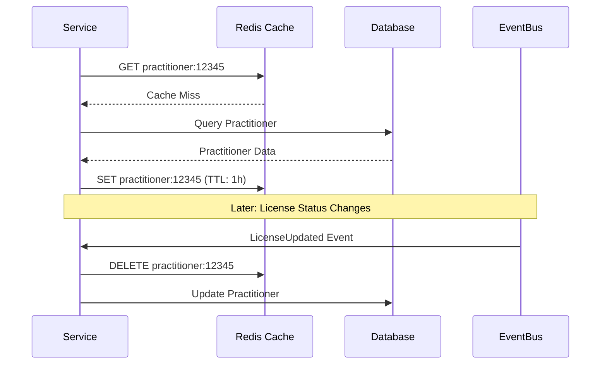

**Best Practices**:
- Use cache-aside pattern for application cache
- Implement cache warming for predictable load
- Monitor cache hit ratio (target: >85%)
- Set appropriate TTLs based on data volatility
- Implement circuit breakers to prevent cache stampede

---

## Security Architecture

### Defense in Depth Strategy

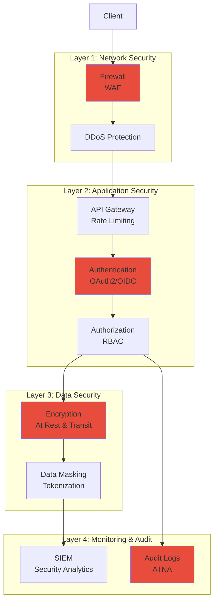

### Authentication & Authorization

**Authentication** (Who you are):

Protocol: **OAuth 2.0 + OpenID Connect**

**Flows by Application**:

| Application | User Type | OAuth Flow | Token Type |
|-------------|-----------|------------|------------|
| Practice360 Mobile | Practitioners | Authorization Code + PKCE | JWT |
| Practice360 Web | Practitioners | Authorization Code | JWT |
| Facility360 Web | Administrators | Authorization Code | JWT |
| Compliance360 Web | Regulators | Authorization Code | JWT |
| API Integrations | Systems | Client Credentials | JWT |

**Token Structure**:
```json
{
  "iss": "https://auth.hie.example.com",
  "sub": "pract_12345",
  "aud": ["practice360", "hfr", "hcwr"],
  "exp": 1700000000,
  "iat": 1699999000,
  "scope": "read:patients write:encounters",
  "roles": ["physician", "department_head"],
  "facility_id": "fac_001",
  "license_status": "active"
}
```

**Authorization** (What you can do):

Model: **Role-Based Access Control (RBAC) + Attribute-Based Access Control (ABAC)**

**Roles by Application**:

**Practice360**:
- `practitioner_basic`: View schedules, appointments
- `practitioner_clinical`: Access patient records, document encounters
- `specialist`: Additional privileges for specialty procedures
- `department_head`: Manage department staff, approve requests

**Facility360**:
- `facility_viewer`: Read-only access to facility data
- `facility_admin`: Manage facility details, staff assignments
- `hr_officer`: Manage workforce, credentials
- `facility_director`: Full access, approve license applications

**Compliance360**:
- `licensing_officer`: Process license applications
- `inspector`: Schedule and conduct inspections
- `enforcement_officer`: Issue sanctions, suspend licenses
- `regulator_admin`: Full access, configure workflows
- `public_user`: Verify licenses only

**Permission Examples**:
```yaml
roles:
  practitioner_clinical:
    permissions:
      - read:patient_demographics
      - read:clinical_history
      - write:encounter
      - write:prescription
    conditions:
      - license_status == "active"
      - facility_privileges.contains(patient.facility_id)
      
  facility_admin:
    permissions:
      - read:facility_details
      - write:facility_details
      - read:staff_roster
      - write:staff_assignments
    conditions:
      - user.facility_id == resource.facility_id
      
  licensing_officer:
    permissions:
      - read:applications
      - write:application_decision
      - read:facility_registry
      - write:license_status
    conditions:
      - user.regulator_id == application.regulator_id
```

### Encryption Strategy

**Data in Transit**:
- **TLS 1.3** for all HTTPS connections
- **mTLS** for service-to-service communication
- Cipher suites: ECDHE-RSA-AES256-GCM-SHA384, ECDHE-RSA-CHACHA20-POLY1305
- Certificate management via cert-manager + Let's Encrypt

**Data at Rest**:
- **Database encryption**: Transparent Data Encryption (TDE)
  - PostgreSQL: pgcrypto extension
  - MongoDB: Encrypted Storage Engine
- **File storage encryption**: AES-256
  - S3/MinIO: Server-side encryption (SSE)
- **Backup encryption**: Encrypted backups with key rotation

**Key Management**:
- **Cloud KMS** (AWS KMS, Google Cloud KMS, Azure Key Vault)
- **Vault** (HashiCorp Vault) for secrets management
- Key rotation policy: Every 90 days
- Separate keys per environment (dev, staging, production)

### Audit Logging (ATNA Compliance)

**Audit Events** (IHE ATNA Profile):

| Event Category | Examples | Retention |
|----------------|----------|-----------|
| Authentication | Login, logout, failed attempts | 7 years |
| Authorization | Permission denied, role changes | 7 years |
| Data Access | View patient record, query registry | 7 years |
| Data Modification | Update license, revoke credential | 10 years |
| System Administration | User creation, config changes | 10 years |
| Security Events | Intrusion attempts, anomalies | 7 years |

**Audit Log Format** (FHIR AuditEvent):
```json
{
  "resourceType": "AuditEvent",
  "type": {
    "system": "http://terminology.hl7.org/CodeSystem/audit-event-type",
    "code": "rest",
    "display": "RESTful Operation"
  },
  "subtype": [{
    "system": "http://hl7.org/fhir/restful-interaction",
    "code": "read",
    "display": "read"
  }],
  "action": "R",
  "recorded": "2025-11-20T10:30:00Z",
  "outcome": "0",
  "agent": [{
    "type": {
      "coding": [{
        "system": "http://terminology.hl7.org/CodeSystem/extra-security-role-type",
        "code": "humanuser"
      }]
    },
    "who": {
      "identifier": {
        "system": "https://hcwr.example.com",
        "value": "pract_12345"
      },
      "display": "Dr. Jane Smith"
    },
    "requestor": true
  }],
  "source": {
    "site": "Practice360 Mobile",
    "observer": {
      "display": "Practice360-API-Gateway"
    },
    "type": [{
      "system": "http://terminology.hl7.org/CodeSystem/security-source-type",
      "code": "4",
      "display": "Application Server"
    }]
  },
  "entity": [{
    "what": {
      "reference": "Patient/pat_67890"
    },
    "type": {
      "system": "http://terminology.hl7.org/CodeSystem/audit-entity-type",
      "code": "1",
      "display": "Person"
    },
    "role": {
      "system": "http://terminology.hl7.org/CodeSystem/object-role",
      "code": "1",
      "display": "Patient"
    }
  }]
}
```

**Audit Log Storage**:
- **Primary**: Dedicated audit database (immutable, append-only)
- **Secondary**: SIEM system for analysis and alerting
- **Backup**: Encrypted, tamper-proof backups in WORM storage

---

## Technology Stack

### Core Technologies

#### Programming Languages

| Language | Use Case | Rationale |
|----------|----------|-----------|
| **Node.js (TypeScript)** | API services, real-time features | Fast development, event-driven, large ecosystem |
| **Java (Spring Boot)** | Complex business logic, batch processing | Enterprise maturity, strong typing, performance |
| **Python** | Data processing, ML/AI, ETL jobs | Rich libraries, data science ecosystem |
| **Go** | High-performance services, system utilities | Performance, concurrency, small footprint |

#### Frontend Technologies

| Technology | Use Case | Rationale |
|------------|----------|-----------|
| **React** | Web applications | Component-based, large ecosystem, performance |
| **React Native** | Mobile applications (iOS/Android) | Cross-platform, code reuse, native performance |
| **Angular** | Enterprise admin portals | Full-featured framework, TypeScript native |
| **Tailwind CSS** | Styling | Utility-first, rapid development, consistency |

#### Databases

| Database | Use Case | Rationale |
|----------|----------|-----------|
| **PostgreSQL** | Transactional data, relational data | ACID compliance, JSON support, mature |
| **MongoDB** | Document storage, flexible schemas | Schema flexibility, horizontal scaling |
| **Redis** | Caching, session storage, rate limiting | In-memory performance, rich data structures |
| **TimescaleDB** | Time-series data (metrics, logs) | Time-series optimization, PostgreSQL compatible |

#### Message Queue / Event Streaming

| Technology | Use Case | Rationale |
|------------|----------|-----------|
| **Apache Kafka** | Event streaming, high-throughput messaging | Durability, scalability, replay capability |
| **RabbitMQ** | Task queues, request-response patterns | AMQP standard, routing flexibility |

#### Search & Analytics

| Technology | Use Case | Rationale |
|------------|----------|-----------|
| **Elasticsearch** | Full-text search, log analytics | Powerful search, aggregations, scalable |
| **Apache Spark** | Big data processing, ETL | Distributed processing, SQL support |

#### Object Storage

| Technology | Use Case | Rationale |
|------------|----------|-----------|
| **MinIO** | On-premise object storage | S3-compatible, self-hosted, high performance |
| **AWS S3 / GCS / Azure Blob** | Cloud object storage | Managed, durable, scalable |

### Infrastructure & DevOps

#### Container & Orchestration

| Technology | Purpose |
|------------|---------|
| **Docker** | Application containerization |
| **Kubernetes** | Container orchestration |
| **Helm** | Kubernetes package management |
| **Istio** | Service mesh (traffic management, security) |

#### CI/CD

| Technology | Purpose |
|------------|---------|
| **GitLab CI / Jenkins** | Build and deployment pipelines |
| **ArgoCD** | GitOps continuous deployment |
| **SonarQube** | Code quality and security scanning |
| **Trivy** | Container vulnerability scanning |

#### Monitoring & Observability

| Technology | Purpose |
|------------|---------|
| **Prometheus** | Metrics collection and alerting |
| **Grafana** | Metrics visualization and dashboards |
| **ELK Stack (Elasticsearch, Logstash, Kibana)** | Log aggregation and analysis |
| **Jaeger** | Distributed tracing |
| **Sentry** | Error tracking and alerting |

#### Security

| Technology | Purpose |
|------------|---------|
| **HashiCorp Vault** | Secrets management |
| **cert-manager** | Certificate management (Let's Encrypt) |
| **Keycloak / Auth0** | Identity and access management (OAuth2/OIDC) |
| **Falco** | Runtime security monitoring |

### Technology Stack Diagram

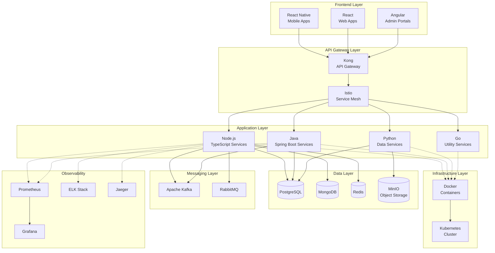

---

## Deployment Architecture

### Kubernetes Deployment

**Cluster Configuration**:
- **Multi-AZ Deployment**: 3 availability zones for high availability
- **Node Pools**:
  - **Application Pool**: 10-50 nodes (auto-scaling), 8 vCPU, 32 GB RAM each
  - **Data Pool**: 5-10 nodes (stateful sets), 16 vCPU, 64 GB RAM, SSD storage
  - **Job Pool**: 5-20 nodes (spot instances), for batch jobs
- **Network**: Calico CNI for network policies
- **Ingress**: NGINX Ingress Controller with TLS termination

**Namespace Strategy**:
```
hie-cluster/
├── practice360-prod/          # Practice360 production
├── practice360-staging/       # Practice360 staging
├── facility360-prod/          # Facility360 production
├── facility360-staging/       # Facility360 staging
├── compliance360-prod/        # Compliance360 production (multi-tenant)
├── compliance360-staging/     # Compliance360 staging
├── openhie-core/              # OpenHIE components (IOL, FHIR, etc.)
├── hie-registries/            # HFR, HCWR, CR, SHR
├── shared-services/           # E-Learning, Payment Gateway, etc.)
├── monitoring/                # Prometheus, Grafana, ELK
└── security/                  # Vault, Keycloak, cert-manager
```

**Resource Quotas** (per namespace):
```yaml
apiVersion: v1
kind: ResourceQuota
metadata:
  name: practice360-prod-quota
  namespace: practice360-prod
spec:
  hard:
    requests.cpu: "50"
    requests.memory: 100Gi
    limits.cpu: "100"
    limits.memory: 200Gi
    persistentvolumeclaims: "10"
    pods: "100"
```

### Deployment Strategies

**Rolling Update** (Default):
```yaml
strategy:
  type: RollingUpdate
  rollingUpdate:
    maxUnavailable: 1
    maxSurge: 1
```
- **Use Case**: Standard deployments, low-risk changes
- **Downtime**: Zero downtime
- **Rollback**: Automated on health check failures

**Blue-Green Deployment**:
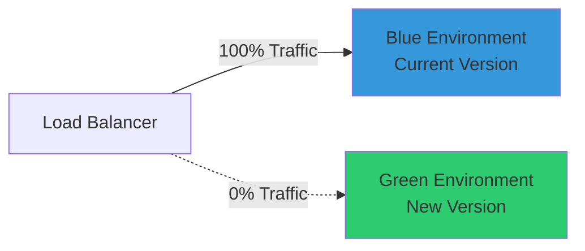
- **Use Case**: Major releases, database migrations
- **Downtime**: Zero downtime
- **Rollback**: Instant (switch traffic back)

**Canary Deployment**:
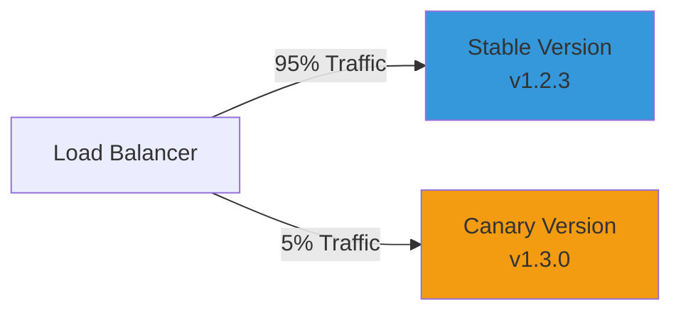
- **Use Case**: High-risk changes, testing in production
- **Downtime**: Zero downtime
- **Rollback**: Gradual (reduce canary traffic to 0%)

### Auto-Scaling Configuration

**Horizontal Pod Autoscaler (HPA)**:
```yaml
apiVersion: autoscaling/v2
kind: HorizontalPodAutoscaler
metadata:
  name: practice360-api-hpa
spec:
  scaleTargetRef:
    apiVersion: apps/v1
    kind: Deployment
    name: practice360-api
  minReplicas: 3
  maxReplicas: 20
  metrics:
  - type: Resource
    resource:
      name: cpu
      target:
        type: Utilization
        averageUtilization: 70
  - type: Resource
    resource:
      name: memory
      target:
        type: Utilization
        averageUtilization: 80
  behavior:
    scaleDown:
      stabilizationWindowSeconds: 300  # 5 minutes
      policies:
      - type: Percent
        value: 50
        periodSeconds: 60
    scaleUp:
      stabilizationWindowSeconds: 0
      policies:
      - type: Percent
        value: 100
        periodSeconds: 30
```

**Cluster Autoscaler**:
- Automatically adds/removes nodes based on pending pods
- Min nodes: 10, Max nodes: 50
- Scale-up triggers: Pods pending for >30 seconds
- Scale-down triggers: Node utilization <50% for >10 minutes

### High Availability Configuration

**Pod Disruption Budget**:
```yaml
apiVersion: policy/v1
kind: PodDisruptionBudget
metadata:
  name: practice360-api-pdb
spec:
  minAvailable: 2
  selector:
    matchLabels:
      app: practice360-api
```

**Pod Anti-Affinity** (spread across zones):
```yaml
affinity:
  podAntiAffinity:
    requiredDuringSchedulingIgnoredDuringExecution:
    - labelSelector:
        matchExpressions:
        - key: app
          operator: In
          values:
          - practice360-api
      topologyKey: topology.kubernetes.io/zone
```

---

## Performance & Scalability

### Performance Requirements

| Application | Operation | Target Latency | Throughput |
|-------------|-----------|----------------|------------|
| Practice360 | Login | <1s | 1000 req/s |
| Practice360 | View Schedule | <500ms | 5000 req/s |
| Practice360 | Access Patient Record | <1s | 2000 req/s |
| Facility360 | View Dashboard | <2s | 500 req/s |
| Facility360 | Submit Application | <3s | 100 req/s |
| Compliance360 | Review Application | <2s | 200 req/s |
| Compliance360 | Update License Status | <1s | 500 req/s |

### Scalability Targets

**Practice360**:
- Concurrent users: 50,000
- Daily active users: 200,000
- API requests/day: 100 million
- Data storage: 50 TB (5-year retention)

**Facility360**:
- Concurrent users: 10,000
- Facilities managed: 20,000
- Practitioners managed: 500,000
- Document storage: 100 TB

**Compliance360**:
- Concurrent users: 5,000 (across all tenants)
- Regulators (tenants): 10-20
- Applications/year: 100,000
- Inspections/year: 50,000

### Performance Optimization Strategies

**Database Optimization**:
- **Indexing**: Create indexes on frequently queried columns
- **Partitioning**: Partition large tables by date or tenant
- **Connection Pooling**: Use pgBouncer for PostgreSQL
- **Read Replicas**: Route read queries to replicas
- **Query Optimization**: Use EXPLAIN ANALYZE, avoid N+1 queries

**Caching Strategy**:
- **Redis Cache**: 95%+ hit ratio for frequently accessed data
- **CDN**: Static assets, API responses for public endpoints
- **Application-level**: In-memory cache for reference data

**API Optimization**:
- **Pagination**: Limit results to 20-100 items per page
- **Field Filtering**: Allow clients to request specific fields
- **Compression**: gzip compression for responses >1KB
- **HTTP/2**: Enable HTTP/2 for multiplexing

**Asynchronous Processing**:
- Move heavy operations to background jobs (email sending, report generation)
- Use message queues for decoupling
- Implement webhook callbacks for long-running operations

---

## Monitoring & Observability

### Monitoring Stack

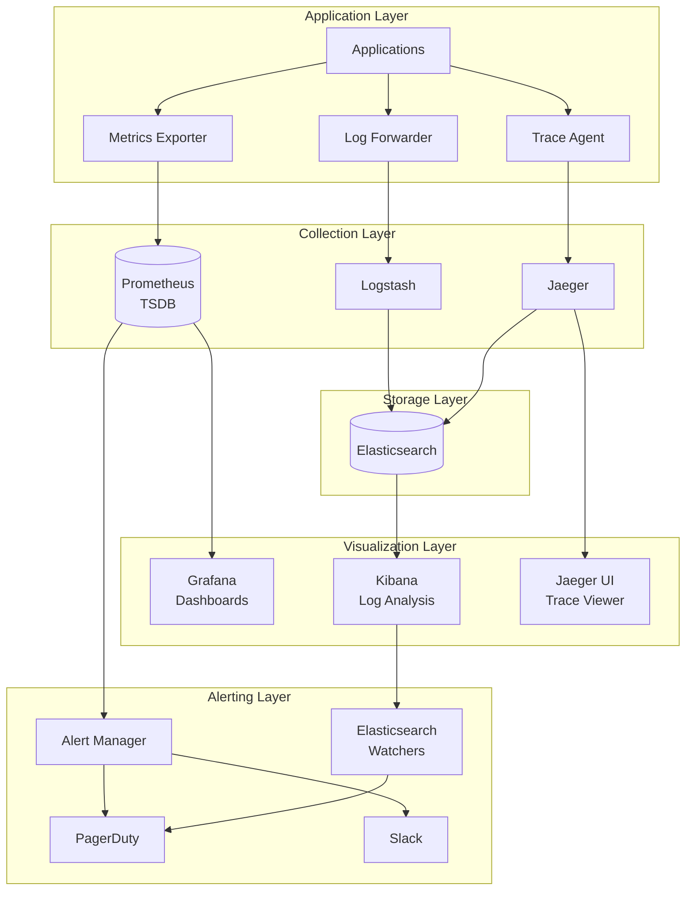

### Key Metrics

**Golden Signals** (SRE Principles):

1. **Latency**: Time to service requests
   - p50, p95, p99 latencies
   - Alert: p95 > 1s for critical endpoints

2. **Traffic**: Demand on the system
   - Requests per second
   - Concurrent users
   - Alert: Traffic spike >200% of baseline

3. **Errors**: Rate of failed requests
   - HTTP 5xx error rate
   - Business logic errors
   - Alert: Error rate >1%

4. **Saturation**: System resource utilization
   - CPU, memory, disk, network
   - Database connections
   - Alert: CPU >80%, Memory >85%

**Application-Specific Metrics**:

Practice360:
- Login success rate
- Average appointment booking time
- Patient record access latency
- Offline sync queue depth

Facility360:
- Application submission time
- Schedule conflict rate
- Workforce utilization
- Document upload success rate

Compliance360:
- Application processing time (SLA)
- Inspection completion rate
- License approval/rejection ratio
- Regulator response time

### Dashboards

**Infrastructure Dashboard**:
- Cluster health (node status, pod health)
- Resource utilization (CPU, memory, storage)
- Network traffic and latency
- Pod distribution across zones

**Application Dashboard**:
- Request rate and latency
- Error rate by endpoint
- Active users and sessions
- Top slow queries

**Business Metrics Dashboard**:
- Daily/weekly/monthly active users
- Feature usage statistics
- License applications processed
- Practitioner onboarding rate

### Alerting Rules

**Critical Alerts** (Page On-Call):
- API error rate >5% for >5 minutes
- Database primary down
- Disk usage >90%
- Certificate expiring in <7 days
- Pod crash loop (>3 restarts in 10 minutes)

**Warning Alerts** (Slack Notification):
- API latency p95 >1s for >10 minutes
- CPU usage >80% for >15 minutes
- Memory usage >85% for >15 minutes
- Queue depth >1000 messages

**Alert Example** (Prometheus):
```yaml
groups:
- name: practice360_alerts
  rules:
  - alert: HighErrorRate
    expr: |
      rate(http_requests_total{status=~"5..", app="practice360"}[5m]) 
      / rate(http_requests_total{app="practice360"}[5m]) > 0.05
    for: 5m
    labels:
      severity: critical
      app: practice360
    annotations:
      summary: "High error rate on Practice360"
      description: "Error rate is {{ $value | humanizePercentage }} (threshold: 5%)"
```

---

## Disaster Recovery & Business Continuity

### Backup Strategy

**Database Backups**:
- **Frequency**: 
  - Full backup: Daily at 2 AM
  - Incremental backup: Every 6 hours
  - Transaction logs: Continuous replication
- **Retention**:
  - Daily backups: 30 days
  - Weekly backups: 13 weeks
  - Monthly backups: 12 months
  - Yearly backups: 7 years (compliance)
- **Storage**: Encrypted, geo-replicated to secondary region
- **Testing**: Monthly restore tests, quarterly DR drills

**Application State**:
- **Configuration**: GitOps (ArgoCD), version controlled
- **Secrets**: Backed up in Vault, encrypted at rest
- **Container Images**: Stored in multiple registries (primary + DR)

### Recovery Objectives

| Tier | Application Component | RPO | RTO | Strategy |
|------|----------------------|-----|-----|----------|
| Tier 1 | HCWR, HFR (Registries) | <1 hour | <4 hours | Multi-region active-active |
| Tier 2 | Practice360, Compliance360 | <4 hours | <8 hours | Warm standby in DR region |
| Tier 3 | Facility360 | <24 hours | <24 hours | Cold standby, backup restore |

**RPO** (Recovery Point Objective): Maximum acceptable data loss  
**RTO** (Recovery Time Objective): Maximum acceptable downtime

### Disaster Recovery Procedures

**Scenario 1: Primary Region Failure**

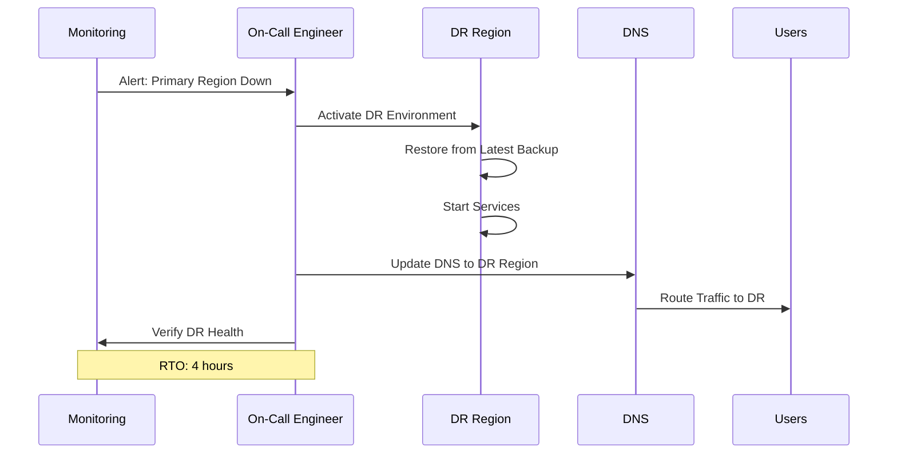

**Scenario 2: Data Corruption**

1. **Detect**: Monitoring alerts on data anomalies
2. **Isolate**: Stop writes to affected database
3. **Assess**: Determine extent of corruption and last known good backup
4. **Restore**: Restore from backup to point-in-time before corruption
5. **Validate**: Verify data integrity, run consistency checks
6. **Resume**: Resume operations, monitor closely

**Scenario 3: Cyber Attack / Ransomware**

1. **Detect**: Security monitoring alerts on anomalous activity
2. **Contain**: Isolate affected systems, revoke compromised credentials
3. **Assess**: Determine scope of breach and data impact
4. **Eradicate**: Remove malware, patch vulnerabilities
5. **Recover**: Restore from clean backups, reset credentials
6. **Post-Incident**: Conduct forensics, update security controls

### Business Continuity Plan

**Critical Operations** (must continue during disaster):
- Practitioner access to patient records (Practice360)
- License verification (Compliance360 public portal)
- Emergency facility assignments (Facility360)

**Degraded Mode Operations**:
- Read-only access to historical data
- Manual workflows for critical operations
- Phone/SMS fallback for notifications

**Communication Plan**:
- **Stakeholders**: Ministry of Health, Regulatory Bodies, Facility Administrators
- **Channels**: Email, SMS, Status Page (https://status.hie.example.com)
- **Frequency**: Updates every 2 hours during incident
- **Post-Mortem**: Within 5 business days of incident resolution

---

## Conclusion

This architectural framework provides a robust, scalable, and secure foundation for the three HIE support applications. By adhering to these principles and leveraging the specified technology stack, the implementation will deliver:

- **Interoperability**: Seamless data exchange across the health sector
- **Scalability**: Support for growing user base and data volumes
- **Security**: Protection of sensitive health information
- **Reliability**: High availability and disaster recovery capabilities
- **Performance**: Fast, responsive user experiences
- **Maintainability**: Easy to update, extend, and operate

The following documents provide detailed architectures for each individual application, building upon these foundational principles.

---

**Next Document**: [03_Practice360_Architecture.md](03_Practice360_Architecture.md)
