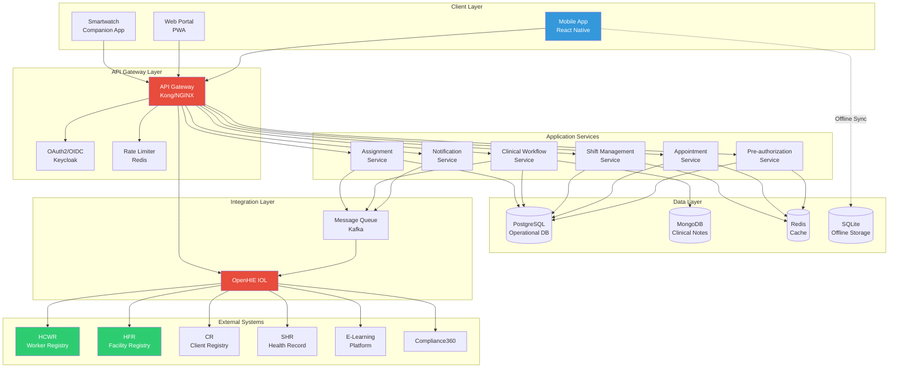
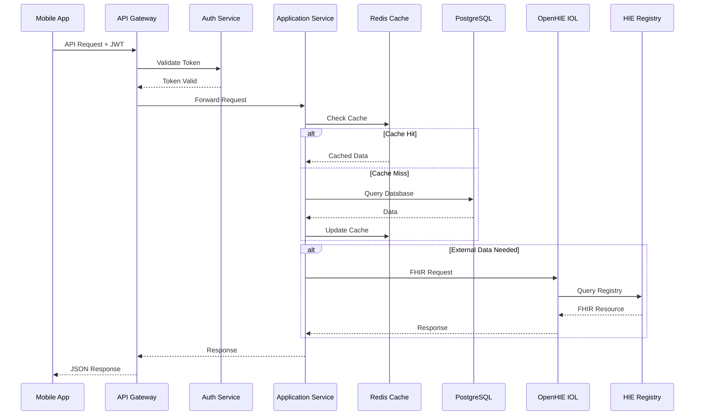
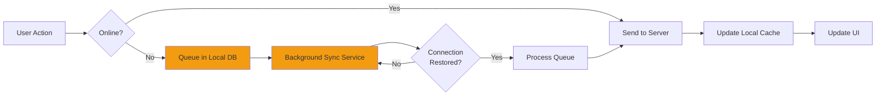
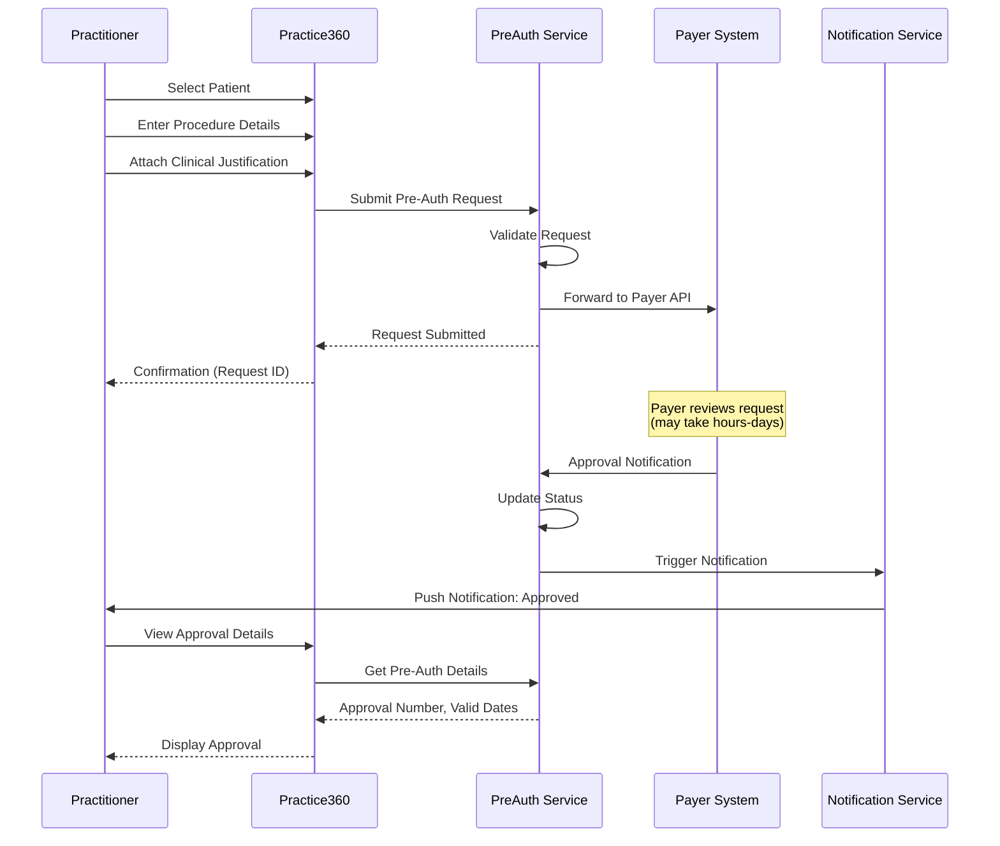
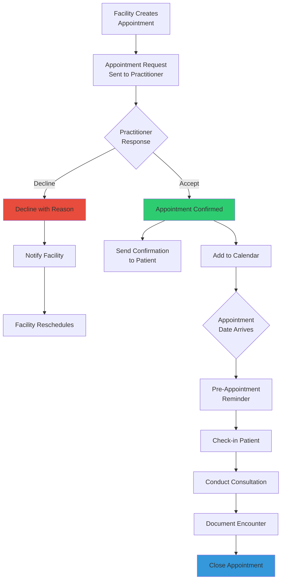
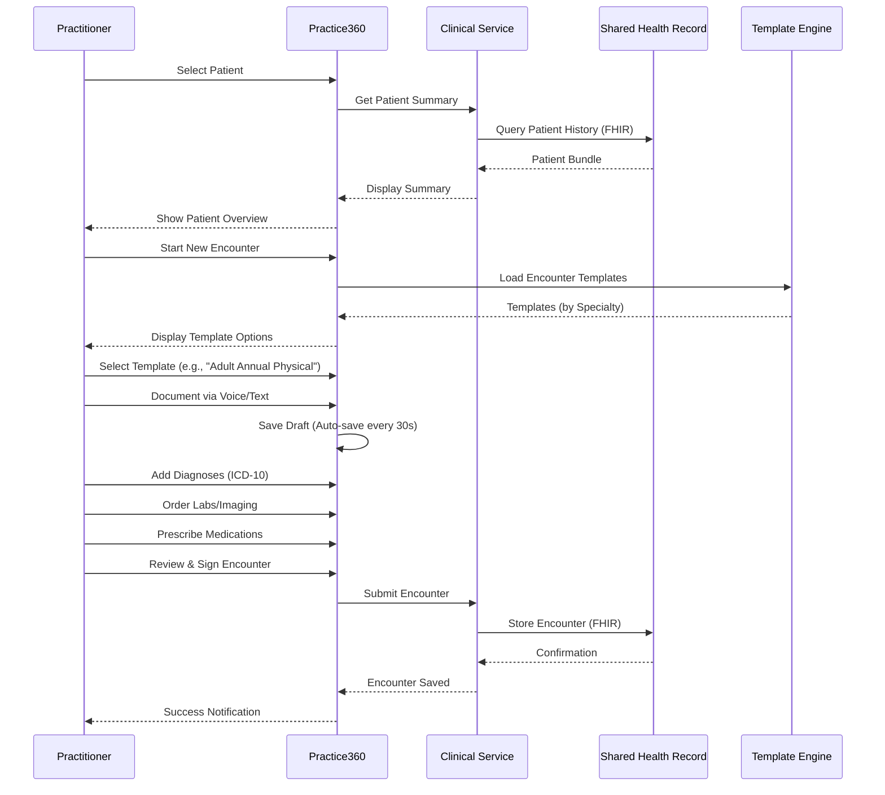
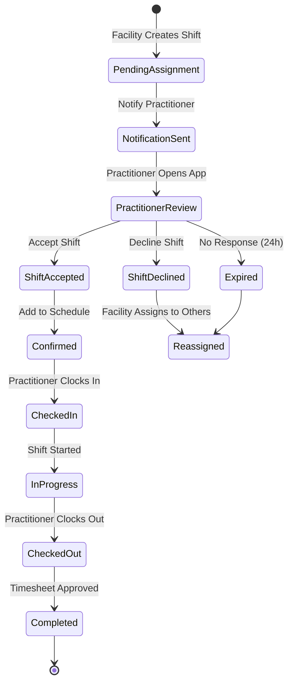
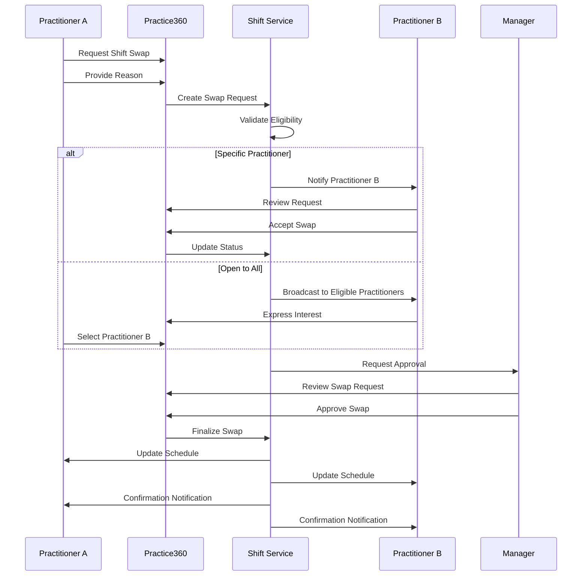
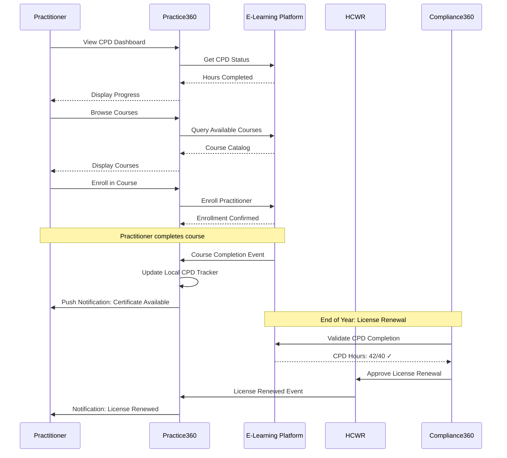
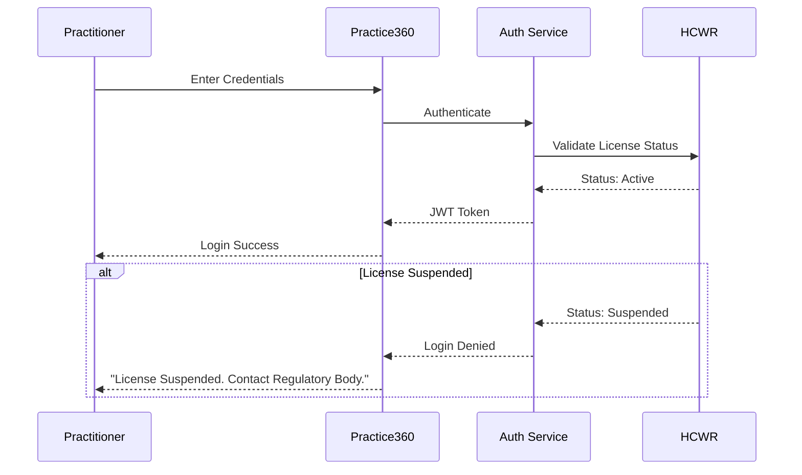

# Practice360 - Practitioner Application Architecture

## Overview

Practice360 is a comprehensive mobile-first application designed to empower healthcare practitioners with seamless access to clinical and operational workflows. It serves as the primary digital tool for physicians, nurses, clinical officers, and allied health professionals to manage their professional activities, patient care, and compliance requirements.

**Core Value Proposition**: Reduce administrative burden and enable practitioners to focus on patient care while maintaining regulatory compliance and professional development.

---

## Table of Contents

1. [System Architecture](#system-architecture)
2. [Core Components](#core-components)
3. [Key Features & Workflows](#key-features--workflows)
4. [Use Cases](#use-cases)
5. [Integration Points](#integration-points)
6. [Data Model](#data-model)
7. [Security Considerations](#security-considerations)
8. [Performance Requirements](#performance-requirements)

---

## System Architecture

### High-Level Architecture



### Component Interaction Flow



---

## Core Components

### 1. Mobile Application (React Native)

**Purpose**: Primary interface for practitioners on-the-go

**Key Features**:
- Cross-platform (iOS & Android) from single codebase
- Offline-first architecture with local SQLite database
- Push notifications for real-time alerts
- Biometric authentication (fingerprint, Face ID)
- Camera integration for document scanning
- Voice-to-text for clinical documentation

**Technology Stack**:
- **Framework**: React Native 0.72+
- **State Management**: Redux Toolkit + RTK Query
- **Navigation**: React Navigation 6
- **Local Storage**: React Native SQLite Storage
- **Push Notifications**: Firebase Cloud Messaging (FCM)
- **Offline Sync**: WatermelonDB
- **UI Components**: React Native Paper (Material Design)

**Offline Capability**:


### 2. Web Portal (Progressive Web App)

**Purpose**: Full-featured web access for practitioners and facility staff

**Key Features**:
- Responsive design (desktop, tablet)
- Service workers for offline support
- Installation as native-like app
- Real-time updates via WebSocket
- Rich data visualization and reporting

**Technology Stack**:
- **Framework**: React 18+ with TypeScript
- **State Management**: Redux Toolkit
- **UI Library**: Material-UI (MUI)
- **Real-time**: Socket.io
- **Charts**: Recharts / Chart.js
- **Forms**: React Hook Form + Yup validation

### 3. Pre-authorization Service

**Purpose**: Manage medical procedure pre-authorization requests and approvals

**Responsibilities**:
- Submit pre-authorization requests to payers/facilities
- Track approval status and validity periods
- Notify practitioners of approvals/denials
- Maintain pre-auth history and documentation

**API Endpoints**:
```
POST   /api/v1/pre-auths                    # Submit new pre-auth request
GET    /api/v1/pre-auths                    # List practitioner's pre-auths
GET    /api/v1/pre-auths/{id}               # Get pre-auth details
PUT    /api/v1/pre-auths/{id}               # Update pre-auth
GET    /api/v1/pre-auths/{id}/status        # Check approval status
POST   /api/v1/pre-auths/{id}/documents     # Upload supporting documents
```

**Data Model**:
```typescript
interface PreAuthorization {
  id: string;
  practitionerId: string;
  patientId: string;
  facilityId: string;
  procedureCode: string;  // CPT/ICD-10 code
  procedureDescription: string;
  clinicalJustification: string;
  urgency: 'routine' | 'urgent' | 'emergency';
  requestedDate: Date;
  proposedDate: Date;
  status: 'pending' | 'approved' | 'denied' | 'expired';
  approvalNumber?: string;
  validFrom?: Date;
  validUntil?: Date;
  payerName: string;
  denialReason?: string;
  supportingDocuments: Document[];
  createdAt: Date;
  updatedAt: Date;
}
```

### 4. Appointment Service

**Purpose**: Manage clinical appointments and practitioner availability

**Responsibilities**:
- Accept or decline appointment requests
- View appointment schedule (day/week/month views)
- Manage practitioner availability
- Handle appointment rescheduling
- Integrate with facility scheduling systems

**API Endpoints**:
```
GET    /api/v1/appointments                 # List appointments (filtered)
GET    /api/v1/appointments/{id}            # Get appointment details
POST   /api/v1/appointments/{id}/accept     # Accept appointment
POST   /api/v1/appointments/{id}/decline    # Decline appointment
POST   /api/v1/appointments/{id}/reschedule # Request reschedule
GET    /api/v1/appointments/availability    # Get practitioner availability
PUT    /api/v1/appointments/availability    # Update availability
```

**Data Model**:
```typescript
interface Appointment {
  id: string;
  practitionerId: string;
  patientId: string;
  facilityId: string;
  appointmentType: 'consultation' | 'follow-up' | 'procedure' | 'emergency';
  scheduledStart: Date;
  scheduledEnd: Date;
  actualStart?: Date;
  actualEnd?: Date;
  status: 'scheduled' | 'confirmed' | 'in-progress' | 'completed' | 'cancelled' | 'no-show';
  chiefComplaint?: string;
  notes?: string;
  cancelledBy?: string;
  cancellationReason?: string;
  createdAt: Date;
  updatedAt: Date;
}

interface PractitionerAvailability {
  practitionerId: string;
  facilityId: string;
  dayOfWeek: 0 | 1 | 2 | 3 | 4 | 5 | 6;  // 0=Sunday
  startTime: string;  // HH:MM format
  endTime: string;
  isAvailable: boolean;
  specialNotes?: string;
}
```

### 5. Shift Management Service

**Purpose**: Manage practitioner work shifts and schedules

**Responsibilities**:
- View assigned shifts
- Accept or decline shift assignments
- Request shift swaps with colleagues
- Update shift availability
- Track shift attendance and hours worked

**API Endpoints**:
```
GET    /api/v1/shifts                       # List shifts (filtered by date range)
GET    /api/v1/shifts/{id}                  # Get shift details
POST   /api/v1/shifts/{id}/accept           # Accept shift assignment
POST   /api/v1/shifts/{id}/decline          # Decline shift with reason
POST   /api/v1/shifts/{id}/swap-request     # Request shift swap
GET    /api/v1/shifts/swap-requests         # List pending swap requests
POST   /api/v1/shifts/availability          # Update availability preferences
POST   /api/v1/shifts/{id}/check-in         # Clock in for shift
POST   /api/v1/shifts/{id}/check-out        # Clock out from shift
```

**Data Model**:
```typescript
interface Shift {
  id: string;
  practitionerId: string;
  facilityId: string;
  departmentId?: string;
  shiftType: 'day' | 'night' | 'evening' | 'call' | 'oncall';
  scheduledStart: Date;
  scheduledEnd: Date;
  actualStart?: Date;
  actualEnd?: Date;
  status: 'scheduled' | 'confirmed' | 'in-progress' | 'completed' | 'cancelled' | 'no-show';
  role: string;  // e.g., "ER Physician", "ICU Nurse"
  notes?: string;
  breakDuration?: number;  // minutes
  overtimeHours?: number;
  createdAt: Date;
  updatedAt: Date;
}

interface ShiftSwapRequest {
  id: string;
  requestorPractitionerId: string;
  requestorShiftId: string;
  recipientPractitionerId: string;
  recipientShiftId?: string;  // null for "anyone can take"
  reason: string;
  status: 'pending' | 'approved' | 'declined' | 'cancelled';
  reviewedBy?: string;  // Facility manager who approved
  reviewedAt?: Date;
  createdAt: Date;
}
```

### 6. Clinical Workflow Service

**Purpose**: Support clinical documentation and patient care workflows

**Responsibilities**:
- Access patient clinical history
- Document clinical encounters
- Create and update care plans
- Order labs and imaging studies
- Prescribe medications
- Document procedures

**API Endpoints**:
```
GET    /api/v1/patients/{id}/summary         # Get patient clinical summary
GET    /api/v1/patients/{id}/encounters      # List patient encounters
POST   /api/v1/encounters                     # Create new encounter
PUT    /api/v1/encounters/{id}                # Update encounter
POST   /api/v1/encounters/{id}/notes          # Add clinical notes
GET    /api/v1/encounters/{id}/vitals         # Get vital signs
POST   /api/v1/encounters/{id}/orders         # Place orders (labs, imaging)
POST   /api/v1/encounters/{id}/prescriptions  # E-prescribe medications
```

**Data Model**:
```typescript
interface ClinicalEncounter {
  id: string;
  patientId: string;
  practitionerId: string;
  facilityId: string;
  encounterType: 'ambulatory' | 'emergency' | 'inpatient' | 'outpatient' | 'home-health';
  encounterDate: Date;
  chiefComplaint: string;
  historyOfPresentIllness: string;
  vitalSigns: VitalSigns;
  physicalExam: PhysicalExam;
  assessment: string;
  plan: string;
  diagnoses: Diagnosis[];
  procedures: Procedure[];
  orders: Order[];
  prescriptions: Prescription[];
  status: 'in-progress' | 'completed' | 'cancelled';
  signedBy?: string;
  signedAt?: Date;
  createdAt: Date;
  updatedAt: Date;
}

interface VitalSigns {
  temperature?: number;  // Celsius
  temperatureUnit: 'C' | 'F';
  bloodPressureSystolic?: number;  // mmHg
  bloodPressureDiastolic?: number;
  heartRate?: number;  // bpm
  respiratoryRate?: number;  // breaths/min
  oxygenSaturation?: number;  // percentage
  weight?: number;  // kg
  height?: number;  // cm
  bmi?: number;
  recordedAt: Date;
  recordedBy: string;
}
```

### 7. Assignment Service

**Purpose**: Manage practitioner assignments to facilities and departments

**Responsibilities**:
- Notify practitioners of new assignment offers
- Accept or decline facility assignments
- View current and past assignments
- Manage clinical privileges at each facility
- Track credentialing and privileging status

**API Endpoints**:
```
GET    /api/v1/assignments                  # List assignments
GET    /api/v1/assignments/{id}             # Get assignment details
POST   /api/v1/assignments/{id}/accept      # Accept assignment
POST   /api/v1/assignments/{id}/decline     # Decline assignment
GET    /api/v1/assignments/{id}/privileges  # View clinical privileges
POST   /api/v1/assignments/{id}/onboarding  # Complete onboarding checklist
```

**Data Model**:
```typescript
interface FacilityAssignment {
  id: string;
  practitionerId: string;
  facilityId: string;
  departmentId?: string;
  assignmentType: 'permanent' | 'temporary' | 'locum' | 'volunteer';
  startDate: Date;
  endDate?: Date;
  status: 'pending' | 'active' | 'suspended' | 'terminated';
  role: string;
  clinicalPrivileges: ClinicalPrivilege[];
  onboardingStatus: 'not-started' | 'in-progress' | 'completed';
  onboardingChecklist: OnboardingItem[];
  terminationReason?: string;
  createdAt: Date;
  updatedAt: Date;
}

interface ClinicalPrivilege {
  id: string;
  privilegeCode: string;
  privilegeName: string;  // e.g., "Perform Appendectomy"
  category: string;  // e.g., "Surgical Procedures"
  grantedDate: Date;
  expiryDate?: Date;
  restrictions?: string;
  status: 'active' | 'suspended' | 'revoked';
}
```

### 8. Notification Service

**Purpose**: Deliver real-time notifications and alerts to practitioners

**Responsibilities**:
- Send push notifications (mobile)
- Send in-app notifications (web portal)
- Send SMS for critical alerts
- Send email for non-urgent communications
- Track notification delivery and read status

**Notification Types**:
- **Critical**: License suspension, emergency shift assignment
- **High Priority**: Shift changes, appointment cancellations
- **Normal**: New appointments, CPD reminders
- **Low**: Weekly summaries, feature announcements

**Technology Stack**:
- **Push Notifications**: Firebase Cloud Messaging (FCM), Apple Push Notification Service (APNS)
- **SMS**: Twilio, Africa's Talking
- **Email**: SendGrid, AWS SES
- **In-app**: WebSocket (Socket.io)

---

## Key Features & Workflows

### Feature 1: Pre-authorization Management

#### User Story
"As a practitioner, I want to submit pre-authorization requests for medical procedures so that I can ensure payment coverage before performing the procedure."

#### Workflow Diagram



#### Step-by-Step Process

1. **Initiate Request**:
   - Practitioner selects patient from list
   - Searches procedure catalog (CPT/ICD-10 codes)
   - Selects procedure(s) requiring authorization

2. **Provide Clinical Information**:
   - Enter or dictate clinical justification
   - Select urgency level (routine/urgent/emergency)
   - Propose procedure date
   - Attach supporting documents (lab results, imaging)

3. **Submit Request**:
   - Review request summary
   - Confirm and submit
   - Receive request ID for tracking

4. **Track Status**:
   - View in "Pre-Authorizations" tab
   - Status badges: Pending (yellow), Approved (green), Denied (red)
   - Estimated review time displayed

5. **Receive Decision**:
   - Push notification when status changes
   - If approved: Approval number and validity dates displayed
   - If denied: Denial reason and appeal options

6. **Use Authorization**:
   - Approval number automatically populated when scheduling procedure
   - System alerts if authorization expired

#### Screenshots / Wireframes

```
┌─────────────────────────────────┐
│ ☰  Pre-Authorizations      [+]  │
├─────────────────────────────────┤
│ Filters: ⊙ All  ○ Pending       │
│          ○ Approved  ○ Denied   │
├─────────────────────────────────┤
│ ┌─────────────────────────────┐ │
│ │ REQ-2025-001234    [Pending]│ │
│ │ Patient: John Doe, M, 45    │ │
│ │ Procedure: Appendectomy     │ │
│ │ Submitted: Nov 15, 2025     │ │
│ │ Estimated Review: 2-3 days  │ │
│ └─────────────────────────────┘ │
│ ┌─────────────────────────────┐ │
│ │ REQ-2025-001200  [Approved] │ │
│ │ Patient: Jane Smith, F, 32  │ │
│ │ Procedure: MRI Brain        │ │
│ │ Approval #: AUTH-12345678   │ │
│ │ Valid Until: Dec 15, 2025   │ │
│ └─────────────────────────────┘ │
└─────────────────────────────────┘
```

---

### Feature 2: Appointment Management

#### User Story
"As a practitioner, I want to view and manage my appointment schedule so that I can organize my patient consultations efficiently."

#### Workflow Diagram



#### Calendar Views

**Day View**:
```
┌────────────────────────────────┐
│  📅 Monday, Nov 20, 2025       │
├────────────────────────────────┤
│ 08:00 ┌──────────────────────┐ │
│       │ Ward Rounds          │ │
│       │ Location: Ward 3A    │ │
│ 09:00 └──────────────────────┘ │
│       ┌──────────────────────┐ │
│       │ John Doe - F/Up      │ │
│       │ Chief C/O: Diabetes  │ │
│ 09:30 └──────────────────────┘ │
│       ┌──────────────────────┐ │
│       │ Jane Smith - New     │ │
│ 10:00 │ Chief C/O: Headache  │ │
│       └──────────────────────┘ │
│ 10:30 (Available)              │
│ 11:00 ┌──────────────────────┐ │
│       │ Bob Johnson - F/Up   │ │
│ 11:30 └──────────────────────┘ │
└────────────────────────────────┘
```

**Week View**:
```
┌──────┬──────┬──────┬──────┬──────┬──────┬──────┐
│ Mon  │ Tue  │ Wed  │ Thu  │ Fri  │ Sat  │ Sun  │
├──────┼──────┼──────┼──────┼──────┼──────┼──────┤
│ 08:00│ 08:00│ 08:00│ 08:00│ 08:00│ OFF  │ OFF  │
│ Rnds │ Rnds │ Rnds │ Rnds │ Rnds │      │      │
├──────┼──────┼──────┼──────┼──────┼──────┼──────┤
│ 09:00│ 09:00│ 09:00│ 09:00│ 09:00│      │      │
│ 5 pts│ 4 pts│ 6 pts│ 3 pts│ 4 pts│      │      │
├──────┼──────┼──────┼──────┼──────┼──────┼──────┤
│ 13:00│ 13:00│ 13:00│ 13:00│ 13:00│      │      │
│ Lunch│ Lunch│ Lunch│ Surg.│ Lunch│      │      │
└──────┴──────┴──────┴──────┴──────┴──────┴──────┘
```

---

### Feature 3: Clinical Documentation

#### User Story
"As a practitioner, I want to document patient encounters quickly and accurately so that I can maintain comprehensive clinical records while minimizing administrative time."

#### Documentation Workflow



#### Smart Documentation Features

**1. Voice-to-Text Dictation**:
- Activate microphone button
- Dictate clinical notes in natural language
- AI automatically structures into SOAP format
- Practitioner reviews and edits

**2. Clinical Templates**:
- Pre-built templates by specialty:
  - Adult Annual Physical
  - Pediatric Well-Child Visit
  - Emergency Department Encounter
  - Surgical Consultation
  - Follow-up Visit
- Customizable fields based on chief complaint

**3. Smart Suggestions**:
```
Chief Complaint: "Chest pain"

AI Suggests:
✓ Add: EKG to orders
✓ Add: Troponin to lab orders
✓ Template: "Acute Chest Pain Evaluation"
✓ Differential Dx: Acute MI, Unstable Angina, PE
```

**4. Diagnosis Coding Assistant**:
```
Search: "Type 2 diabetes"

Results:
┌────────────────────────────────────────┐
│ E11.9 - Type 2 diabetes mellitus       │
│          without complications         │
├────────────────────────────────────────┤
│ E11.65 - Type 2 diabetes with          │
│          hyperglycemia                 │
├────────────────────────────────────────┤
│ E11.21 - Type 2 diabetes with diabetic │
│          nephropathy                   │
└────────────────────────────────────────┘
```

**5. Medication Prescribing**:
- Drug name search with autocomplete
- Dosage and frequency suggestions
- Drug interaction warnings
- Allergy checking
- Formulary checking (insurance coverage)
- Electronic signature for controlled substances

---

### Feature 4: Shift Management

#### User Story
"As a practitioner, I want to manage my work shifts efficiently so that I can maintain work-life balance and ensure adequate coverage."

#### Shift Acceptance Workflow



#### Shift Swap Process



#### Shift Dashboard

```
┌─────────────────────────────────────────┐
│ 📅 My Shifts - This Week               │
├─────────────────────────────────────────┤
│ Monday, Nov 20                          │
│ ┌─────────────────────────────────────┐ │
│ │ ⏰ 07:00 - 15:00  [Confirmed]       │ │
│ │ 📍 Emergency Department             │ │
│ │ 👤 ER Physician                     │ │
│ │ [Check In] [View Details]           │ │
│ └─────────────────────────────────────┘ │
│                                         │
│ Tuesday, Nov 21                         │
│ ┌─────────────────────────────────────┐ │
│ │ ⏰ 15:00 - 23:00  [Pending]         │ │
│ │ 📍 ICU                              │ │
│ │ 👤 Intensivist                      │ │
│ │ [Accept] [Decline]                  │ │
│ └─────────────────────────────────────┘ │
│                                         │
│ ⚠️ Swap Request Pending                │
│ ┌─────────────────────────────────────┐ │
│ │ Dr. Jane Smith wants to swap:       │ │
│ │ Your: Wed Nov 22, 07:00-15:00       │ │
│ │ Hers: Thu Nov 23, 07:00-15:00       │ │
│ │ Reason: Family commitment           │ │
│ │ [Accept Swap] [Decline]             │ │
│ └─────────────────────────────────────┘ │
└─────────────────────────────────────────┘
```

---

### Feature 5: License & CPD Tracking

#### User Story
"As a practitioner, I want to track my license status and CPD requirements so that I can maintain regulatory compliance and renew my license on time."

#### License Status Dashboard

```
┌─────────────────────────────────────────┐
│ 📜 Professional License Status          │
├─────────────────────────────────────────┤
│ License Number: MD/2025/12345           │
│ Status: ✓ ACTIVE                        │
│ Issued: Jan 15, 2023                    │
│ Expires: Jan 14, 2026                   │
│ Days Until Expiry: 420 days             │
│                                         │
│ ━━━━━━━━━━━━━━━━━━━━━━━━━━━━━━━━━━━━━ │
│                                         │
│ 📚 CPD Requirements (Annual)            │
│ ┌─────────────────────────────────────┐ │
│ │ Progress: 32 / 40 hours   [80%]    │ │
│ │ ████████████████░░░░                │ │
│ │                                     │ │
│ │ Clinical Hours: 25 / 30 ✓           │ │
│ │ Research/Teaching: 5 / 5 ✓          │ │
│ │ Ethics: 2 / 5 ⚠️                    │ │
│ │                                     │ │
│ │ Deadline: Dec 31, 2025 (42 days)    │ │
│ │ [Browse Courses]                    │ │
│ └─────────────────────────────────────┘ │
│                                         │
│ 🎓 Completed Courses (Recent)           │
│ • Advanced Cardiac Life Support         │
│   Completed: Nov 1, 2025 (8 hours)      │
│ • Clinical Ethics Workshop              │
│   Completed: Oct 15, 2025 (2 hours)     │
│ • Infectious Disease Update 2025        │
│   Completed: Sep 20, 2025 (6 hours)     │
│                                         │
│ [View All] [Download Certificate]       │
└─────────────────────────────────────────┘
```

#### CPD Integration Workflow



---

## Use Cases

### Use Case 1: Emergency Shift Coverage

**Scenario**: A practitioner is urgently needed to cover an emergency department shift due to another practitioner's illness.

**Actors**:
- Facility Manager (initiates request)
- Practitioner (receives and responds to request)
- System

**Preconditions**:
- Practitioner has active license
- Practitioner is credentialed at the facility
- Practitioner has ER privileges

**Flow**:
1. Facility manager marks shift as "Urgent - Emergency Coverage Needed"
2. System identifies eligible practitioners:
   - Active license
   - ER privileges at facility
   - Not already scheduled
   - Within reasonable distance
3. System sends **critical priority** push notifications to top 5 eligible practitioners
4. First practitioner to accept is assigned
5. Others receive cancellation notification
6. Accepted practitioner receives detailed shift information
7. System updates all schedules and notifies relevant parties

**Postconditions**:
- Shift is covered
- Practitioner's schedule is updated
- Facility manager is notified
- Other notified practitioners are informed

**Alternative Flows**:
- **No response within 15 minutes**: Escalate to next tier of practitioners
- **All decline**: Notify facility director and suggest contract/locum agencies
- **Multiple simultaneous accepts**: First timestamp wins, others notified

---

### Use Case 2: Multi-Facility Practitioner Management

**Scenario**: A specialist works at three different hospitals and needs to manage appointments, shifts, and privileges across all locations.

**Actors**:
- Specialist Practitioner
- Facility A, B, C (three hospitals)
- System

**Preconditions**:
- Practitioner has active assignments at all three facilities
- Different privileges at each facility

**Flow**:
1. Practitioner logs into Practice360
2. Dashboard displays unified view:
   - All appointments across facilities
   - All shifts across facilities
   - Facility-specific privileges clearly marked
3. Practitioner views week schedule:
   ```
   Mon: Facility A (Morning), Facility B (Afternoon)
   Tue: Facility B (All day)
   Wed: Facility C (Morning), Facility A (Afternoon)
   Thu: Facility A (All day)
   Fri: Facility B (Morning), Facility C (Afternoon)
   ```
4. System provides travel time estimates between facilities
5. System alerts if scheduling conflicts detected
6. Practitioner accepts appointment at Facility C
7. System validates:
   - Privileges allow the procedure type
   - No scheduling conflicts
   - Practitioner available at that time
8. Appointment confirmed and added to unified calendar

**Postconditions**:
- Unified schedule maintained
- No double-booking
- Privilege-appropriate assignments

---

### Use Case 3: Telemedicine Consultation

**Scenario**: A practitioner conducts a virtual consultation with a patient using integrated telemedicine features.

**Actors**:
- Practitioner
- Patient (remote)
- System

**Preconditions**:
- Appointment scheduled as "Telemedicine"
- Patient has access to web/mobile portal
- Both parties have stable internet connection

**Flow**:
1. 15 minutes before appointment, practitioner receives reminder
2. Practitioner clicks "Join Video Call" in appointment
3. System:
   - Loads patient summary (recent vitals, medications, allergies)
   - Opens secure video call interface
   - Enables clinical documentation tools
4. Patient joins from their device
5. Video consultation conducted:
   - Screen sharing for reviewing test results
   - Ability to take screenshots for documentation
   - Picture-in-picture view of patient while reviewing records
6. During consultation, practitioner:
   - Documents encounter in real-time (voice-to-text)
   - E-prescribes medications
   - Orders follow-up labs
   - Schedules next appointment
7. Consultation ends, system:
   - Saves recording (if consented and required by policy)
   - Automatically generates encounter summary
   - Sends patient instructions and prescriptions
   - Uploads encounter to SHR

**Postconditions**:
- Complete clinical documentation
- Patient receives care remotely
- Prescriptions sent to pharmacy
- Follow-up scheduled

---

## Integration Points

### Integration with HCWR (Health Worker Registry)

**Purpose**: Authoritative source for practitioner credentials and license status

**FHIR Resources**:
- `Practitioner` - Demographics, identifiers, contact info
- `PractitionerRole` - Roles, specializations, facility associations
- `Qualification` - Education, certifications, licenses

**Integration Scenarios**:

**1. Login / Authentication**:


**2. Profile Synchronization** (Daily Background Job):
```
GET https://hcwr.example.com/fhir/Practitioner/pract_12345

Response:
{
  "resourceType": "Practitioner",
  "id": "pract_12345",
  "identifier": [{
    "system": "https://hcwr.example.com",
    "value": "MD/2025/12345"
  }],
  "active": true,
  "name": [{
    "use": "official",
    "family": "Smith",
    "given": ["Jane"]
  }],
  "telecom": [{
    "system": "phone",
    "value": "+254712345678"
  }, {
    "system": "email",
    "value": "jane.smith@example.com"
  }],
  "qualification": [{
    "identifier": [{
      "value": "MD/2025/12345"
    }],
    "code": {
      "coding": [{
        "system": "http://snomed.info/sct",
        "code": "309343006",
        "display": "Physician"
      }]
    },
    "period": {
      "start": "2023-01-15",
      "end": "2026-01-14"
    },
    "issuer": {
      "display": "Medical Practitioners Board"
    }
  }]
}
```

**3. Real-time License Status Check** (Before Critical Actions):
- Before accepting shift at new facility
- Before documenting encounter
- Before e-prescribing controlled substances

---

### Integration with HFR (Health Facility Registry)

**Purpose**: Retrieve facility details, validate facility codes, check facility license status

**FHIR Resources**:
- `Organization` - Facility master data
- `Location` - Physical locations, departments
- `HealthcareService` - Services offered

**Integration Scenarios**:

**1. Facility Search** (When Accepting Assignment):
```
GET https://hfr.example.com/fhir/Organization?
    name:contains=General Hospital&
    type=http://terminology.hl7.org/CodeSystem/organization-type|prov&
    active=true

Response: Bundle of matching facilities
```

**2. Facility Details Display**:
```json
{
  "resourceType": "Organization",
  "id": "fac_001",
  "identifier": [{
    "system": "https://hfr.example.com",
    "value": "FAC-2025-001"
  }],
  "active": true,
  "type": [{
    "coding": [{
      "system": "http://terminology.hl7.org/CodeSystem/organization-type",
      "code": "prov",
      "display": "Healthcare Provider"
    }]
  }],
  "name": "City General Hospital",
  "telecom": [{
    "system": "phone",
    "value": "+254201234567"
  }],
  "address": [{
    "use": "work",
    "line": ["123 Main Street"],
    "city": "Nairobi",
    "postalCode": "00100",
    "country": "KE"
  }],
  "contact": [{
    "purpose": {
      "coding": [{
        "code": "ADMIN"
      }]
    },
    "name": {
      "text": "Hospital Administration"
    },
    "telecom": [{
      "system": "email",
      "value": "admin@citygeneral.example.com"
    }]
  }]
}
```

---

### Integration with Client Registry (CR)

**Purpose**: Patient identification, demographic queries, MPI lookups

**FHIR Resources**:
- `Patient` - Patient demographics and identifiers

**Integration Scenarios**:

**1. Patient Search** (By Name and DOB):
```
GET https://cr.example.com/fhir/Patient?
    given=John&
    family=Doe&
    birthdate=1980-05-15

Response: Bundle of matching patients
```

**2. Patient Demographics Lookup** (By ID):
```json
{
  "resourceType": "Patient",
  "id": "pat_67890",
  "identifier": [{
    "system": "https://cr.example.com",
    "value": "PAT-2025-67890"
  }, {
    "system": "http://nationalid.gov.ke",
    "value": "12345678"
  }],
  "active": true,
  "name": [{
    "use": "official",
    "family": "Doe",
    "given": ["John"]
  }],
  "gender": "male",
  "birthDate": "1980-05-15",
  "address": [{
    "use": "home",
    "city": "Nairobi",
    "country": "KE"
  }],
  "telecom": [{
    "system": "phone",
    "value": "+254723456789"
  }],
  "maritalStatus": {
    "coding": [{
      "system": "http://terminology.hl7.org/CodeSystem/v3-MaritalStatus",
      "code": "M",
      "display": "Married"
    }]
  }
}
```

---

### Integration with SHR (Shared Health Record)

**Purpose**: Access patient clinical history, submit encounter documentation

**FHIR Resources**:
- `Encounter` - Clinical encounters
- `Observation` - Lab results, vital signs
- `DiagnosticReport` - Lab and imaging reports
- `MedicationRequest` - Prescriptions
- `Condition` - Diagnoses
- `Procedure` - Procedures performed

**Integration Scenarios**:

**1. Retrieve Patient Clinical Summary**:
```
GET https://shr.example.com/fhir/Patient/pat_67890/$summary

Response: Bundle containing:
- Active problems/diagnoses
- Current medications
- Allergies
- Recent lab results
- Recent encounters
```

**2. Submit Clinical Encounter**:
```json
POST https://shr.example.com/fhir/Encounter

{
  "resourceType": "Encounter",
  "status": "finished",
  "class": {
    "system": "http://terminology.hl7.org/CodeSystem/v3-ActCode",
    "code": "AMB",
    "display": "ambulatory"
  },
  "subject": {
    "reference": "Patient/pat_67890"
  },
  "participant": [{
    "individual": {
      "reference": "Practitioner/pract_12345"
    }
  }],
  "period": {
    "start": "2025-11-20T09:00:00Z",
    "end": "2025-11-20T09:30:00Z"
  },
  "reasonCode": [{
    "coding": [{
      "system": "http://snomed.info/sct",
      "code": "44054006",
      "display": "Diabetes mellitus type 2"
    }]
  }],
  "location": [{
    "location": {
      "reference": "Location/fac_001_outpatient"
    }
  }]
}
```

---

## Data Model

### Core Entities

```typescript
// Practitioner Profile (Local)
interface PractitionerProfile {
  id: string;
  hcwrId: string;  // Reference to HCWR
  firstName: string;
  lastName: string;
  email: string;
  phone: string;
  licenseNumber: string;
  licenseStatus: 'active' | 'suspended' | 'revoked' | 'expired';
  licenseExpiryDate: Date;
  specialty: string[];
  subSpecialty?: string[];
  cpdHoursCompleted: number;
  cpdHoursRequired: number;
  profilePhotoUrl?: string;
  preferredLanguage: string;
  notificationPreferences: NotificationPreferences;
  createdAt: Date;
  updatedAt: Date;
  lastSyncedAt: Date;
}

// Facility Assignment
interface FacilityAssignment {
  id: string;
  practitionerId: string;
  facilityId: string;
  facilityName: string;
  departmentId?: string;
  departmentName?: string;
  assignmentType: 'permanent' | 'temporary' | 'locum' | 'volunteer';
  role: string;
  startDate: Date;
  endDate?: Date;
  status: 'pending' | 'active' | 'suspended' | 'terminated';
  clinicalPrivileges: ClinicalPrivilege[];
  onboardingStatus: 'not-started' | 'in-progress' | 'completed';
  createdAt: Date;
  updatedAt: Date;
}

// Clinical Privilege
interface ClinicalPrivilege {
  id: string;
  code: string;
  name: string;
  category: string;
  grantedDate: Date;
  expiryDate?: Date;
  restrictions?: string;
  status: 'active' | 'suspended' | 'revoked';
}

// Appointment
interface Appointment {
  id: string;
  practitionerId: string;
  patientId: string;
  patientName: string;
  facilityId: string;
  facilityName: string;
  appointmentType: 'consultation' | 'follow-up' | 'procedure' | 'emergency';
  scheduledStart: Date;
  scheduledEnd: Date;
  actualStart?: Date;
  actualEnd?: Date;
  status: 'scheduled' | 'confirmed' | 'in-progress' | 'completed' | 'cancelled' | 'no-show';
  chiefComplaint?: string;
  notes?: string;
  reminderSent: boolean;
  createdAt: Date;
  updatedAt: Date;
}

// Shift
interface Shift {
  id: string;
  practitionerId: string;
  facilityId: string;
  facilityName: string;
  departmentId?: string;
  departmentName?: string;
  shiftType: 'day' | 'night' | 'evening' | 'call' | 'oncall';
  scheduledStart: Date;
  scheduledEnd: Date;
  actualStart?: Date;
  actualEnd?: Date;
  status: 'scheduled' | 'confirmed' | 'in-progress' | 'completed' | 'cancelled' | 'no-show';
  role: string;
  notes?: string;
  breakDuration?: number;
  createdAt: Date;
  updatedAt: Date;
}
```

### Database Schema (PostgreSQL)

```sql
-- Practitioners table (local cache from HCWR)
CREATE TABLE practitioners (
    id UUID PRIMARY KEY DEFAULT gen_random_uuid(),
    hcwr_id VARCHAR(50) UNIQUE NOT NULL,
    first_name VARCHAR(100) NOT NULL,
    last_name VARCHAR(100) NOT NULL,
    email VARCHAR(255) UNIQUE NOT NULL,
    phone VARCHAR(20),
    license_number VARCHAR(50) UNIQUE NOT NULL,
    license_status VARCHAR(20) NOT NULL CHECK (license_status IN ('active', 'suspended', 'revoked', 'expired')),
    license_expiry_date DATE NOT NULL,
    specialty TEXT[] NOT NULL,
    sub_specialty TEXT[],
    cpd_hours_completed INTEGER DEFAULT 0,
    cpd_hours_required INTEGER DEFAULT 40,
    profile_photo_url VARCHAR(500),
    preferred_language VARCHAR(10) DEFAULT 'en',
    notification_preferences JSONB DEFAULT '{}',
    created_at TIMESTAMP DEFAULT CURRENT_TIMESTAMP,
    updated_at TIMESTAMP DEFAULT CURRENT_TIMESTAMP,
    last_synced_at TIMESTAMP DEFAULT CURRENT_TIMESTAMP
);

CREATE INDEX idx_practitioners_license ON practitioners(license_number);
CREATE INDEX idx_practitioners_hcwr ON practitioners(hcwr_id);
CREATE INDEX idx_practitioners_license_status ON practitioners(license_status);

-- Facility assignments
CREATE TABLE facility_assignments (
    id UUID PRIMARY KEY DEFAULT gen_random_uuid(),
    practitioner_id UUID NOT NULL REFERENCES practitioners(id) ON DELETE CASCADE,
    facility_id VARCHAR(50) NOT NULL,
    facility_name VARCHAR(255) NOT NULL,
    department_id VARCHAR(50),
    department_name VARCHAR(255),
    assignment_type VARCHAR(20) NOT NULL CHECK (assignment_type IN ('permanent', 'temporary', 'locum', 'volunteer')),
    role VARCHAR(100) NOT NULL,
    start_date DATE NOT NULL,
    end_date DATE,
    status VARCHAR(20) NOT NULL CHECK (status IN ('pending', 'active', 'suspended', 'terminated')),
    clinical_privileges JSONB DEFAULT '[]',
    onboarding_status VARCHAR(20) DEFAULT 'not-started' CHECK (onboarding_status IN ('not-started', 'in-progress', 'completed')),
    created_at TIMESTAMP DEFAULT CURRENT_TIMESTAMP,
    updated_at TIMESTAMP DEFAULT CURRENT_TIMESTAMP
);

CREATE INDEX idx_assignments_practitioner ON facility_assignments(practitioner_id);
CREATE INDEX idx_assignments_facility ON facility_assignments(facility_id);
CREATE INDEX idx_assignments_status ON facility_assignments(status);

-- Appointments
CREATE TABLE appointments (
    id UUID PRIMARY KEY DEFAULT gen_random_uuid(),
    practitioner_id UUID NOT NULL REFERENCES practitioners(id) ON DELETE CASCADE,
    patient_id VARCHAR(50) NOT NULL,
    patient_name VARCHAR(255) NOT NULL,
    facility_id VARCHAR(50) NOT NULL,
    facility_name VARCHAR(255) NOT NULL,
    appointment_type VARCHAR(20) NOT NULL CHECK (appointment_type IN ('consultation', 'follow-up', 'procedure', 'emergency')),
    scheduled_start TIMESTAMP NOT NULL,
    scheduled_end TIMESTAMP NOT NULL,
    actual_start TIMESTAMP,
    actual_end TIMESTAMP,
    status VARCHAR(20) NOT NULL CHECK (status IN ('scheduled', 'confirmed', 'in-progress', 'completed', 'cancelled', 'no-show')),
    chief_complaint TEXT,
    notes TEXT,
    reminder_sent BOOLEAN DEFAULT FALSE,
    created_at TIMESTAMP DEFAULT CURRENT_TIMESTAMP,
    updated_at TIMESTAMP DEFAULT CURRENT_TIMESTAMP
);

CREATE INDEX idx_appointments_practitioner ON appointments(practitioner_id);
CREATE INDEX idx_appointments_patient ON appointments(patient_id);
CREATE INDEX idx_appointments_scheduled_start ON appointments(scheduled_start);
CREATE INDEX idx_appointments_status ON appointments(status);

-- Shifts
CREATE TABLE shifts (
    id UUID PRIMARY KEY DEFAULT gen_random_uuid(),
    practitioner_id UUID NOT NULL REFERENCES practitioners(id) ON DELETE CASCADE,
    facility_id VARCHAR(50) NOT NULL,
    facility_name VARCHAR(255) NOT NULL,
    department_id VARCHAR(50),
    department_name VARCHAR(255),
    shift_type VARCHAR(20) NOT NULL CHECK (shift_type IN ('day', 'night', 'evening', 'call', 'oncall')),
    scheduled_start TIMESTAMP NOT NULL,
    scheduled_end TIMESTAMP NOT NULL,
    actual_start TIMESTAMP,
    actual_end TIMESTAMP,
    status VARCHAR(20) NOT NULL CHECK (status IN ('scheduled', 'confirmed', 'in-progress', 'completed', 'cancelled', 'no-show')),
    role VARCHAR(100) NOT NULL,
    notes TEXT,
    break_duration INTEGER,
    created_at TIMESTAMP DEFAULT CURRENT_TIMESTAMP,
    updated_at TIMESTAMP DEFAULT CURRENT_TIMESTAMP
);

CREATE INDEX idx_shifts_practitioner ON shifts(practitioner_id);
CREATE INDEX idx_shifts_facility ON shifts(facility_id);
CREATE INDEX idx_shifts_scheduled_start ON shifts(scheduled_start);
CREATE INDEX idx_shifts_status ON shifts(status);

-- Pre-authorizations
CREATE TABLE pre_authorizations (
    id UUID PRIMARY KEY DEFAULT gen_random_uuid(),
    practitioner_id UUID NOT NULL REFERENCES practitioners(id) ON DELETE CASCADE,
    patient_id VARCHAR(50) NOT NULL,
    patient_name VARCHAR(255) NOT NULL,
    facility_id VARCHAR(50) NOT NULL,
    procedure_code VARCHAR(20) NOT NULL,
    procedure_description TEXT NOT NULL,
    clinical_justification TEXT NOT NULL,
    urgency VARCHAR(20) NOT NULL CHECK (urgency IN ('routine', 'urgent', 'emergency')),
    requested_date DATE NOT NULL,
    proposed_date DATE NOT NULL,
    status VARCHAR(20) NOT NULL CHECK (status IN ('pending', 'approved', 'denied', 'expired')),
    approval_number VARCHAR(100),
    valid_from DATE,
    valid_until DATE,
    payer_name VARCHAR(255) NOT NULL,
    denial_reason TEXT,
    supporting_documents JSONB DEFAULT '[]',
    created_at TIMESTAMP DEFAULT CURRENT_TIMESTAMP,
    updated_at TIMESTAMP DEFAULT CURRENT_TIMESTAMP
);

CREATE INDEX idx_preauths_practitioner ON pre_authorizations(practitioner_id);
CREATE INDEX idx_preauths_patient ON pre_authorizations(patient_id);
CREATE INDEX idx_preauths_status ON pre_authorizations(status);
CREATE INDEX idx_preauths_proposed_date ON pre_authorizations(proposed_date);
```

---

## Security Considerations

### Authentication

**Method**: OAuth 2.0 + OpenID Connect

**Flow**: Authorization Code + PKCE (for mobile)

**Token Lifecycle**:
- Access Token: 1 hour validity
- Refresh Token: 30 days validity
- Auto-refresh when access token expires

**Biometric Authentication**:
- Fingerprint / Face ID for mobile app
- Secure enclave storage for biometric data
- Fallback to PIN/password if biometric fails

### Authorization

**Model**: Role-Based Access Control (RBAC) + Attribute-Based Access Control (ABAC)

**Roles**:
- `practitioner_basic`: View schedules, appointments (non-clinical)
- `practitioner_clinical`: Full clinical access (patient records, encounters)
- `specialist`: Additional privileges for specialty procedures
- `department_head`: Manage department staff, approve requests

**Permission Checks**:
```typescript
// Example: Check if practitioner can access patient record
function canAccessPatientRecord(
  practitioner: Practitioner,
  patient: Patient,
  facility: Facility
): boolean {
  // 1. License must be active
  if (practitioner.licenseStatus !== 'active') {
    return false;
  }
  
  // 2. Must have clinical role
  if (!practitioner.roles.includes('practitioner_clinical')) {
    return false;
  }
  
  // 3. Must be assigned to facility where patient is
  const assignment = practitioner.assignments.find(
    a => a.facilityId === facility.id && a.status === 'active'
  );
  if (!assignment) {
    return false;
  }
  
  // 4. Must have privilege to access patient records
  const hasPrivilege = assignment.clinicalPrivileges.some(
    p => p.code === 'access_patient_records' && p.status === 'active'
  );
  if (!hasPrivilege) {
    return false;
  }
  
  return true;
}
```

### Data Protection

**Encryption at Rest**:
- SQLite database on mobile: Encrypted with AES-256
- PostgreSQL: Transparent Data Encryption (TDE)
- Encryption key management: Device keychain (mobile), HashiCorp Vault (server)

**Encryption in Transit**:
- TLS 1.3 for all API calls
- Certificate pinning for mobile app
- mTLS for service-to-service communication

**Sensitive Data Handling**:
```typescript
// Patient data masked in logs
logger.info('Accessed patient record', {
  practitionerId: 'pract_12345',
  patientId: 'pat_*****',  // Masked
  facilityId: 'fac_001',
  action: 'view_summary'
});

// Personally Identifiable Information (PII) encrypted in database
interface EncryptedPatientData {
  id: string;
  encryptedName: string;  // AES-256 encrypted
  encryptedPhone: string;
  encryptedEmail: string;
  // Non-sensitive data in plaintext
  gender: string;
  ageRange: string;  // e.g., "40-45" instead of exact DOB
}
```

### Audit Logging

**Events Logged** (ATNA-compliant):
- Login/logout
- Patient record access
- Clinical documentation
- Prescription creation
- License status changes
- Configuration changes

**Audit Log Format**:
```json
{
  "eventId": "audit_abc123",
  "eventType": "patient_record_access",
  "timestamp": "2025-11-20T10:30:00Z",
  "actor": {
    "userId": "pract_12345",
    "userName": "Dr. Jane Smith",
    "ipAddress": "192.168.1.100",
    "userAgent": "Practice360-Mobile/2.1.0 (iOS 17.0)"
  },
  "action": "read",
  "resource": {
    "type": "Patient",
    "id": "pat_67890"
  },
  "context": {
    "facilityId": "fac_001",
    "sessionId": "sess_xyz789"
  },
  "outcome": "success"
}
```

---

## Performance Requirements

### Response Time Targets

| Operation | Target (p95) | Target (p99) |
|-----------|--------------|--------------|
| Login | <1s | <2s |
| Load Dashboard | <500ms | <1s |
| Search Patient | <500ms | <1s |
| Load Patient Summary | <1s | <2s |
| Submit Encounter | <2s | <3s |
| Sync Offline Data | <5s | <10s |

### Scalability Targets

- **Concurrent Users**: 50,000
- **API Requests/sec**: 10,000
- **Database Connections**: 500 (pooled)
- **Cache Hit Ratio**: >95%

### Optimization Strategies

**1. Database Query Optimization**:
```sql
-- Use indexes for frequently queried columns
CREATE INDEX idx_appointments_practitioner_date 
ON appointments(practitioner_id, scheduled_start);

-- Partition large tables by date
CREATE TABLE appointments (
    ...
) PARTITION BY RANGE (scheduled_start);

-- Use materialized views for complex aggregations
CREATE MATERIALIZED VIEW practitioner_stats AS
SELECT 
    practitioner_id,
    COUNT(*) FILTER (WHERE status = 'completed') as completed_appointments,
    AVG(EXTRACT(EPOCH FROM (actual_end - actual_start))) as avg_duration_seconds
FROM appointments
GROUP BY practitioner_id;
```

**2. Caching Strategy**:
```typescript
// Redis cache with TTL
const cachePatientSummary = async (patientId: string) => {
  const cacheKey = `patient:summary:${patientId}`;
  
  // Check cache first
  const cached = await redis.get(cacheKey);
  if (cached) {
    return JSON.parse(cached);
  }
  
  // Fetch from database
  const summary = await fetchPatientSummaryFromDB(patientId);
  
  // Cache for 5 minutes
  await redis.setex(cacheKey, 300, JSON.stringify(summary));
  
  return summary;
};
```

**3. Pagination**:
```typescript
// Cursor-based pagination for large datasets
interface PaginatedResponse<T> {
  data: T[];
  nextCursor?: string;
  hasMore: boolean;
}

async function getAppointments(
  practitionerId: string,
  cursor?: string,
  limit: number = 20
): Promise<PaginatedResponse<Appointment>> {
  const query = `
    SELECT * FROM appointments
    WHERE practitioner_id = $1
    ${cursor ? 'AND id > $2' : ''}
    ORDER BY scheduled_start DESC
    LIMIT $${cursor ? 3 : 2}
  `;
  
  const params = cursor 
    ? [practitionerId, cursor, limit + 1] 
    : [practitionerId, limit + 1];
  
  const results = await db.query(query, params);
  
  const hasMore = results.length > limit;
  const data = hasMore ? results.slice(0, limit) : results;
  const nextCursor = hasMore ? data[data.length - 1].id : undefined;
  
  return { data, nextCursor, hasMore };
}
```

---

## Conclusion

Practice360 provides a comprehensive, mobile-first solution for healthcare practitioners to manage their clinical and operational workflows efficiently. By integrating seamlessly with the OpenHIE ecosystem and other HIE registries, it ensures that practitioners have real-time access to accurate information while maintaining the highest standards of security and compliance.

The architecture emphasizes:
- **Offline-first design** for reliability in low-connectivity areas
- **Real-time synchronization** for critical updates
- **User-centric workflows** that minimize administrative burden
- **Standards compliance** through FHIR R4 and OpenHIE integration
- **Security and privacy** at every layer

---

**Next Document**: [04_Facility360_Architecture.md](04_Facility360_Architecture.md)
