# Facility360 - Facility Management Application Architecture

## Overview

Facility360 is a comprehensive web-based platform designed to empower healthcare facility administrators, managers, and HR officers with tools to manage facility operations, workforce, compliance, and licensing. It serves as the central management hub for healthcare facilities to maintain operational excellence and regulatory compliance.

**Core Value Proposition**: Streamline facility operations, ensure workforce compliance, and automate licensing processes while maintaining seamless integration with the national HIE ecosystem.

---

## Table of Contents

1. [System Architecture](#system-architecture)
2. [Core Components](#core-components)
3. [Key Features & Workflows](#key-features--workflows)
4. [Use Cases](#use-cases)
5. [Integration Points](#integration-points)
6. [Security Considerations](#security-considerations)

---

## System Architecture

### High-Level Architecture


---

## Core Components

### 1. Facility Management Service

**Purpose**: Manage facility master data, hierarchy, and operational information

**Key Responsibilities**:
- Create and update facility records
- Manage facility hierarchy (parent-child, networks, chains)
- Track service capabilities and capacity
- Sync with HFR (bidirectional)
- Manage operational hours and contact information

**API Endpoints**:
```
POST   /api/v1/facilities                    # Create new facility
GET    /api/v1/facilities                    # List facilities (filtered)
GET    /api/v1/facilities/{id}               # Get facility details
PUT    /api/v1/facilities/{id}               # Update facility
GET    /api/v1/facilities/{id}/hierarchy     # Get facility relationships
POST   /api/v1/facilities/{id}/services      # Add service capability
PUT    /api/v1/facilities/{id}/hours         # Update operating hours
POST   /api/v1/facilities/{id}/sync-hfr      # Trigger HFR sync
```

**Data Model**:
```typescript
interface Facility {
  id: string;
  hfrId?: string;  // Reference to HFR
  name: string;
  type: 'hospital' | 'clinic' | 'health-center' | 'dispensary' | 'laboratory';
  level: 1 | 2 | 3 | 4 | 5 | 6;  // Healthcare levels
  ownership: 'public' | 'private' | 'ngo' | 'faith-based';
  licenseNumber?: string;
  licenseStatus: 'none' | 'pending' | 'active' | 'expired' | 'suspended' | 'revoked';
  licenseExpiryDate?: Date;
  parentFacilityId?: string;  // For facility chains
  address: Address;
  contactInfo: ContactInfo;
  operatingHours: OperatingHours[];
  serviceCapabilities: ServiceCapability[];
  capacity: {
    beds?: number;
    icu_beds?: number;
    emergency_beds?: number;
    outpatient_capacity?: number;
  };
  accreditations: Accreditation[];
  status: 'active' | 'inactive' | 'under-construction' | 'closed';
  createdAt: Date;
  updatedAt: Date;
  lastSyncedWithHFR?: Date;
}

interface ServiceCapability {
  code: string;  // WHO service codes
  name: string;
  category: string;  // e.g., "Surgical", "Diagnostic", "Maternity"
  available247: boolean;
  notes?: string;
}
```

---

### 2. Workforce Management Service

**Purpose**: Manage healthcare workforce assignments, credentials, and privileges

**Key Responsibilities**:
- Associate practitioners with facilities
- Validate practitioner credentials via HCWR
- Assign clinical privileges
- Manage department assignments
- Track workforce capacity and utilization
- Bulk import/export practitioners

**API Endpoints**:
```
POST   /api/v1/workforce/assignments          # Assign practitioner to facility
GET    /api/v1/workforce/assignments          # List workforce
PUT    /api/v1/workforce/assignments/{id}     # Update assignment
DELETE /api/v1/workforce/assignments/{id}     # Remove assignment
POST   /api/v1/workforce/validate-credentials # Validate via HCWR
POST   /api/v1/workforce/privileges           # Grant clinical privilege
POST   /api/v1/workforce/bulk-import          # Import multiple practitioners
GET    /api/v1/workforce/utilization          # Workforce analytics
```

**Data Model**:
```typescript
interface WorkforceAssignment {
  id: string;
  facilityId: string;
  practitionerId: string;
  hcwrId: string;  // Reference to HCWR
  practitionerName: string;
  licenseNumber: string;
  licenseStatus: string;  // Synced from HCWR
  departmentId?: string;
  role: string;
  assignmentType: 'permanent' | 'temporary' | 'locum' | 'volunteer';
  startDate: Date;
  endDate?: Date;
  status: 'pending' | 'active' | 'suspended' | 'terminated';
  clinicalPrivileges: ClinicalPrivilege[];
  workSchedule?: {
    hoursPerWeek: number;
    shiftPattern: string;
  };
  terminationReason?: string;
  createdAt: Date;
  updatedAt: Date;
}

interface ClinicalPrivilege {
  id: string;
  privilegeCode: string;
  privilegeName: string;
  category: string;
  grantedDate: Date;
  expiryDate?: Date;
  restrictions?: string;
  grantedBy: string;
  status: 'active' | 'suspended' | 'revoked';
}
```

---

### 3. License Application Service

**Purpose**: Manage facility license applications, renewals, and upgrades

**Key Responsibilities**:
- Submit new license applications
- Process license renewals
- Handle facility upgrades/downgrades
- Track application status
- Manage supporting documents
- Integrate with payment gateway
- Submit to Compliance360 for review

**API Endpoints**:
```
POST   /api/v1/licenses/applications         # Submit new application
GET    /api/v1/licenses/applications         # List applications
GET    /api/v1/licenses/applications/{id}    # Get application details
PUT    /api/v1/licenses/applications/{id}    # Update application
POST   /api/v1/licenses/applications/{id}/documents  # Upload documents
POST   /api/v1/licenses/applications/{id}/submit     # Submit for review
GET    /api/v1/licenses/applications/{id}/status     # Check status
POST   /api/v1/licenses/renewals              # Initiate renewal
POST   /api/v1/licenses/upgrades              # Request upgrade
```

**License Application Workflow**:


---

### 4. Scheduling Service

**Purpose**: Manage staff schedules, shift patterns, and resource allocation

**Key Responsibilities**:
- Create and publish shift schedules
- Assign shifts to practitioners
- Detect scheduling conflicts
- Track shift coverage and gaps
- Integrate with Practice360 for shift notifications
- Support shift swaps and leave management

**API Endpoints**:
```
POST   /api/v1/schedules                     # Create schedule
GET    /api/v1/schedules                     # List schedules
GET    /api/v1/schedules/{id}                # Get schedule details
PUT    /api/v1/schedules/{id}                # Update schedule
POST   /api/v1/schedules/{id}/publish        # Publish to practitioners
POST   /api/v1/schedules/shifts              # Create individual shift
GET    /api/v1/schedules/conflicts           # Detect conflicts
GET    /api/v1/schedules/coverage-report     # Coverage analytics
```

**Scheduling Algorithm**:


---

### 5. Compliance Monitoring Service

**Purpose**: Track facility compliance status, inspection history, and violations

**Key Responsibilities**:
- Monitor license expiry dates
- Track inspection schedules and results
- Alert on compliance issues
- Record violation history
- Generate compliance reports
- Sync with Compliance360

**API Endpoints**:
```
GET    /api/v1/compliance/status              # Overall compliance status
GET    /api/v1/compliance/inspections         # Inspection history
GET    /api/v1/compliance/violations          # Violation records
GET    /api/v1/compliance/alerts              # Active alerts
POST   /api/v1/compliance/corrective-actions  # Submit corrective action
GET    /api/v1/compliance/reports             # Generate reports
```

**Compliance Dashboard**:
```
┌─────────────────────────────────────────────┐
│ 📊 Compliance Dashboard - City General Hosp│
├─────────────────────────────────────────────┤
│ Overall Status: ⚠️ ACTION REQUIRED          │
│                                             │
│ ━━━━━━━━━━━━━━━━━━━━━━━━━━━━━━━━━━━━━━━━━ │
│ 📜 License Status                           │
│ ├─ Status: ✓ ACTIVE                        │
│ ├─ Expires: Jan 14, 2026 (55 days)         │
│ └─ Renewal: ⚠️ Action needed in 30 days    │
│                                             │
│ 🔍 Inspections                              │
│ ├─ Last Inspection: Sep 15, 2025           │
│ ├─ Result: PASSED (Score: 92/100)          │
│ ├─ Next Inspection: Mar 15, 2026           │
│ └─ Outstanding Items: 2 minor issues        │
│                                             │
│ ⚠️ Active Alerts (3)                        │
│ ├─ License renewal due in 30 days          │
│ ├─ 2 staff credentials expiring soon        │
│ └─ Fire safety drill overdue                │
│                                             │
│ 📋 Recent Violations                        │
│ ├─ None in past 12 months ✓                │
│                                             │
│ [View Detailed Report] [Submit Renewal]     │
└─────────────────────────────────────────────┘
```

---

### 6. Analytics & Reporting Service

**Purpose**: Provide insights and reports on facility operations and performance

**Key Responsibilities**:
- Generate compliance reports
- Workforce utilization analytics
- Financial reports (license fees, payments)
- Operational metrics dashboards
- Trend analysis
- Export capabilities (PDF, Excel, CSV)

**Key Metrics**:
- **Workforce**:
  - Staff-to-patient ratio
  - Credential expiry rates
  - Shift coverage percentage
  - Overtime hours
- **Compliance**:
  - License status across facilities
  - Inspection pass rates
  - Time to resolve violations
- **Operations**:
  - Service utilization rates
  - Patient volume trends
  - Resource availability

---

## Key Features & Workflows

### Feature 1: Facility License Application

#### Complete Application Workflow


#### Application Form Sections

**Section 1: Basic Information**
- Facility name and type
- Ownership and management structure
- Physical address and GPS coordinates
- Contact information
- Parent organization (if applicable)

**Section 2: Infrastructure**
- Total floor area
- Number of buildings
- Bed capacity (by ward type)
- Specialized units (ICU, NICU, ER, etc.)
- Support services (pharmacy, lab, imaging)

**Section 3: Services Offered**
- Clinical services checklist
- Surgical capabilities
- Diagnostic services
- Emergency care availability
- Specialized programs

**Section 4: Workforce**
- Number of practitioners by category
- Qualification summaries
- Clinical privileges granted
- Staff-to-patient ratios

**Section 5: Equipment & Resources**
- Major medical equipment inventory
- Diagnostic equipment
- Life support equipment
- Maintenance schedules

**Section 6: Quality & Safety**
- Infection control measures
- Quality assurance programs
- Patient safety protocols
- Emergency preparedness plans

**Section 7: Supporting Documents**
- Business registration certificate
- Proof of ownership/lease
- Building approval plans
- Fire safety certificate
- Waste management plan
- Staff credential certificates
- Equipment calibration certificates

---

### Feature 2: Workforce Management

#### Practitioner Assignment Process


#### Bulk Import Workflow

**Step 1: Download Template**
```
Facility Admin downloads Excel template with columns:
- License Number (Required)
- First Name (Required)
- Last Name (Required)
- Email (Required)
- Phone
- Department
- Role (Required)
- Assignment Type (Required)
- Start Date (Required)
- End Date (Optional)
- Clinical Privileges (Comma-separated codes)
```

**Step 2: Populate Template**
```
Admin fills in practitioner details offline
- Can import from existing HR systems
- Validates data locally before upload
```

**Step 3: Upload & Validate**

```mermaid
sequenceDiagram
    participant Admin
    participant F360
    participant HCWR
    
    Admin->>F360: Upload Excel File
    F360->>F360: Parse File
    F360->>F360: Validate Format
    
    loop For Each Practitioner
        F360->>HCWR: Verify License Number
        HCWR-->>F360: Practitioner Details + Status
        F360->>F360: Match or Flag Issue
    end
    
    F360-->>Admin: Validation Report
    Note over Admin,F360: Shows:<br/>✓ Valid (can import)<br/>⚠️ Warnings (can review)<br/>✗ Errors (must fix)
    
    Admin->>F360: Confirm Import
    F360->>F360: Create Assignments
    F360-->>Admin: Import Complete
```


---

### Feature 3: Shift Scheduling

#### Weekly Schedule Creation

```
┌─────────────────────────────────────────────┐
│ 📅 Create Schedule - Emergency Department   │
├─────────────────────────────────────────────┤
│ Week: Nov 20-26, 2025                       │
│ Department: Emergency Department            │
│                                             │
│ Required Coverage:                          │
│ ├─ ER Physician: 2 per shift (24/7)        │
│ ├─ Nurse: 4 per shift (24/7)               │
│ ├─ Clinical Officer: 2 per shift (24/7)    │
│ └─ Radiographer: 1 per shift (Day/Evening) │
│                                             │
│ ━━━━━━━━━━━━━━━━━━━━━━━━━━━━━━━━━━━━━━━━━ │
│                                             │
│ Mon Nov 20                                  │
│ ┌─ Morning (07:00-15:00) ─────────────────┐│
│ │ ER Physician: Dr. Smith, Dr. Jones      ││
│ │ Nurse: [4 assigned]                     ││
│ │ Clinical Officer: [2 assigned]          ││
│ │ Radiographer: [Conflict!] ⚠️             ││
│ └─────────────────────────────────────────┘│
│                                             │
│ ┌─ Afternoon (15:00-23:00) ────────────────┐│
│ │ ER Physician: Dr. Lee, [1 needed] ⚠️     ││
│ │ Nurse: [4 assigned]                     ││
│ │ Clinical Officer: [2 assigned]          ││
│ │ Radiographer: [1 assigned]              ││
│ └─────────────────────────────────────────┘│
│                                             │
│ [Auto-Assign] [Resolve Conflicts] [Publish]│
└─────────────────────────────────────────────┘
```

---

## Use Cases

### Use Case 1: Multi-Facility Chain Management

**Scenario**: A hospital group operates 5 facilities across a region and needs centralized management.

**Actors**:
- Group Administrator
- Individual Facility Managers
- System

**Flow**:
1. Group admin creates parent organization in Facility360
2. Links 5 facilities as child facilities
3. Sets up hierarchical permissions:
   - Group admin: Full access to all facilities
   - Facility managers: Access only to their facility
4. Establishes shared services:
   - Central laboratory serving 3 facilities
   - Shared specialist pool (telemedicine consultations)
5. Implements group-wide policies:
   - Standard operating procedures
   - Common quality metrics
   - Centralized compliance monitoring
6. Generates consolidated reports:
   - Group-wide workforce utilization
   - Combined financial performance
   - Aggregate compliance status

**Benefits**:
- Centralized oversight with local autonomy
- Resource sharing and optimization
- Consistent quality standards
- Consolidated reporting for board/investors

---

### Use Case 2: Rapid Facility Upgrade Request

**Scenario**: A Level 3 Health Centre wants to upgrade to Level 4 (Sub-District Hospital) after adding surgical capabilities.

**Flow**:
1. Facility admin initiates upgrade application in Facility360
2. System guides through upgrade requirements checklist:
   - ✓ Minimum bed capacity (50 beds) - Met
   - ✓ Surgical theatre - New addition
   - ✓ Laboratory services - Existing
   - ⚠️ Required specialists - Need to hire
   - ✓ Emergency services - Available
   - ⚠️ Blood bank - Need to establish
3. Admin uploads evidence:
   - Photos of new surgical theatre
   - Equipment certificates
   - Staff credentials for new hires
4. System calculates upgrade fee
5. Admin pays fee via integrated payment gateway
6. Application auto-submitted to Compliance360
7. Regulator reviews and schedules inspection
8. Inspection conducted - facility passes
9. Upgrade approved
10. HFR updated automatically - facility now Level 4
11. Practitioner privileges automatically updated
12. Practice360 notified - practitioners can now perform Level 4 procedures at this facility

---

## Integration Points

### Integration with HFR

**Bidirectional Sync**:


**Conflict Resolution**:
- **HFR is authoritative** for: License status, official facility code, regulatory compliance ratings
- **Facility360 is authoritative** for: Operating hours, contact details, internal structure, staff assignments

---

### Integration with HCWR

**Credential Validation**:


---

## Security Considerations

**Role-Based Access Control**:

```typescript
enum FacilityRole {
  VIEWER = 'viewer',              // Read-only access
  ADMIN = 'admin',                // Manage facility details
  HR_OFFICER = 'hr_officer',      // Manage workforce
  FINANCE_OFFICER = 'finance',    // Handle payments
  COMPLIANCE_OFFICER = 'compliance', // Compliance monitoring
  DIRECTOR = 'director'           // Full access
}

// Permission matrix
const permissions = {
  viewer: ['read:facility', 'read:workforce', 'read:compliance'],
  admin: ['read:facility', 'write:facility', 'read:workforce', 'read:compliance'],
  hr_officer: ['read:facility', 'read:workforce', 'write:workforce', 'manage:privileges'],
  finance: ['read:facility', 'read:applications', 'manage:payments'],
  compliance: ['read:facility', 'read:compliance', 'write:compliance'],
  director: ['*']  // All permissions
};
```

**Multi-Facility Access**:
- Users can have different roles at different facilities
- Permissions checked per facility
- Group administrators have elevated access across facility chain

---

## Conclusion

Facility360 provides comprehensive facility management capabilities that streamline operations, ensure workforce compliance, and automate regulatory processes. Its tight integration with the HIE ecosystem ensures data consistency and enables efficient coordination across the health sector.

---

**Next Document**: [05_Compliance360_Architecture.md](05_Compliance360_Architecture.md)
