# Compliance360 - Regulatory Management System Architecture

## Overview

Compliance360 is a multi-tenant regulatory platform designed to enable health sector oversight bodies to efficiently manage licensing, inspections, compliance monitoring, and enforcement activities. It provides regulators with comprehensive tools to ensure quality healthcare delivery while streamlining regulatory processes.

**Core Value Proposition**: Modernize regulatory operations, enhance oversight effectiveness, reduce processing times, and increase transparency in health sector regulation.

---

## Table of Contents

1. [System Architecture](#system-architecture)
2. [Multi-Tenant Architecture](#multi-tenant-architecture)
3. [Core Components](#core-components)
4. [Key Features & Workflows](#key-features--workflows)
5. [Use Cases](#use-cases)
6. [Integration Points](#integration-points)
7. [Security & Compliance](#security--compliance)

---

## System Architecture

### High-Level Multi-Tenant Architecture


---

## Multi-Tenant Architecture

### Tenant Isolation Strategy

**Schema-Per-Tenant Approach**:

```sql
-- Tenant 1: Medical Practitioners Board
CREATE SCHEMA tenant_med_board;

CREATE TABLE tenant_med_board.applications (
    id UUID PRIMARY KEY,
    application_type VARCHAR(50),
    applicant_id VARCHAR(100),
    status VARCHAR(20),
    ...
);

-- Tenant 2: Nursing & Midwifery Council
CREATE SCHEMA tenant_nursing_council;

CREATE TABLE tenant_nursing_council.applications (
    id UUID PRIMARY KEY,
    application_type VARCHAR(50),
    applicant_id VARCHAR(100),
    status VARCHAR(20),
    ...
);
```

**Benefits**:
- **Complete Data Isolation**: No possibility of data leakage between regulators
- **Tenant-Specific Customization**: Each regulator can have custom fields, workflows
- **Independent Backup/Restore**: Can backup/restore individual tenant data
- **Performance**: Efficient queries within tenant schema
- **Compliance**: Meets strict regulatory data sovereignty requirements

### Tenant Configuration

```typescript
interface TenantConfig {
  tenantId: string;
  regulatorName: string;
  regulatorType: 'medical' | 'nursing' | 'pharmacy' | 'dental' | 'clinical-officers' | 'laboratory';
  
  branding: {
    logoUrl: string;
    primaryColor: string;
    secondaryColor: string;
    customDomain?: string;  // e.g., medboard.compliance360.gov
  };
  
  workflows: {
    facilityLicensing: WorkflowDefinition;
    practitionerLicensing: WorkflowDefinition;
    renewals: WorkflowDefinition;
    complaints: WorkflowDefinition;
  };
  
  inspectionConfig: {
    riskBasedScheduling: boolean;
    defaultFrequency: 'annual' | 'biennial' | 'on-demand';
    checklistTemplates: ChecklistTemplate[];
  };
  
  cpdRequirements: {
    annualHoursRequired: number;
    clinicalHoursMinimum: number;
    ethicsHoursMinimum: number;
    mandatoryTopics: string[];
  };
  
  fees: {
    newLicense: number;
    renewal: number;
    upgrade: number;
    lateFee: number;
  };
  
  slaTargets: {
    applicationReview: number;  // days
    inspectionScheduling: number;  // days
    complaintResponse: number;  // days
  };
}
```

### Example Regulatory Tenants

**Tenant 1: Medical Practitioners Board**
```yaml
regulatorName: "Medical Practitioners & Dentists Board"
licenseeTypes:
  - Physician
  - Surgeon
  - Specialist (15 subspecialties)
workflowStages:
  - Application Received
  - Documents Verified
  - Credentials Committee Review
  - Board Approval
  - License Issued
inspectionFrequency: "Risk-based (High-risk annual, Low-risk biennial)"
cpdHours: 40 per year (30 clinical, 5 ethics, 5 research/teaching)
```

**Tenant 2: Nursing & Midwifery Council**
```yaml
regulatorName: "Nursing Council"
licenseeTypes:
  - Registered Nurse
  - Enrolled Nurse
  - Midwife
  - Clinical Officer
workflowStages:
  - Application Received
  - Documents Verified
  - Peer Review
  - Council Approval
  - License Issued
inspectionFrequency: "Complaint-triggered + Random sampling"
cpdHours: 30 per year (25 clinical, 5 ethics) + Practical Exam every 3 years
```

**Tenant 3: Pharmacy & Poisons Board**
```yaml
regulatorName: "Pharmacy & Poisons Board"
licenseeTypes:
  - Pharmacist
  - Pharmaceutical Technologist
  - Pharmacy (Facility)
workflowStages:
  - Application Received
  - Documents Verified
  - Premises Inspection (Mandatory)
  - Technical Committee Review
  - Board Approval
  - License Issued
inspectionFrequency: "Quarterly for controlled substances, Annual for others"
cpdHours: 25 per year (specialized pharmaceutical continuing education)
specialFeatures:
  - Controlled Substance Tracking
  - Narcotic Register Audits
  - Supply Chain Verification
```

---

## Core Components

### 1. License Management Service

**Purpose**: Process and manage license applications for facilities and practitioners

**Key Responsibilities**:
- Receive applications from Facility360/practitioners
- Route to appropriate workflow based on license type
- Track application status through approval stages
- Integrate with payment system for fee collection
- Generate license certificates with digital signatures
- Manage renewals and upgrades
- Update HFR/HCWR with approved licenses

**Workflow Engine Integration**:


---

### 2. Inspection Service

**Purpose**: Schedule, conduct, and document facility/practitioner inspections

**Key Responsibilities**:
- Risk-based inspection scheduling
- Inspector assignment based on expertise and location
- Mobile app for field inspections
- Digital checklists with photo/video capture
- GPS verification of inspection location
- Inspection report generation
- Follow-up and corrective action tracking

**Inspector Mobile App Features**:

```
┌─────────────────────────────────────────┐
│ 🔍 Inspection App - Offline Mode       │
├─────────────────────────────────────────┤
│ Current Inspection:                     │
│ City General Hospital - License Renewal │
│ Inspector: John Doe (ID: INS-001)       │
│ Date: Nov 20, 2025                      │
│                                         │
│ ━━━━━━━━━━━━━━━━━━━━━━━━━━━━━━━━━━━━━ │
│ 📍 GPS Verification                     │
│ Location: ✓ Confirmed at facility       │
│ Lat: -1.2921, Lng: 36.8219             │
│                                         │
│ ━━━━━━━━━━━━━━━━━━━━━━━━━━━━━━━━━━━━━ │
│ 📋 Inspection Checklist (Section 2/8)  │
│                                         │
│ ✓ 2.1 Emergency Exit Signs Visible     │
│ ✓ 2.2 Fire Extinguishers Accessible    │
│ ⚠️ 2.3 Fire Drill Records (Issue!)     │
│   └─ [📷 Photo] [🎤 Voice Note]        │
│   └─ Issue: Last drill 18 months ago   │
│ ○ 2.4 Sprinkler System Functional      │
│ ○ 2.5 Evacuation Plan Posted           │
│                                         │
│ Progress: ████████░░░░ 65%              │
│                                         │
│ [Previous] [Next Section] [Save Draft] │
└─────────────────────────────────────────┘
```

**Inspection Checklist Categories**:
1. **Infrastructure & Safety**
   - Building integrity
   - Fire safety
   - Electrical safety
   - Water and sanitation

2. **Equipment & Supplies**
   - Medical equipment inventory
   - Equipment calibration records
   - Supply chain management
   - Drug storage conditions

3. **Clinical Services**
   - Service protocols adherence
   - Clinical documentation quality
   - Infection control practices
   - Patient safety measures

4. **Workforce**
   - Staff credentials verification
   - Adequate staffing levels
   - Training records
   - Duty rosters

5. **Quality Management**
   - Quality assurance program
   - Incident reporting system
   - Patient feedback mechanism
   - Clinical audits

6. **Records Management**
   - Patient records security
   - Data backup procedures
   - Confidentiality measures
   - Retention policies

7. **Waste Management**
   - Segregation practices
   - Storage facilities
   - Disposal contracts
   - Training documentation

8. **General Administration**
   - License display
   - Fee payment records
   - Insurance coverage
   - Complaint handling procedures

---

### 3. Incident & Complaint Management Service

**Purpose**: Track and resolve complaints and adverse incidents

**Key Responsibilities**:
- Receive complaints from public, patients, facilities
- Triage and prioritize based on severity
- Assign investigators
- Track investigation progress
- Evidence management with chain of custody
- Resolution and enforcement actions
- Public reporting (where appropriate)

**Complaint Lifecycle**:


**Complaint Severity Levels**:

| Level | Description | Response Time | Examples |
|-------|-------------|---------------|----------|
| **Critical** | Immediate danger to life | 24 hours | Patient death, serious injury, dangerous conditions |
| **High** | Significant safety risk | 3 days | Unsafe practices, credential fraud, drug diversion |
| **Medium** | Quality/compliance issues | 7 days | Poor standards of care, incomplete records |
| **Low** | Administrative concerns | 14 days | Billing disputes, appointment issues |

---

### 4. Enforcement Service

**Purpose**: Issue sanctions, suspensions, and revocations based on violations

**Key Responsibilities**:
- Issue warning letters
- Impose fines and penalties
- Suspend licenses (temporary)
- Revoke licenses (permanent)
- Publish enforcement actions
- Manage appeals process
- Update HFR/HCWR immediately with status changes
- Notify all affected systems (Practice360, Facility360, etc.)

**Enforcement Actions**:

```typescript
enum EnforcementAction {
  WARNING_LETTER = 'warning_letter',
  FINE = 'fine',
  MANDATORY_TRAINING = 'mandatory_training',
  PROBATION = 'probation',
  SUSPENSION = 'suspension',          // Temporary (30-180 days)
  LICENSE_RESTRICTION = 'restriction', // Limited scope of practice
  REVOCATION = 'revocation',          // Permanent
  CRIMINAL_REFERRAL = 'criminal_referral'  // Refer to law enforcement
}

interface EnforcementCase {
  id: string;
  tenantId: string;
  caseType: 'facility' | 'practitioner';
  subjectId: string;  // Facility or Practitioner ID
  subjectName: string;
  violations: Violation[];
  action: EnforcementAction;
  effectiveDate: Date;
  expiryDate?: Date;  // For suspensions
  fineAmount?: number;
  conditions?: string;  // Conditions for reinstatement
  appealDeadline?: Date;
  appealStatus?: 'none' | 'filed' | 'under-review' | 'upheld' | 'overturned';
  issuedBy: string;
  approvedBy: string;
  publicRecord: boolean;  // Whether to publish publicly
  createdAt: Date;
  updatedAt: Date;
}
```

**Enforcement Cascade Workflow**:

```mermaid
sequenceDiagram
    participant Reg as Regulator
    participant C360
    participant HFR
    participant HCWR
    participant EventBus
    participant F360
    participant P360
    participant SHR
    
    Reg->>C360: Issue License Revocation
    C360->>C360: Create Enforcement Record
    C360->>C360: Digital Signature
    
    alt Facility License
        C360->>HFR: Update License Status = "REVOKED"
        HFR-->>C360: Confirmation
        HFR->>EventBus: FacilityLicenseRevoked Event
    else Practitioner License
        C360->>HCWR: Update License Status = "REVOKED"
        HCWR-->>C360: Confirmation
        HCWR->>EventBus: PractitionerLicenseRevoked Event
    end
    
    EventBus->>P360: Deliver Event
    P360->>P360: Disable Clinical Access
    P360->>Reg: Notification Delivered
    
    EventBus->>F360: Deliver Event
    F360->>F360: Remove from Rosters
    F360->>Reg: Notification Delivered
    
    EventBus->>SHR: Deliver Event
    SHR->>SHR: Revoke Access Privileges
    
    C360->>Reg: Notification Sent to Subject
    
    Note over C360: SLA: <15 minutes<br/>end-to-end propagation
```



---

### 5. Analytics & Regulatory Intelligence Service

**Purpose**: Provide insights, trends, and predictive analytics for regulatory oversight

**Key Dashboards**:

**1. Executive Dashboard**:
```
┌─────────────────────────────────────────────┐
│ 📊 Regulatory Dashboard - Medical Board     │
├─────────────────────────────────────────────┤
│ Active Licenses: 12,450 (+2.3% YoY)         │
│ Applications Pending: 234 (Avg: 18 days)    │
│ Inspections This Month: 45/60 (75%)         │
│ Compliance Rate: 94.2% (↑ 1.5%)            │
│                                             │
│ ━━━━━━━━━━━━━━━━━━━━━━━━━━━━━━━━━━━━━━━━━ │
│ 🚨 Risk Alerts (12)                         │
│ ├─ 3 licenses expiring in 7 days           │
│ ├─ 5 facilities with repeat violations      │
│ ├─ 2 practitioners with multiple complaints │
│ └─ 2 facilities overdue for inspection      │
│                                             │
│ ━━━━━━━━━━━━━━━━━━━━━━━━━━━━━━━━━━━━━━━━━ │
│ 📈 Trends (6 Months)                        │
│ ├─ Application Processing: ↓ 15% (Improved)│
│ ├─ Inspection Pass Rate: 89% (Stable)      │
│ ├─ Complaint Resolution: ↑ 22% (Better)    │
│ └─ License Renewals: 98% on-time           │
└─────────────────────────────────────────────┘
```

**2. Risk Scoring Dashboard**:
- Predictive model identifying high-risk facilities/practitioners
- Factors: Complaint history, inspection failures, late renewals, workforce turnover
- Prioritize resources for targeted oversight

**3. Geographic Heatmap**:
- Visual map showing:
  - License density by region
  - Compliance rate by county
  - Inspection coverage gaps
  - Complaint hotspots

---

## Key Features & Workflows

### Feature 1: Digital Inspection with Mobile App

**Offline-Capable Workflow**:


---

### Feature 2: Public License Verification Portal

**Use Case**: A patient wants to verify their doctor's license before a consultation.

**Portal Features**:
```
┌─────────────────────────────────────────┐
│ 🔍 Verify Healthcare Professional       │
├─────────────────────────────────────────┤
│ Search by:                              │
│ ○ License Number                        │
│ ● Name                                  │
│ ○ Registration Number                   │
│                                         │
│ First Name: [Jane        ]              │
│ Last Name:  [Smith       ]              │
│                                         │
│ [Search]                                │
├─────────────────────────────────────────┤
│ Search Results (3 found):               │
│                                         │
│ ┌─────────────────────────────────────┐ │
│ │ Dr. Jane Smith                      │ │
│ │ License: MD/2025/12345              │ │
│ │ Status: ✓ ACTIVE (Valid)           │ │
│ │ Specialty: Internal Medicine        │ │
│ │ Issued: Jan 15, 2023                │ │
│ │ Expires: Jan 14, 2026               │ │
│ │ Regulator: Medical Practitioners    │ │
│ │            & Dentists Board         │ │
│ │ [View Details] [Download PDF]       │ │
│ └─────────────────────────────────────┘ │
└─────────────────────────────────────────┘
```

**API for Third-Party Integration**:
```
GET /api/public/v1/verify/practitioner/{license_number}

Response:
{
  "status": "active",
  "licensee": {
    "name": "Dr. Jane Smith",
    "licenseNumber": "MD/2025/12345",
    "specialty": "Internal Medicine",
    "regulator": "Medical Practitioners & Dentists Board"
  },
  "license": {
    "issueDate": "2023-01-15",
    "expiryDate": "2026-01-14",
    "restrictions": null
  },
  "verified": true,
  "verifiedAt": "2025-11-20T10:30:00Z"
}
```

---

### Feature 3: Automated Compliance Monitoring

**Proactive Alerts**:

```typescript
interface ComplianceAlert {
  id: string;
  tenantId: string;
  alertType: 'license_expiry' | 'inspection_overdue' | 'cpd_deficiency' | 'repeated_violation';
  severity: 'low' | 'medium' | 'high' | 'critical';
  subjectType: 'facility' | 'practitioner';
  subjectId: string;
  subjectName: string;
  message: string;
  actionRequired: string;
  dueDate?: Date;
  status: 'new' | 'acknowledged' | 'resolved' | 'dismissed';
  createdAt: Date;
}
```

**Alert Examples**:
- **License Expiry**: "Dr. John Doe's license expires in 30 days. Renewal application not received."
- **Inspection Overdue**: "City General Hospital inspection overdue by 45 days. High-risk facility."
- **CPD Deficiency**: "Nurse Jane Smith has completed only 15/30 CPD hours. License renewal at risk."
- **Repeated Violations**: "ABC Clinic has 3 repeat violations in 6 months. Enforcement review recommended."

---

## Use Cases

### Use Case 1: Emergency License Suspension

**Scenario**: A practitioner commits serious malpractice requiring immediate license suspension.

**Actors**:
- Enforcement Officer (Regulator)
- Practitioner
- Facility where practitioner works
- System

**Flow**:
1. Enforcement officer receives investigation report with serious findings
2. Officer initiates emergency suspension in Compliance360
3. System requires:
   - Violation details
   - Evidence attachments
   - Suspension duration
   - Digital signature from authorized officer
4. Officer completes form and submits
5. System IMMEDIATELY (within seconds):
   - Updates HCWR with license status = "SUSPENDED"
   - Publishes "LicenseSuspended" event to message queue
   - Sends email/SMS to practitioner
   - Posts notice to public portal
6. Event propagates to:
   - **Practice360**: Clinical access disabled, practitioner notified via push notification
   - **Facility360**: Removed from all active shifts and schedules
   - **SHR**: Patient access privileges revoked
7. Within 15 minutes: All systems updated, practitioner cannot perform clinical duties
8. Practitioner receives suspension notice with:
   - Reason for suspension
   - Duration
   - Conditions for reinstatement
   - Appeal process and deadline

**Critical Success Factors**:
- Speed: <15 minutes end-to-end
- Reliability: 100% delivery to all systems
- Audit: Complete trail for legal proceedings
- Communication: Clear notice to all stakeholders

---

### Use Case 2: Multi-Regulator Coordination

**Scenario**: A practitioner holds licenses from two regulators (Medical Board + Pharmacy Board) and violates pharmacy regulations.

**Flow**:
1. Pharmacy Board suspends pharmacist license
2. Pharmacy Board flags case for Medical Board review (dual-licensed practitioner)
3. System notifies Medical Board of suspension by sibling regulator
4. Medical Board reviews case in context of medical license
5. Medical Board decides on action for medical license (suspend, restrict, monitor)
6. Both regulators' actions reflected in:
   - HCWR (comprehensive disciplinary history)
   - Practice360 (practitioner sees both restrictions)
   - Public portal (both licenses' status visible)

---

## Integration Points

### Authoritative Updates to HFR & HCWR

**Compliance360 is AUTHORITATIVE for**:
- License status (active/suspended/revoked)
- License validity dates
- Disciplinary actions
- Compliance ratings
- Enforcement history

**Update Flow**:

```mermaid
sequenceDiagram
    participant C360
    participant IOL
    participant HFR_HCWR as HFR/HCWR
    participant EventBus
    participant Apps as All Apps
    
    C360->>IOL: Update License Status (FHIR)
    IOL->>HFR_HCWR: PATCH Organization/Practitioner
    HFR_HCWR->>HFR_HCWR: Update Status
    HFR_HCWR-->>IOL: Confirmation
    IOL-->>C360: Success
    
    HFR_HCWR->>EventBus: LicenseStatusChanged Event
    EventBus->>Apps: Broadcast to Subscribers
    Apps->>Apps: Update Local Caches
```


---

## Security & Compliance

### Legal Compliance Requirements

**1. Audit Trails**:
- Every action logged with user, timestamp, before/after state
- Immutable logs (WORM storage)
- 10-year retention for legal proceedings
- Chain of custody for evidence

**2. Digital Signatures**:
- All enforcement actions digitally signed
- PKI infrastructure with certificate authority
- Non-repudiation for legal validity
- Timestamp authority for proof of timing

**3. Data Protection**:
- Encryption at rest (AES-256)
- Encryption in transit (TLS 1.3)
- Access controls (RBAC + ABAC)
- Data minimization (only collect necessary data)
- Right to access (subjects can request their records)

**4. Transparency**:
- Public portal for license verification
- Published enforcement actions (with privacy considerations)
- Annual regulatory reports
- Appeal process documentation

---

## Conclusion

Compliance360 modernizes regulatory operations through:
- **Multi-tenant architecture** supporting multiple regulatory bodies
- **Digital workflows** reducing processing times by 50-70%
- **Mobile inspections** improving field efficiency
- **Real-time enforcement** protecting public safety
- **Data-driven insights** enabling evidence-based policy
- **Public transparency** building trust in regulation

By serving as the authoritative source for license status and integrating tightly with the HIE ecosystem, Compliance360 ensures that regulatory decisions are immediately reflected across all health systems, protecting patient safety and quality of care.

---

**Document Version**: 1.0  
**Last Updated**: November 2025  
**Framework**: OpenHIE Architecture  
**Compliance**: ISO 27001, HIPAA, GDPR-aligned
