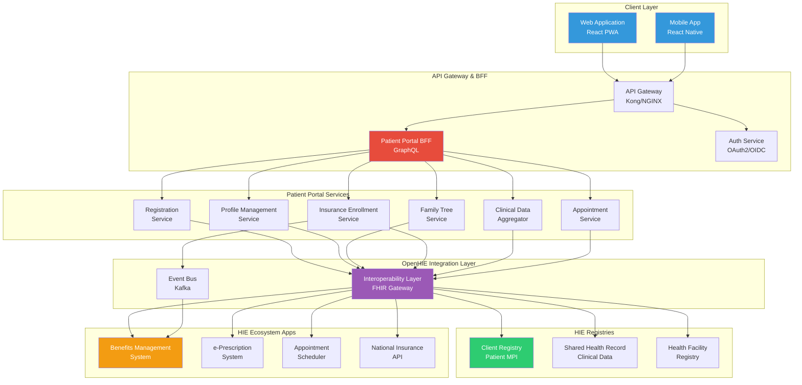
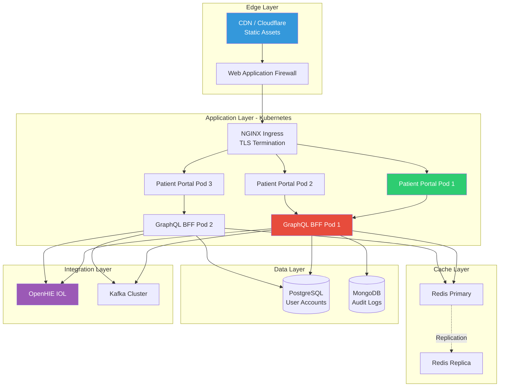

# Patient Portal - Core Architecture

## High-Level System Architecture



---

## Core Components

### 1. Client Layer

#### Web Application (Progressive Web App)
**Technology**: React 18+ with TypeScript

**Features**:
- Responsive design (mobile, tablet, desktop)
- Service workers for offline capability
- Installable as native-like app
- Push notification support
- Real-time updates via WebSocket

**Key Libraries**:
- React Router for navigation
- Redux Toolkit for state management
- Apollo Client for GraphQL
- Material-UI (MUI) for components
- React Hook Form for forms

#### Mobile Application
**Technology**: React Native

**Features**:
- Cross-platform (iOS & Android)
- Native performance
- Biometric authentication (fingerprint, Face ID)
- Offline-first with SQLite local storage
- Camera integration for document scanning
- Push notifications (FCM/APNS)

**Offline Strategy**:
- Local SQLite database mirrors server data
- Background sync service
- Conflict resolution on sync
- Offline queue for mutations

---

### 2. API Gateway Layer

#### API Gateway (Kong/NGINX)
**Responsibilities**:
- Request routing
- Rate limiting (per user)
- SSL/TLS termination
- Request/response logging
- IP whitelisting
- DDoS protection

**Configuration**:
```yaml
rate_limiting:
  requests_per_second: 10
  burst: 20
  
authentication:
  type: oauth2
  token_validation_endpoint: "https://auth.hie.example.com/validate"
  
logging:
  access_log: true
  error_log: true
  audit_log: true
```

#### Authentication Service
**Protocol**: OAuth 2.0 + OpenID Connect

**Token Types**:
- **Access Token**: 1 hour validity (JWT)
- **Refresh Token**: 30 days validity
- **ID Token**: Contains user claims

**Token Storage**:
- Web: HttpOnly cookies (secure)
- Mobile: Secure keychain (iOS) / Keystore (Android)

---

### 3. Backend for Frontend (BFF) - GraphQL

#### Purpose
Aggregate data from multiple HIE sources into patient-optimized responses, reducing:
- Number of API calls from client
- Over-fetching of data
- Network latency

#### Technology Stack
- Apollo Server (Node.js)
- TypeScript
- DataLoader for batching
- Redis for caching
- GraphQL subscriptions for real-time updates

#### Sample GraphQL Schema

```graphql
type Query {
  me: Patient!
  myFamily: [FamilyMember!]!
  myInsuranceEnrollments: [InsuranceEnrollment!]!
  myClinicalTimeline(limit: Int = 10): [ClinicalEvent!]!
  upcomingAppointments: [Appointment!]!
}

type Mutation {
  registerPatient(input: RegistrationInput!): RegistrationResult!
  addDependent(input: DependentInput!): FamilyMember!
  enrollInInsurance(input: InsuranceEnrollmentInput!): InsuranceEnrollment!
  addBeneficiary(enrollmentId: ID!, dependentId: ID!): Beneficiary!
  updateProfile(input: ProfileInput!): Patient!
  scheduleAppointment(input: AppointmentInput!): Appointment!
}

type Subscription {
  benefitBalanceUpdated(membershipId: ID!): BenefitBalance!
  newAppointmentScheduled: Appointment!
  clinicalDataAvailable: ClinicalEvent!
}

type Patient {
  id: ID!
  identifiers: [Identifier!]!
  demographics: Demographics!
  dependents: [Dependent!]!
  insuranceEnrollments: [InsuranceEnrollment!]!
  recentEncounters(limit: Int = 10): [Encounter!]!
  activePrescriptions: [Prescription!]!
  upcomingAppointments: [Appointment!]!
}

type InsuranceEnrollment {
  id: ID!
  scheme: InsuranceScheme!
  memberNumber: String!
  status: EnrollmentStatus!
  effectiveDate: Date!
  expiryDate: Date
  role: EnrollmentRole!  # PRIMARY or BENEFICIARY
  principalMember: Patient  # If BENEFICIARY
  beneficiaries: [Beneficiary!]!
  benefitPackage: BenefitPackage!
  balances: [BenefitBalance!]!
}

type BenefitBalance {
  benefitType: BenefitType!
  totalAllocation: Money!
  utilized: Money!
  remaining: Money!
  utilizationPercentage: Float!
  resetDate: Date!
}

type FamilyMember {
  id: ID!
  patient: Patient!  # Reference to CR Patient
  relationship: RelationshipType!
  isDependent: Boolean!
  isPrimaryDependent: Boolean!
  insuranceCoverage: [InsuranceCoverage!]!
  addedDate: Date!
}

enum RelationshipType {
  SPOUSE
  CHILD
  PARENT
  SIBLING
  GUARDIAN
  OTHER
}

enum EnrollmentRole {
  PRIMARY
  BENEFICIARY
}

enum EnrollmentStatus {
  ACTIVE
  PENDING
  SUSPENDED
  TERMINATED
}
```

#### GraphQL Resolver Example

```typescript
const resolvers = {
  Query: {
    me: async (_, __, context) => {
      const patientId = context.user.patientId;
      
      // Fetch from Client Registry via IOL
      const patient = await iolClient.getPatient(patientId);
      return patient;
    },
    
    myInsuranceEnrollments: async (_, __, context) => {
      const patientId = context.user.patientId;
      
      // Check cache first
      const cached = await redis.get(`enrollments:${patientId}`);
      if (cached) return JSON.parse(cached);
      
      // Fetch from BMS via IOL
      const enrollments = await bmsClient.getEnrollments(patientId);
      
      // Cache for 15 minutes
      await redis.setex(
        `enrollments:${patientId}`,
        900,
        JSON.stringify(enrollments)
      );
      
      return enrollments;
    }
  },
  
  Patient: {
    insuranceEnrollments: async (patient, _, context) => {
      // Use DataLoader for batching
      return context.loaders.enrollmentLoader.load(patient.id);
    },
    
    recentEncounters: async (patient, { limit }, context) => {
      // Fetch from SHR
      return shrClient.getEncounters({
        patient: patient.id,
        _count: limit,
        _sort: '-date'
      });
    }
  },
  
  InsuranceEnrollment: {
    balances: async (enrollment, _, context) => {
      // Real-time fetch from BMS
      return bmsClient.getBenefitBalances(enrollment.memberNumber);
    }
  },
  
  Mutation: {
    addBeneficiary: async (_, { enrollmentId, dependentId }, context) => {
      // Validate authorization
      const canManage = await authService.canManageEnrollment(
        context.user.patientId,
        enrollmentId
      );
      
      if (!canManage) {
        throw new Error('Unauthorized to manage this enrollment');
      }
      
      // Add beneficiary via BMS
      const beneficiary = await bmsClient.addBeneficiary({
        enrollmentId,
        patientId: dependentId,
        requestedBy: context.user.patientId
      });
      
      // Invalidate cache
      await redis.del(`enrollments:${context.user.patientId}`);
      
      return beneficiary;
    }
  },
  
  Subscription: {
    benefitBalanceUpdated: {
      subscribe: (_, { membershipId }, context) => {
        // Subscribe to Kafka topic
        return pubsub.asyncIterator(`benefit-balance-${membershipId}`);
      }
    }
  }
};
```

---

### 4. Patient Portal Services

#### Registration Service
**Responsibilities**:
- Validate national ID
- Check for existing records in CR
- Create new Patient in CR via FHIR
- Generate login credentials
- Send verification emails/SMS

**Technology**: Node.js microservice

**API Endpoints**:
```
POST /api/registration/validate-id          # Validate national ID
POST /api/registration/check-existing       # Check if patient exists
POST /api/registration/register             # Complete registration
POST /api/registration/verify-email         # Verify email address
POST /api/registration/resend-verification  # Resend verification
```

#### Profile Management Service
**Responsibilities**:
- Update patient demographics
- Manage contact information
- Update preferences (language, notifications)
- Profile photo management

#### Family Tree Service
**Responsibilities**:
- Search for existing patients to link as dependents
- Create new dependent patients in CR
- Create RelatedPerson resources
- Manage family relationships
- Validate relationship constraints

#### Insurance Enrollment Service
**Responsibilities**:
- Fetch insurance enrollments from BMS
- Add/remove beneficiaries
- Update enrollment status
- Cache management
- Subscribe to enrollment events

#### Clinical Data Aggregator
**Responsibilities**:
- Fetch encounters from SHR
- Fetch prescriptions from eRX
- Fetch lab results from Lab systems
- Merge into unified timeline
- Cache clinical summaries

#### Appointment Service
**Responsibilities**:
- Search for facilities and providers
- Check appointment availability
- Book appointments
- Manage appointment reminders
- Integration with facility scheduling systems

---

### 5. Data Layer

#### PostgreSQL Database
**Purpose**: Patient Portal operational data

**Tables**:
- `users` - Login credentials and user accounts
- `user_sessions` - Active sessions and refresh tokens
- `family_trees` - Local cache of family relationships
- `insurance_cache` - Local snapshot of insurance enrollments
- `notification_preferences` - User notification settings
- `audit_logs` - All user actions

**Schema Example**:
```sql
CREATE TABLE users (
    id UUID PRIMARY KEY DEFAULT gen_random_uuid(),
    patient_id VARCHAR(100) UNIQUE NOT NULL,  -- CR Patient ID
    email VARCHAR(255) UNIQUE NOT NULL,
    phone VARCHAR(20),
    password_hash VARCHAR(255) NOT NULL,
    email_verified BOOLEAN DEFAULT FALSE,
    phone_verified BOOLEAN DEFAULT FALSE,
    two_factor_enabled BOOLEAN DEFAULT FALSE,
    status VARCHAR(20) DEFAULT 'ACTIVE',
    created_at TIMESTAMP DEFAULT CURRENT_TIMESTAMP,
    updated_at TIMESTAMP DEFAULT CURRENT_TIMESTAMP
);

CREATE TABLE family_trees (
    id UUID PRIMARY KEY DEFAULT gen_random_uuid(),
    primary_patient_id VARCHAR(100) NOT NULL,
    dependent_patient_id VARCHAR(100) NOT NULL,
    relationship VARCHAR(50) NOT NULL,
    is_primary_dependent BOOLEAN DEFAULT FALSE,
    added_by VARCHAR(100) NOT NULL,
    added_date TIMESTAMP DEFAULT CURRENT_TIMESTAMP,
    status VARCHAR(20) DEFAULT 'ACTIVE',
    UNIQUE(primary_patient_id, dependent_patient_id)
);

CREATE TABLE insurance_cache (
    id UUID PRIMARY KEY DEFAULT gen_random_uuid(),
    patient_id VARCHAR(100) NOT NULL,
    enrollment_id VARCHAR(100) UNIQUE NOT NULL,
    scheme_id VARCHAR(100) NOT NULL,
    member_number VARCHAR(100) NOT NULL,
    role VARCHAR(20) NOT NULL,  -- PRIMARY or BENEFICIARY
    status VARCHAR(20) NOT NULL,
    data JSONB NOT NULL,
    cached_at TIMESTAMP DEFAULT CURRENT_TIMESTAMP,
    expires_at TIMESTAMP NOT NULL
);

CREATE INDEX idx_family_primary ON family_trees(primary_patient_id);
CREATE INDEX idx_family_dependent ON family_trees(dependent_patient_id);
CREATE INDEX idx_insurance_patient ON insurance_cache(patient_id);
```

#### Redis Cache
**Purpose**: High-performance caching layer

**Data Structures**:
```
# Patient demographics (1 hour TTL)
patient:{patientId}

# Benefit balances (5 minutes TTL)
benefits:{membershipId}

# Insurance enrollments (15 minutes TTL)
enrollments:{patientId}

# Clinical timeline (5 minutes TTL)
clinical-timeline:{patientId}

# Session data (token validity period)
session:{sessionId}

# Rate limiting
rate-limit:{userId}:{endpoint}
```

#### MongoDB
**Purpose**: Audit logs and document storage

**Collections**:
- `audit_logs` - All user actions with full context
- `consent_records` - Data sharing consents
- `notification_history` - Sent notifications

---

### 6. Integration Layer

#### OpenHIE Interoperability Layer (IOL)
**Protocol**: HL7 FHIR R4

**Authentication**: OAuth 2.0 Client Credentials

**Integration Patterns**:
- **Synchronous**: REST API calls for real-time data
- **Asynchronous**: Event subscriptions via Kafka

**FHIR Operations**:
```
# Patient operations
POST   /fhir/Patient                    # Create patient
GET    /fhir/Patient/{id}               # Read patient
PUT    /fhir/Patient/{id}               # Update patient
GET    /fhir/Patient?identifier={nid}   # Search by ID

# RelatedPerson operations
POST   /fhir/RelatedPerson              # Create relationship
GET    /fhir/RelatedPerson?patient={id} # Get family members

# Encounter operations
GET    /fhir/Encounter?patient={id}&_sort=-date&_count=10

# Subscription for real-time updates
POST   /fhir/Subscription               # Subscribe to events
```

#### Event Bus (Kafka)
**Topics**:
- `benefit.utilized` - When patient uses benefits
- `enrollment.status_changed` - Enrollment status updates
- `clinical.data_available` - New clinical data ready
- `appointment.scheduled` - New appointment created
- `prescription.ready` - Prescription ready for pickup

**Consumer Groups**:
- `patient-portal-benefits` - Benefit update consumers
- `patient-portal-clinical` - Clinical data consumers
- `patient-portal-notifications` - Notification triggers

---

## Technology Stack Summary

| Layer | Technology | Purpose |
|-------|------------|---------|
| **Frontend** | React 18, TypeScript | Web application |
| **Mobile** | React Native | iOS/Android apps |
| **API Gateway** | Kong/NGINX | Request routing, security |
| **BFF** | Apollo Server, Node.js | GraphQL API |
| **Microservices** | Node.js, TypeScript | Business logic |
| **Database** | PostgreSQL 14+ | Relational data |
| **Cache** | Redis 7+ | Performance optimization |
| **Document Store** | MongoDB | Audit logs |
| **Message Queue** | Apache Kafka | Event streaming |
| **Authentication** | Keycloak | OAuth2/OIDC |
| **Container** | Docker | Containerization |
| **Orchestration** | Kubernetes | Container management |
| **Monitoring** | Prometheus, Grafana | Metrics & dashboards |
| **Logging** | ELK Stack | Log aggregation |

---

## Deployment Architecture



**Scaling Configuration**:
- **Patient Portal**: Auto-scale 3-20 pods based on CPU (70% threshold)
- **GraphQL BFF**: Auto-scale 2-10 pods based on request rate (1000 req/s)
- **Redis**: Master-replica with sentinel for automatic failover
- **PostgreSQL**: Primary + 2 read replicas for query load distribution
- **Kafka**: 3-broker cluster with replication factor 3

---

## Performance Considerations

### Response Time Targets

| Operation | Target (p95) | Target (p99) |
|-----------|--------------|--------------|
| Login | <1s | <2s |
| Load Dashboard | <1s | <2s |
| Fetch Benefit Balances | <500ms | <1s |
| Load Clinical Timeline | <1s | <2s |
| Add Dependent | <2s | <3s |
| Enroll Beneficiary | <2s | <4s |

### Caching Strategy

**Cache Hierarchy**:
1. **Browser Cache** (Service Worker): Static assets, app shell
2. **CDN Cache**: Public content, API responses for non-sensitive data
3. **Redis Cache**: Patient data, benefit balances, clinical summaries
4. **Database Query Cache**: PostgreSQL query results

**Cache TTLs**:
- Patient demographics: 1 hour
- Benefit balances: 5 minutes
- Insurance enrollments: 15 minutes
- Clinical timeline: 5 minutes
- Appointment list: 10 minutes

**Cache Invalidation**:
- Event-driven (Kafka events trigger invalidation)
- Time-based (TTL expiration)
- Manual (user-initiated refresh)

---

## Monitoring & Observability

### Metrics to Track

**Application Metrics**:
- Request rate (req/s)
- Response time (p50, p95, p99)
- Error rate (%)
- Active sessions
- GraphQL query complexity
- Cache hit ratio

**Business Metrics**:
- Registrations per day
- Active users (DAU, MAU)
- Benefit balance checks
- Appointment bookings
- Dependent additions
- Feature usage statistics

### Logging

**Structured Logging**:
```json
{
  "timestamp": "2025-11-20T10:30:00Z",
  "level": "info",
  "service": "patient-portal-bff",
  "userId": "patient-123",
  "action": "fetch_benefit_balances",
  "membershipId": "NHIF-12345",
  "duration_ms": 245,
  "cache_hit": true,
  "status": "success"
}
```

**Log Levels**:
- ERROR: System failures, unhandled exceptions
- WARN: Degraded performance, fallback to defaults
- INFO: User actions, API calls, business events
- DEBUG: Detailed execution flow (dev/staging only)

---

**Next Document**: [PP_03_Registration_Identity.md](PP_03_Registration_Identity.md)
