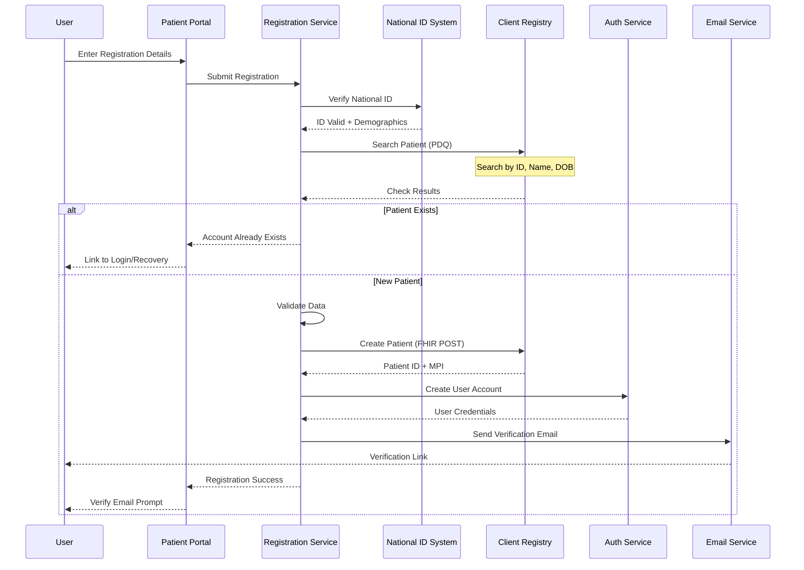
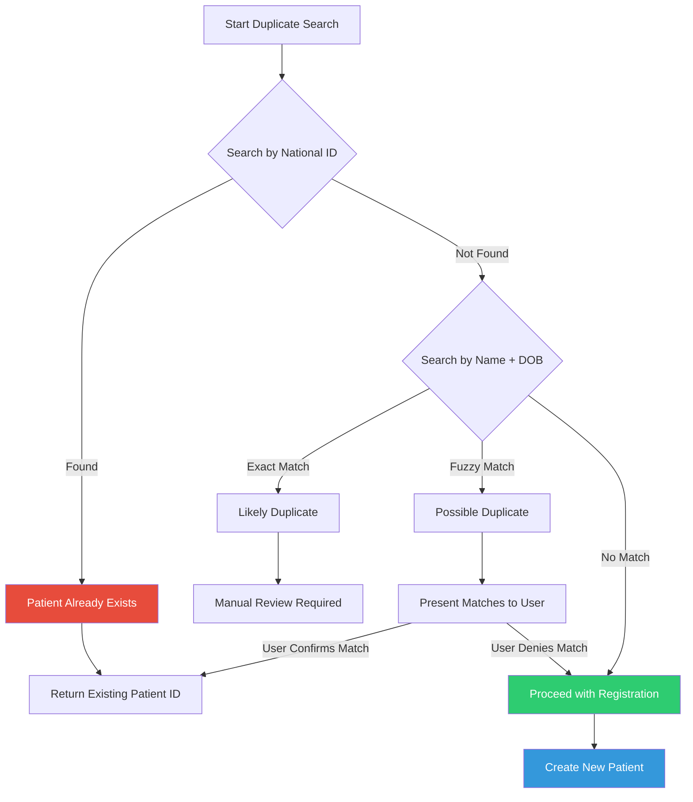
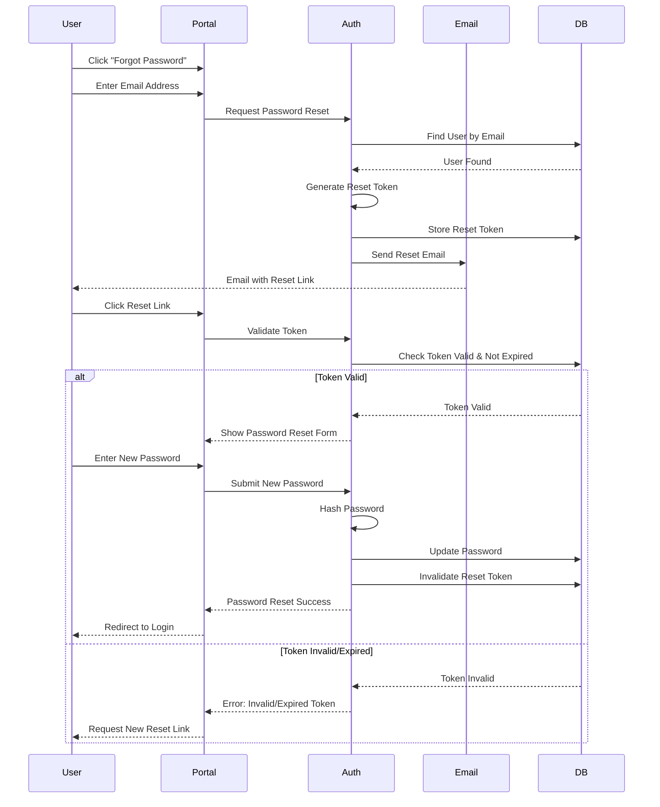
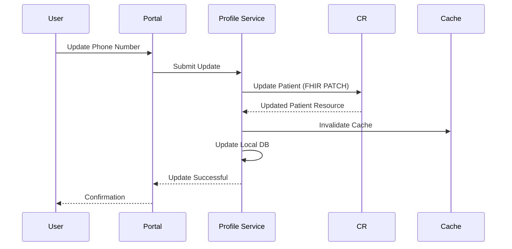

# Patient Portal - Registration & Identity Management

## Overview

Patient registration is the entry point to the Patient Portal, establishing the patient's identity in the Client Registry (CR) and creating login credentials for portal access.

**Key Principle**: Client Registry (CR) is the authoritative source for patient identity. The portal creates and references CR Patient records, never maintaining independent identity records.

---

## Registration Flow



---

## Step-by-Step Registration Process

### Step 1: User Provides Registration Details

**Required Information**:
- National ID or Passport number
- Full name (as per ID)
- Date of birth
- Gender
- Mobile phone number
- Email address
- Password (with strength requirements)

**Optional Information**:
- Physical address
- Emergency contact
- Preferred language

**Form Validation**:
```typescript
interface RegistrationInput {
  nationalId: string;        // Format: 8 digits
  firstName: string;
  middleName?: string;
  lastName: string;
  dateOfBirth: Date;         // Must be 18+ for self-registration
  gender: 'male' | 'female' | 'other';
  phone: string;             // Format: +254XXXXXXXXX
  email: string;             // Valid email format
  password: string;          // Min 8 chars, 1 uppercase, 1 number, 1 special
  confirmPassword: string;
  agreeToTerms: boolean;     // Must be true
}

// Validation rules
const validationSchema = {
  nationalId: {
    required: true,
    pattern: /^\d{8}$/,
    custom: async (value) => {
      // Check if ID is valid format for country
      return await validateNationalId(value);
    }
  },
  phone: {
    required: true,
    pattern: /^\+254\d{9}$/
  },
  email: {
    required: true,
    pattern: /^[^\s@]+@[^\s@]+\.[^\s@]+$/,
    custom: async (value) => {
      // Check if email already used
      const exists = await checkEmailExists(value);
      return !exists;
    }
  },
  password: {
    required: true,
    minLength: 8,
    pattern: /^(?=.*[a-z])(?=.*[A-Z])(?=.*\d)(?=.*[@$!%*?&])/
  }
};
```

### Step 2: National ID Verification

**Integration with National ID System**:
```typescript
async function verifyNationalId(nationalId: string): Promise<IDVerificationResult> {
  const response = await nationalIdApi.verify({
    idNumber: nationalId,
    requestingSystem: 'PATIENT_PORTAL',
    purpose: 'REGISTRATION'
  });
  
  return {
    valid: response.valid,
    demographics: {
      fullName: response.fullName,
      dateOfBirth: response.dateOfBirth,
      gender: response.gender,
      placeOfBirth: response.placeOfBirth
    },
    photo: response.photo  // Optional: ID photo for verification
  };
}
```

**Name Matching**:
- Compare entered name with ID system name
- Allow for minor variations (middle names, spelling)
- Flag significant mismatches for manual review

### Step 3: Duplicate Detection in Client Registry

**Search Strategy**:


**FHIR Patient Search**:
```
GET https://cr.hie.example.com/fhir/Patient?
    identifier=http://nationalid.gov.ke|12345678

Response (if exists):
{
  "resourceType": "Bundle",
  "type": "searchset",
  "total": 1,
  "entry": [{
    "resource": {
      "resourceType": "Patient",
      "id": "patient-existing-123",
      "identifier": [...]
    }
  }]
}
```

**If No Exact Match, Search by Demographics**:
```
GET https://cr.hie.example.com/fhir/Patient?
    family=Juma&
    given=John&
    birthdate=1985-06-15&
    gender=male
```

### Step 4: Create Patient in Client Registry

**FHIR Patient Resource**:
```json
POST https://cr.hie.example.com/fhir/Patient

{
  "resourceType": "Patient",
  "identifier": [
    {
      "use": "official",
      "system": "http://nationalid.gov.ke",
      "value": "12345678"
    },
    {
      "use": "secondary",
      "system": "https://patient-portal.hie.example.com/patient-id",
      "value": "PP-2025-001234"
    }
  ],
  "active": true,
  "name": [
    {
      "use": "official",
      "family": "Juma",
      "given": ["John", "Patrick"]
    }
  ],
  "telecom": [
    {
      "system": "phone",
      "value": "+254712345678",
      "use": "mobile",
      "rank": 1
    },
    {
      "system": "email",
      "value": "john.Juma@example.com",
      "use": "home"
    }
  ],
  "gender": "male",
  "birthDate": "1985-06-15",
  "address": [
    {
      "use": "home",
      "type": "physical",
      "line": ["123 Main Street", "Apartment 4B"],
      "city": "Nairobi",
      "district": "Westlands",
      "postalCode": "00100",
      "country": "KE"
    }
  ],
  "maritalStatus": {
    "coding": [{
      "system": "http://terminology.hl7.org/CodeSystem/v3-MaritalStatus",
      "code": "M",
      "display": "Married"
    }]
  },
  "contact": [
    {
      "relationship": [{
        "coding": [{
          "system": "http://terminology.hl7.org/CodeSystem/v2-0131",
          "code": "C",
          "display": "Emergency Contact"
        }]
      }],
      "name": {
        "family": "Juma",
        "given": ["Jane"]
      },
      "telecom": [{
        "system": "phone",
        "value": "+254723456789",
        "use": "mobile"
      }],
      "address": {
        "use": "home",
        "line": ["123 Main Street"],
        "city": "Nairobi"
      }
    }
  ],
  "communication": [
    {
      "language": {
        "coding": [{
          "system": "urn:ietf:bcp:47",
          "code": "en-KE",
          "display": "English (Kenya)"
        }]
      },
      "preferred": true
    }
  ],
  "managingOrganization": {
    "reference": "Organization/patient-portal",
    "display": "Patient Portal Registration"
  },
  "meta": {
    "tag": [
      {
        "system": "http://terminology.hl7.org/CodeSystem/v3-ActReason",
        "code": "HTEST",
        "display": "patient portal registration"
      }
    ]
  }
}
```

**CR Response**:
```json
{
  "resourceType": "Patient",
  "id": "patient-123",
  "identifier": [
    {
      "use": "official",
      "system": "http://nationalid.gov.ke",
      "value": "12345678"
    },
    {
      "use": "official",
      "system": "https://cr.hie.example.com/mpi",
      "value": "MPI-2025-789012"
    },
    {
      "use": "secondary",
      "system": "https://patient-portal.hie.example.com/patient-id",
      "value": "PP-2025-001234"
    }
  ],
  ...
}
```

### Step 5: Create Portal User Account

**User Account Creation**:
```typescript
interface UserAccount {
  id: string;
  patientId: string;  // Reference to CR Patient ID
  email: string;
  phone: string;
  passwordHash: string;  // bcrypt hash
  emailVerified: boolean;
  phoneVerified: boolean;
  twoFactorEnabled: boolean;
  status: 'ACTIVE' | 'PENDING_VERIFICATION' | 'SUSPENDED' | 'DELETED';
  createdAt: Date;
  updatedAt: Date;
}

async function createUserAccount(
  patientId: string,
  email: string,
  phone: string,
  password: string
): Promise<UserAccount> {
  // Hash password
  const passwordHash = await bcrypt.hash(password, 10);
  
  // Create user record
  const user = await db.users.create({
    patientId,
    email,
    phone,
    passwordHash,
    emailVerified: false,
    phoneVerified: false,
    twoFactorEnabled: false,
    status: 'PENDING_VERIFICATION'
  });
  
  // Generate verification token
  const verificationToken = await generateVerificationToken(user.id);
  
  return user;
}
```

### Step 6: Send Verification Email/SMS

**Email Verification**:
```typescript
async function sendVerificationEmail(user: UserAccount): Promise<void> {
  const token = await generateVerificationToken(user.id);
  const verificationUrl = `https://patient-portal.hie.example.com/verify-email?token=${token}`;
  
  await emailService.send({
    to: user.email,
    subject: 'Verify Your Patient Portal Account',
    template: 'email-verification',
    data: {
      firstName: user.firstName,
      verificationUrl,
      expiresIn: '24 hours'
    }
  });
}

async function sendVerificationSMS(user: UserAccount): Promise<void> {
  const code = await generateSMSVerificationCode(user.id);
  
  await smsService.send({
    to: user.phone,
    message: `Your Patient Portal verification code is: ${code}. Valid for 10 minutes.`
  });
}
```

**Verification Token**:
```typescript
interface VerificationToken {
  userId: string;
  token: string;  // Random secure token
  type: 'EMAIL' | 'SMS';
  expiresAt: Date;
  used: boolean;
}

async function generateVerificationToken(userId: string): Promise<string> {
  const token = crypto.randomBytes(32).toString('hex');
  
  await db.verificationTokens.create({
    userId,
    token,
    type: 'EMAIL',
    expiresAt: new Date(Date.now() + 24 * 60 * 60 * 1000), // 24 hours
    used: false
  });
  
  return token;
}

async function verifyEmailToken(token: string): Promise<boolean> {
  const record = await db.verificationTokens.findOne({
    token,
    type: 'EMAIL',
    used: false,
    expiresAt: { $gt: new Date() }
  });
  
  if (!record) return false;
  
  // Mark token as used
  await db.verificationTokens.update(record.id, { used: true });
  
  // Update user status
  await db.users.update(record.userId, {
    emailVerified: true,
    status: 'ACTIVE'
  });
  
  return true;
}
```

---

## Identity Verification Levels

### Level 1: Email/Phone Verified
- User has verified email address
- User has verified phone number
- Can access basic portal features
- **Access**: View own data, manage profile

### Level 2: ID Verified (Standard)
- National ID verified against government system
- Name matches ID records
- Can perform most portal actions
- **Access**: Add dependents, view clinical data, book appointments

### Level 3: Biometric Verified (Enhanced)
- In-person ID verification at health facility
- Biometric capture (fingerprint, photo)
- Highest trust level
- **Access**: Manage insurance, financial transactions, consent management

---

## Account Recovery

### Password Reset Flow



### Account Unlock (After Failed Login Attempts)

**Lockout Policy**:
- 5 failed login attempts → 15-minute lockout
- 10 failed login attempts → 1-hour lockout
- 15 failed login attempts → Account suspended (manual unlock required)

**Unlock Process**:
```typescript
async function unlockAccount(email: string): Promise<void> {
  const user = await db.users.findByEmail(email);
  
  // Send unlock code via SMS
  const unlockCode = await generateUnlockCode(user.id);
  
  await smsService.send({
    to: user.phone,
    message: `Your account unlock code is: ${unlockCode}. Valid for 15 minutes.`
  });
}

async function verifyUnlockCode(email: string, code: string): Promise<boolean> {
  const user = await db.users.findByEmail(email);
  const record = await db.unlockCodes.findOne({
    userId: user.id,
    code,
    expiresAt: { $gt: new Date() },
    used: false
  });
  
  if (!record) return false;
  
  // Reset failed login attempts
  await db.users.update(user.id, {
    failedLoginAttempts: 0,
    lockedUntil: null
  });
  
  // Mark code as used
  await db.unlockCodes.update(record.id, { used: true });
  
  return true;
}
```

---

## Data Synchronization with Client Registry

### Periodic Sync (Daily Background Job)

**Purpose**: Keep portal cache in sync with authoritative CR data

```typescript
async function syncPatientDataFromCR(patientId: string): Promise<void> {
  // Fetch latest from CR
  const crPatient = await iolClient.getPatient(patientId);
  
  // Update local cache
  await db.patientCache.upsert({
    patientId: crPatient.id,
    demographics: {
      name: crPatient.name,
      gender: crPatient.gender,
      birthDate: crPatient.birthDate,
      address: crPatient.address,
      telecom: crPatient.telecom
    },
    lastSyncedAt: new Date()
  });
  
  // Check for significant changes
  const changes = detectSignificantChanges(
    existingData,
    crPatient
  );
  
  if (changes.length > 0) {
    // Notify user of changes
    await notificationService.send({
      userId: patientId,
      type: 'PROFILE_UPDATED',
      message: 'Your profile information has been updated from official records'
    });
  }
}

// Run daily at 2 AM
cron.schedule('0 2 * * *', async () => {
  const activeUsers = await db.users.findActive();
  
  for (const user of activeUsers) {
    try {
      await syncPatientDataFromCR(user.patientId);
    } catch (error) {
      logger.error('Failed to sync patient', { userId: user.id, error });
    }
  }
});
```

### Real-Time Update on Profile Edit



---

## Security Considerations

### Password Security

**Requirements**:
- Minimum 8 characters
- At least 1 uppercase letter
- At least 1 lowercase letter
- At least 1 number
- At least 1 special character
- Not in common password list

**Hashing**:
- Algorithm: bcrypt
- Cost factor: 10 (adjustable based on hardware)
- Salt: Unique per password (automatic with bcrypt)

### Session Management

**Session Storage**:
```typescript
interface UserSession {
  sessionId: string;
  userId: string;
  patientId: string;
  createdAt: Date;
  expiresAt: Date;
  ipAddress: string;
  userAgent: string;
  refreshToken: string;
}

// Store in Redis with TTL
await redis.setex(
  `session:${sessionId}`,
  3600,  // 1 hour
  JSON.stringify(session)
);
```

**Session Validation**:
- Check session exists in Redis
- Verify not expired
- Validate IP address (optional, warn if changed)
- Check user account still active
- Refresh token if close to expiry

### Rate Limiting

**Registration Endpoint**:
- 3 registration attempts per IP per hour
- 5 verification email resends per day
- CAPTCHA after 2 failed registrations

**Login Endpoint**:
- 10 login attempts per IP per hour
- 5 failed attempts per account triggers lockout

---

## Audit Logging

**Registration Events**:
```typescript
interface RegistrationAuditLog {
  eventId: string;
  eventType: 'REGISTRATION_STARTED' | 'REGISTRATION_COMPLETED' | 'EMAIL_VERIFIED';
  timestamp: Date;
  userId?: string;
  patientId?: string;
  ipAddress: string;
  userAgent: string;
  nationalId?: string;  // Masked: ****5678
  email?: string;       // Masked: j***@example.com
  outcome: 'SUCCESS' | 'FAILED' | 'DUPLICATE_DETECTED';
  errorReason?: string;
  metadata: Record<string, any>;
}

// Log example
await auditLogger.log({
  eventType: 'REGISTRATION_COMPLETED',
  timestamp: new Date(),
  userId: 'user-123',
  patientId: 'patient-456',
  ipAddress: '192.168.1.100',
  outcome: 'SUCCESS',
  metadata: {
    crPatientId: 'patient-456',
    verificationType: 'NATIONAL_ID',
    registrationDuration: 245  // seconds
  }
});
```

---

**Next Document**: [PP_04_Family_Dependents.md](PP_04_Family_Dependents.md)
